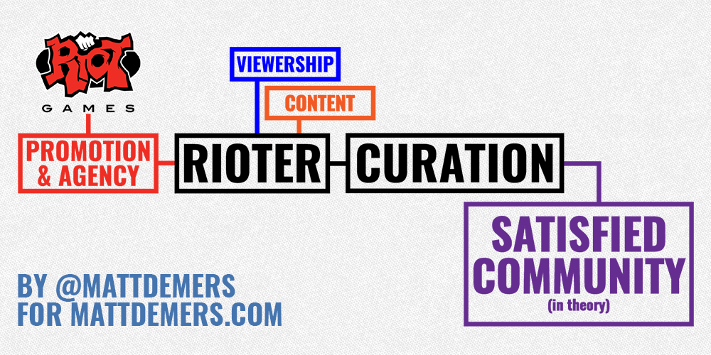
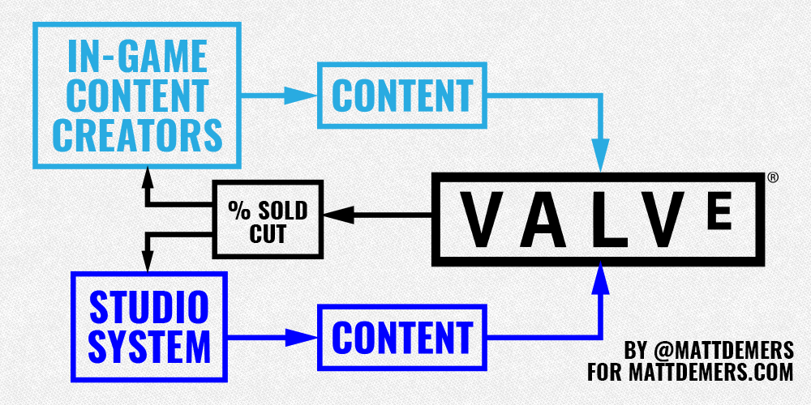

Riot Games' _League of Legends_ and Valve Software's _Dota 2_ are two of the foremost titles in the Multiplayer Online Battle Arena (MOBA) market, and are fundamentally different in audience and scope.

_League of Legends_ has successfully gained a larger audience by being easier to pick up with a more friendly aesthetic. It rewards a different set of skills than _Dota_; _Dota_ fans will tell you it’s easier. _Dota 2_ prides itself on its learning curve, and there is a sense of accomplishment about wrangling the way the game works.

While certain mechanics, like knowing where invisible spawn boxes for monsters occur, are being made more accessible in a recent patch, until then it was on players to learn on their own through videos or testing. Whoever took more time to learn and practice secured the advantage.

Surprisingly, these philosophies also extend to how each company handles community management. Riot Games employees — otherwise known as "Rioters" in this piece — treat the way they reach out to their community very differently than Valve does.

I strongly recommend reading the Valve employee handbook before going further into this piece, as it explains the company’s flat organizational structure pretty well. If you're lazy, essentially Valve employees are encouraged to work on what they feel is valuable, and what they feel their skills will be best used on.

In this piece, I'm going to be looking at how the two companies' approaches to community management affect the ability of people _within_ their communities (writers, artists, cosplayers) to grow their products.

## **The Riot Method**

Similar applications: Hi-Rez Games, Waystone Games, Twitch

Pros: Visibility, interactivity, kingmaking

Cons: Communication, consistency, accessibility

_Disclosure: I am friends with several Rioters, and have worked for the company in the past on a contract basis in 2013. This piece uses speculation and publicly-available knowledge; I was never formally a Rioter, but worked with them._

I've spent some time thinking about how Riot Games has applied a company-wide system of community management in the form of the elevation of employees past just people to the mythical form of "Rioter."

Part of the on-boarding at Riot involved "de-newbification," which familiarizes the new employee with the company, but also with dealing with the general public. Rioters are encouraged to be involved with the public through the company's forums, the /r/LeagueofLegends subreddit, and Twitter.

In the process, many Rioters can become prominent in their roles, as it's likely that they will allow for the community to ask them questions and interact. As a _League of Legends_ fan, you can actually go up to the designer of your favourite champion and ask him/her things (depending on how easy they are to find, and how willing they are to talk).

Some are more visible than others, and have formed sub-fanbases around them, like artist Michael "IronStylus" Maurino. Because Riot has enabled their employees to both have the knowledge about what they can and cannot talk about, as well as the agency to make the decision themselves, they come off as genuine, approachable and _cool_. Fans of _League of Legends_ believe that Riot's employees are people they want to hang out with, and that works in the company's favor.

To be a Rioter means attention, and attention means followings on social sites like Twitter. These followings can then be used to make **curated judgment calls** on what is to be shared. Obviously Riot creations and promotions are going to happen, but I'm talking about a character designer retweeting a fan artist or an esports caster sharing an analytical article; they are essentially kingmakers, able to judge content as valuable.

Promotion by a Rioter gives the creators their share of stability and community; they can keep producing content around _League of Legends_, which promotes the game more and encourages more players to spend time and money. Riot allows certain assets — namely its LCS Flickr and broadcasts — to be used by content creators legally without licensing. Even if creators don't _play_ the game, they can still take part in the community — there's a huge potential audience, and potential methods to gaining fame.

Rioters are essentially as much of an aggregate as Reddit — albeit a likely biased one.

The main issue with is that all creators are not equal in the system; the Rioter is always ultimately going to have the needs of the company be in the forefront of their mind. From my experience, they do _not_ avoid Riot-critical content completely, but they are not in the business of giving more hits to content that is overly antagonistic to their game, company and brand.

This, in turn, can affect the content of the creators, and what they choose to produce; creators who play ball over a long period of time can be rewarded more, and those with huge fanbases can get spotlights just for showing up.

Also, as this grows, though, there's a saturation problem: how many artists get promoted, and how often? What happens when the artist wants to leave a system that's worked for them for so long? What happens if there's a dispute?

Basically, it's Riot's way or the highway, and for a lot of creators, it suits them just fine: they get the promotion that they want, and they reap the benefits of a multi-national fanbase in the millions. Blogs like Surrender@20 and YouTubers like Sp4zie or Sky Williams have enjoyed sharing and cross-promotion from Riot accounts that have generated them a lot of money and stability.

Lastly, an organization with that many people is bound to run into some communication issues across platforms, and Riot is no different. Having semi-autonomous teams across multiple countries means that they need to be on the same page, or have the agency to make region-specific decisions.

This can backfire, especially if "Riot" seems monolithic; decisions affecting the League Championship Series format between Europe and North America were attributed to cultural differences between offices, and it was unclear who was making the final call. Similar inconsistencies have been noted between China, Korea and the rest of the world.

While there might be a ton of Rioters visible, it may be difficult to find the right one who can answer your question, or even find one willing to comment; their statement could cause problems up or down the chain, and giving the _wrong_ information just creates a storm of confusion and complaining no one wants to deal with.

In closing, being so accessible also creates the _expectation_ of communication: it makes it all the more harder to fine tune what information they give, or how much. Releasing champion concepts (like Ao Shin, who was reworked into Aurelion Sol years later) means that you better deliver; sometimes it can be better to leave that information out, rather than be "on the hook."

Similar companies applying Riot methods are Twitch and Hi-Res Games (the makers of SMITE); both celebritize and promote their own employees as personalities while giving them an amount of agency to use on the games they manage.

## **The Valve Method**

Similar applications: Smash Bros Community, Fighting Games

Pros: Creator autonomy, residual income, content influx

Cons: Communication breakdown, contractor syndrome, sink-or-swim

_Disclaimer: This post covers Valve's involvement in competitive Dota 2 more than it does Counter-Strike: Global Offensive due to the similar game models._

While the Riot Method above seems fairly singular, Valve is so different that it requires a breakdown on two fronts: its normal operating model, and what happens when it runs The International and the Dota 2 Majors.

In general, Valve is the antithesis of Riot Games: while it has public-facing employees, any interaction with the community on Twitter or sites like Reddit is seen as a monumental event. This is why company founder Gabe Newell's post apologizing for the shoddy quality of the Shanghai Major was almost surreal: this was the owner — a billionaire — just dropping by and expecting like things _wouldn't_ blow up.

Valve _does_ have a general spokesman for the company, Doug Lombardi, but he isn't hyping up new updates or character releases. The game's developer, the enigma known as Icefrog is more likely to post on his Weibo (China's microblogging service) about his love of mangoes than react to community balance complaints or share in the memes. I could not tell you who is the main point of contact for Dota press, as the generic e-mail I have was not signed with any real person's signature.

There's something important to stress, though: while individual creators may have their contact within the Valve system to deal with their needs, the **general public** does not have the same luxury. From my understanding community Valve is communicative to talent and creators it deals with, but from an outsider's perspective looking in, that can be intimidating to try to decipher. This post looks at Valve's public-facing efforts, rather than its internal.

### **Business as usual**

Valve are masters at making money off of other people's content, partially because they've built great places for people to sell them: Steam, _Team Fortress 2_, _Counter-Strike: Global Offensive_ and _Dota 2_. All three games have ways for community artists to make in-game items, get them implemented, and make a cut of the sales. Additions to the shop are curated by both Valve, and to a degree, the community: the Workshop is available for people to vote on what they'd like to see.

The company apparently has held meetings in the past for its creators (see fifth paragraph), but in general stays out of their way in terms of who is allowed to try something new. If, say, **I** wanted to take the competitive games played for the recent Shanghai Major and put my own voice track over them to commentate, I can, legally. I can also do this for any other ticket I've purchased: as long as I'm using my own camera movements and voiceover, I'm golden.

This system has allowed numerous studios like Beyond the Summit, Moonduck, JoinDOTA and the Dota 2 RU Hub to make sizable followings for themselves and generate their own business. Tournaments need broadcasters and infrastructure, and these companies have invested enough to make that happen. The money that changes hands in terms of the primary broadcasting and promotion rights doesn't pass through Valve: that only happens when it comes to listing the tournament ticket and associated items on its store.

This also applies to creating my own items: if I want to, I can download Valve's development tools, make myself an item, and see if I can get it implemented. I'll be competing with seasoned creators, but if it's good, there's a chance for it to work out.

This is what contributes to Valve's notoriously "hands-off" reputation, and it works for them. They get new content to keep _Dota 2_ fresh, and they also get to take a generous cut in terms of money made; they make money both from this brand-new content, and then take further cuts when normal users buy and sell those items on the second-hand marketplace.

In short, Valve have created an environment where creators need to come up with a viable business model and way of promotion outside of their company, and that contributes to (hopefully) more stable companies in the long run. Beyond the Summit started with a Kickstarter campaign to fund their initial business model, and have kept themselves afloat by competing with other studios for foreign tournament rights, hosting their own tournaments and branching out to games like Smash Bros Melee. That last point may not have happened if the company was tightly tied to Valve for their success.

However, problems arise when the community needs _any_ clarification on the day-to-day goings-on of Dota. The normal response to many queries and questions is silence, which gives the impression they don't care; normally, Valve swoops in as things are at their absolute worst, and by then the damage has been done, or they seem like heroes. They're obviously hoping for the latter.

Valve _will_ release things that Riot does for _League_, like events, comics and videos, but again, there's no roadmap or expectation. An event happening one year could disappear the next, and something like its Reborn overhaul is just dropped with a "go nuts."

This makes things a problem when creators _need_ that point of contact, and without a gentle hand to guide the community in core values, it's become common to see forums and social media devolve into downright shit-flinging and negativity. Dota has a reputation as one of the more aggressive communities for a reason: left to their own devices, they are only as guided as the values of the most prominent members.

Some people like it like that, but it affects the approachability of the game and the community to outsiders, which could affect its long-term health. Then again, as we mentioned earlier, a lot of Dota fans prefer this kind of gatekeeping.

### **Dota 2 Majors**

When it comes to their hosted tournaments, Valve tend to have a few guiding principles: make sure players and the audience are happy, and bring in the people needed to make this happen.

This means hiring outside consultants to keep the event running, as by now, the events are so large that Valve employees can't take care of all the jobs that are needed to be done. This means taking risks on talent, both in front and behind the cameras; if you watched the Shanghai Major, you know how that can backfire with KeyTV.

When this works, Valve's events go big; I firmly believe that The International has set a standard for event production that only now is being met by other companies. However, as mentioned before, there is a communication breakdown when it comes to other things that can be seen as incidental.

For me, Valve's press access at last year's TI was lacking partially because we didn't know if it was going to happen or not. Then, magically, two weeks before the event, we were told we'd get two press days — one before the group stage, and one after — to talk to players. Anything else would be on us to organize.

This is fine, as not every company is obligated to help the media make money, but giving only two weeks' notice likely meant that more than a few content creators couldn't get the vacation or accommodations needed to make the event.

For casters, TI and the Majors also can represent a huge potential in exposure and money: they get paid for the event, and also get a cut of all chests sold with their digital autograph attached. Last year, David "LD" Gorman shed some light on the process; I'd really recommend reading his blog, "The Hardest Time of the Year."

> A key excerpt surrounds the lack of feedback by Valve when it comes to the selection process. Like the process for chests, player-promoted items, or other in-game salable items, how things are chosen is relatively opaque.
> 
> You see, for casters, there are no open qualifiers. There are no second chances. If you don't get invited to work TI, better luck next year. So after a year of crazy hours, little sleep, and a whole lot of flame, these people line up and wait for Valve to be their judge, jury, and executioner. The process is especially brutal because just like team invites (and perhaps most things Valve), it's a total black box. Nobody knows why they were chosen, and for those who don't make the cut or get their preferred assignment, there is no direct appeals process.
> 
> Of course, you can always speculate, and that's what those who aren't invited are reduced to doing. Was that one off-color joke a dealbreaker? Did I offend someone at Valve in a Tweet? Should I have cast more games? Was I not funny enough? Did I get one too many Reddit hate threads? You just don't know.

As we can see, Valve's system of "there, but not" allows for some great benefits, but also some confusing problems. Frustration seems to be dealt with in a few ways in Dota 2, but the most common is to shrug, sometimes with a sigh of defeat, and just say "it's Valve."

Communities that utilize a Valve-like method are fighting games like Smash Bros and Street Fighter; it is only recently that Capcom and Nintendo have sought to reach out the competitive scenes for their games directly, with the former producing a more stable tournament series through partnerships with already-established entities.

## **In closing**

The main reason I decided to write this piece is because Riot and Valve seem diaterically opposed in terms of fanbase and playstyles, and people tend to take sides when it comes to their community management, as well; neither style is the “best” one; each one has their strengths when it comes to enabling different types of behavior, and sometimes loyalty is so strong it keeps people from thinking critically.

The solutions to the problems on both sides of the company aren't exactly something that are fixable, because to some people, it's fine how it is; Riot's promotion and curation keep the community inviting and positive, while Valve's hands-off policy allows for people to truly thrive without necessarily needing to worry about a system may screw them over.

In short, it there's a series of questions a company may ask themselves in their community policy, and **you** can also decide what you value:

- How does a company allow for an amount of openness without ignoring crucial issues?
- How does a company provide a guiding hand without allowing for new players to emerge?
- How does a company determine what is valuable enough to respond to?
- How does a company determine who to promote and reward without punishing people who choose to not follow along?

All of these affect the long-term viability of the company and the game, and especially when other titles are demanding more of the esports market share, it can be tough to adapt as needed.

Will Riot need to let other companies have a bigger piece of the pie? Will Valve need to hire someone specifically for community when they sorely need it? It all depends on the value it brings to the company, and how much it will effect the competition as a whole.
