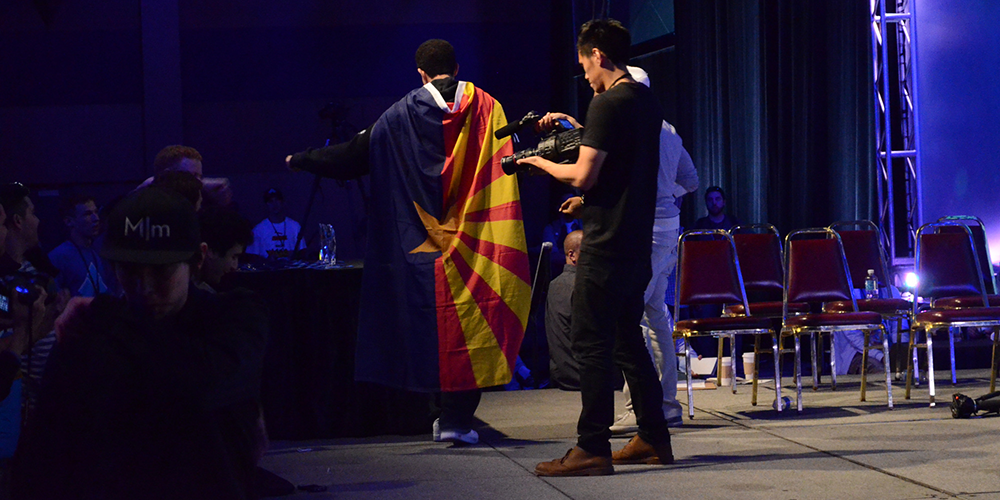
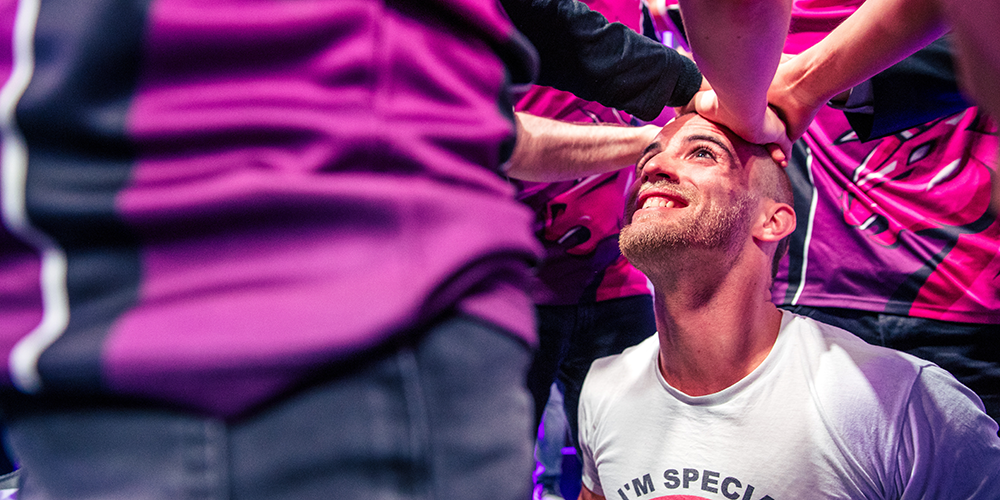

Over the past year I've gotten more comfortable with my fandom for pro wrestling because of a couple reasons; the most prominent is that it introduced a love of pageantry and storytelling that I didn't know that I had.

For the uninitiated, almost all of pro wrestling is pre-determined. Depending on the performers, each match is a certain degree of planned: some like to "call it in the ring" while others meticulously map out every move, mood and moment.

<!--more-->

The first — the performers' entrance — is probably the most important. As I've watched more of them and begun to carve out my favorites, I began to ask myself _why_ they worked me. In most cases, it's because it instantly sets the tone or mood of what I'm about to experience with little more than a song, mannerisms and a walk.

That's something that I think esports can benefit from.

Community Effort Orlando's yearly main event borrows more heavily than others — it should be pretty evident from the wrestling ring that they set up for Top 8's. Something I've always envied about those  competitors is that they get to live out the fantasy of picking an entrance theme and coming out to a hot crowd that wants them to perform.

Some competitors make more of it than others; some end up throwing in a wink-wink-nudge-nudge to other people by emulating well-established routines, like Kenneth "K-Brad" Bradley's "Stone Cold" Steve Austin homage from 2016's event. Hell, it made ESPN.

https://www.youtube.com/watch?v=G2hsewxQdFA

In 2017, CEO did two straight hours of a "Tekken Rumble," complete with surprise entrants, entrances, costumes, and music. However, I think there's a lot more that can be gained from stepping away from just imitation.

In pro wrestling, the entrance's origins lies (supposedly) in the 1970s, when the rise of rock and roll allowed for an opportunity for more showmanship. Over time, it's expanded with pyro, video, LED entrance ramps and all manners of media. The point is simple: tell the audience what they need to know about the performer in the shortest amount of time possible.

A good entrance theme is, above all things, recognizable. This usually comes from crafting a motif that fits with a personality and goals. Bobby Roode's "Glorious Domination" pushes both his tenacity and regality. Steve Austin's "I Won't Do What You Tell Me" emphasizes that he's dangerous, rebellious and unpredictable. Hiroshi Tanahashi's "High Energy" tells us that the superhero-like ace of the company is someone for everyone to believe in. Masato Yoshino's shredding "Speed Star" tells us that he's... fast.

In Japan, some of these themes hold a special reverence in fans' hearts. Mitsuharu Misawa's "Spartan X" and Kenta Kobashi's "Grand Sword" carry the weight of their past successes and current triumphs as part of their ongoing legacy (notably the latter's return from kidney cancer in 2007, which brings the announcer to tears). To be in the crowd and chant their name means you are adding to that. It is part of the complete experience, from triumphs to somber retirements.

https://www.youtube.com/watch?v=liVCJEUjDQk

Most esports events, in my experience, usually have one or two musical themes for when teams walk out, but that's all it is — a walk out. It lacks emotion, personalization, and emotional weight with the audience from the association.

In my opinion, all good themes have one thing in common: I call it a "sting" (no pun intended). This is usually a section of the music in the first 1-3 seconds of the song that instantly identifies the person walking out to it, to which the audience can react. The sting is a tone setter; if you can interrupt someone talking with it (think The Rock's "If ya smell..."), it has done its job.

Starting with the sting, a performer's music allows them to connect emotion with them in a non-verbal way. Their mannerisms as they walk down the ramp provide a context: someone walking with intensity and purpose is different from someone dancing or smiling, even if the same music provides the backdrop. Even the most goofy of performer can give off a "big fight" atmosphere with the right body language.

While a pro wrestling match is billed as an athletic contest, it is really a performance. Its ultimate goal is suspending the audience's disbelief to make them think the drama of the situation (build-ups, comebacks, cheating) is actually happening.

This involves manipulation of the audience over a long period of time — "working" the crowd for cheers or boos, "selling" pain or injuries to make them believable. The wordless context of the entrance is the start of the molding of the audience's emotions, preconceptions and expectations. It is up to the performers to reward or subvert those things in kind.

As an example, and without knowing anything about wrestling, I want you to watch the following clip to see what I mean.

https://twitter.com/BAHUFMW/status/1248625241602945031

By the end of the clip, you know instantly what the context of the match is, even if you weren't around to see its buildup. You know the first man out is a rebel, and hated by the crowd to the point that people are _throwing garbage_ at him as he walks out to X's "Wild Thing."

Emphasizing the brutality of the match to come, he's brought out the classic wrestling folding chair, using it to sit down on the ramp, light up a cigarette and afterward, catch a thrown drink and pour it over his head.

We're told a couple things from this, but it's mainly "Boo this man!" and "He does _not_ care if you do."

Keep in mind: he has not spoken one word to us.

Back to esports.

One of the issues that I see with esports is that players are both not inclined to talk if they do not have the talent for it, or are not given opportunity in the context of the broadcast. Whether they are emoting enough during gameplay is up to the individual, and it can be largely underwhelming to see player cam for stone-faced, focused players. While production budgets have expanded to pre-intro video packages, these still can come out bland and uninspired depending on the effort or pose.

This contributes to audience perceptions growing off of the inability to connect: this leads to the stereotypes of "robotic" competitors, especially when they lack the ability to speak English to English-dominant fans.

Fixing this is a difficult proposition because we run into the issue of how much to ask from players. From my experience, if they don't see something as valuable, they won't usually put forth effort if they don't have to. Entrances, while having the potential to be done _badly_ as they have in the past, offer a potential outlet for players and teams to establish their core values through a very simple and indirect way. However, they have to be into it, and it has to make them look good.

Esports is no stranger to matching music with moods, but mostly on an **event** scale, rather than something more personalized to the team. OGN's The Champions series made a big deal of their use of music throughout their seasons through introductions, and they likely saw a value in establishing tone and storytelling within the best of their ability.

Transferring this down to the team or player level would be a matter of practicality; in team games, you would likely not want to have each individual person come out to different songs, as that could easily rack up the time.

Logistics aside, though, wouldn't it be cool to see a team pick a song to represent them as an organization, put in the thought to choose something that evoked a certain feeling, and then put in the work to be theatrical? Wouldn't it give us more memorable moments when something special happens, like "that one Flash entrance" or "FireBatHero goes swimming"? Wouldn't it completely change the nature of a match if a fun-loving, goofy, emotive team suddenly came in totally focused and primed to kill? Wouldn't it give players (even the ones who aren't on the most winning side of things) a chance to connect?

Perhaps that's the root of things: finding a way to connect.

While I've largely stopped watching the LCS, one thing I _have_ noticed is the Unicorns of Love's manager (Romain Bigeard) embrace more of a role of a mascot for the team. He's one-part cheerleader, one part good luck charm, and from what I can tell, he serves the same function as teams picking up general streamers does: doing something the players will not do, or cannot do _as well_ as he can.

He conveys energy and allows the crowd to feed off of it; this, in a very big way, onboards or enamors people with a brand they might not have spent any time with otherwise, and gets them invested in how well they do.

Because, well, even if they suck, there's still the unicorn guy.

<figure>

<figcaption>

Source: Riot Photo Pool https://flic.kr/p/Wupz2a

</figcaption>

</figure>

With entrances, I find that most players can transplant themselves to that fantasy based on seeing it other sports, or from wrestling itself. In football, Liverpool FC has made "You'll Never Walk Alone" a part of their fans' deep culture with the team, and in New Zealand, the All-Blacks have adapted the Māori Haka as their own pre-match ritual.

In most cases, these kinds of spectacles are effective because they sell us, the audience, on the fact that these people are special. They are larger than life. Their skills are far beyond our own. They are accessible, authentic, and _real_.

Just like with the examples above, two minutes with the right music could probably go a lot farther to bring fans into teams' shared, collective legacy, and make the special moments of esports all the more memorable.

_Disclosure__: I currently work for Evil Geniuses, where Kenneth Bradley is a sponsored player._

_Image Credit: CC BY-SA 2.0 Courtney Rose https://flic.kr/p/DStZnE_
