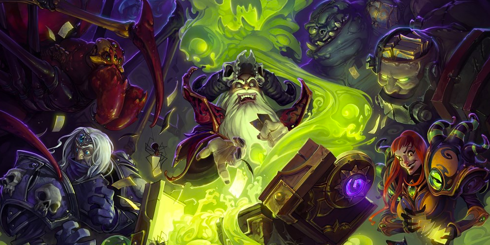
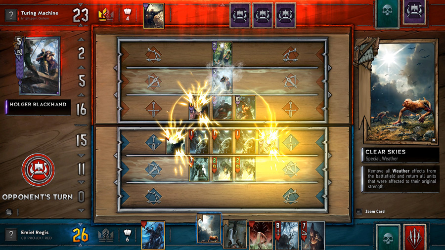
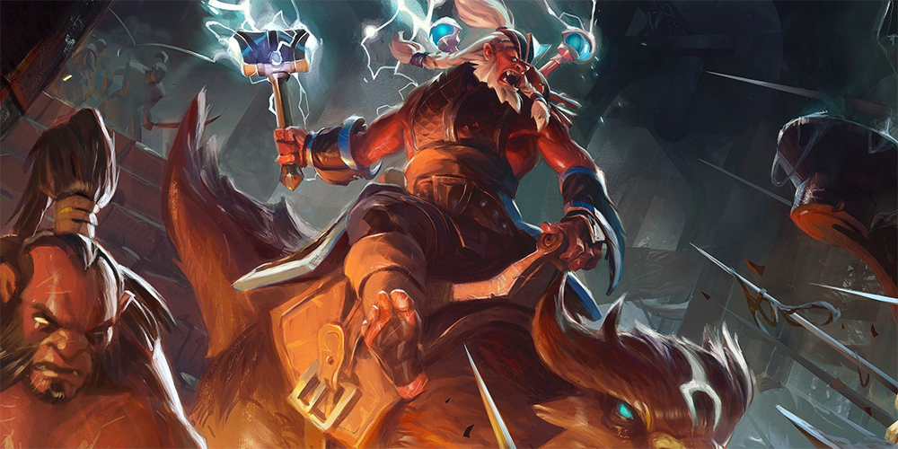

Yesterday when I was watching The International's broadcast, something perked my ears up. Valve announced that they were revealing a new game, right then and there.

<!--more-->

Obviously, for less than a second my mind went to the potential of _Half-Life 3_. Eventually, I realized this was pretty unrealistic. We were treated to a very small teaser with a logo reveal for _Artifact_, and then a subtitle that seemed to suck a lot of air out of KeyArena: "The Dota Card Game."

https://youtu.be/OR4jPtrDCLo

I feel that disappointment comes from a few different areas: the card game genre is already crowded, fans want to see Valve do something _new_ (not "copy Blizzard" or other companies), and that there simply isn't enough attachment to _Dota 2_ as a property in order to care about something new.

Card games based on other properties are based on one thing: fan recognition.

This extends to so many things, even before _Hearthstone_ became a global juggernaut: I remember looking at booster packs of games based on X-Men, DC and WWF properties when I was younger, and that was even before things like Pokemon or Digimon cards. By doing this, you want your players to be able to onboard themselves to your product because they see something they already know and identify with, and want more.

This is important, because collectible card games can be an unforgiving environment. You need to be able to learn a new ruleset and playstyle for something that holds a lot of different possibilities. The gating of needing cards (physical or digital) to play how you want means investment of time or money is rewarded. Getting bored while learning or giving up easily means that you're losing customers.

<figure>

<figcaption>

"Curse of Naxxramas" was based off of a popular dungeon in WoW Vanilla's dying days and Wrath of the Lich King. Credit: Blizzard Press

</figcaption>

</figure>

This is why _Hearthstone_ was so successful: it played off the nostalgia people had for their positive experiences with Blizzard's MMO _World of Warcraft_. Even if they weren't playing currently, _WoW_ was such a landmark in the gaming lives of so many people that they likely recognized the characters, settings and mechanics that _Hearthstone_ portrayed. This carries forward with every new expansion Blizzard; they are based off experiences that people know and remember as being fun.

If Blizzard didn't attach this meaning to their card game, there would likely be a lot less involvement from people who normally wouldn't pick up the genre. A _Hearthstone_ not based on the _Warcraft_ universe would not be as big today.

<figure>

<figcaption>

Credit: CD Projekt RED's media section

</figcaption>

</figure>

_Gwent_ holds a similar function; starting as a card game within CD Projekt RED's _The Witcher 3: The Wild Hunt_, _Gwent_ spun off into its own standalone product. Similarly to _Hearthstone_, _Gwent_'s cards call from the shared lore of all the _Witcher_ games, and also expands into the lore of the books, which not all players may have read.

Because of this, _Gwent_ serves as a way for people interested in the Witcher world to get onboarded into searching more deeply into its history, and learn more about things that aren't touched as much. Factions like Skellige or Nilfgaard might be skimmed through by players within their adventures, and _Gwent_ gives them opportunity to revisit.

<figure>

<figcaption>

Credit: Valve Software

</figcaption>

</figure>

What got me nervous about _Artifact_ is that Dota does not have that much lore built into it. Besides the paragraph that accompanies every hero for flavor and the occasional audio response when meeting a relevant ally/enemy, we truly do not have much to go on when it comes to how the world functions.

This expands, though, every time Valve release a comic, usually to hype a new patch, hero, or update. It gives us subtle peeks inside the world of _Dota_ _2_, letting us see how characters interact with each other and how things function. However, in terms of an over-arching plot, a lot is still in the dark: certain forum posts or speculation waver between feeling in-canon or not, and references are rarely definite.

A side effect of this is that is becomes harder for fans to attach themselves with different characters without the anchors of events or relationships. While someone may like the aesthetic or playstyle of a character, sometimes I feel like we need to hunt for shreds of _anything_ that might tell us more.

I worry that the lack of information will hurt _Artifact_'s chances of attracting an audience, mostly because I feel that the **_game of Dota_** is the main reason to play, not seeing the characters we love do different things.

From what I'm hearing, _Artifact_ will not be a straight rip-off of Hearthstone. It will feature three different boards, similar to _Dota 2_'s lanes. It will focus on an extended game of killing enemies to improve your own, adopting mechanics of farm and levelling up from the game it's based on. It looks like the teaser, because of its vagueness, gave the audience a terrible first impression: "this seems really lazy, and it seems too similar to what we've seen before."

It's up to Valve to fix this impression.

I wish the best for _Artifact_, mostly because l hunger for more content in relation to the Dota 2 world. Hopefully seeing the opportunity to grow both properties is what allows it to succeed, instead of just thinking "Oh people love Dota, so we can count on them to automatically love this, too."
