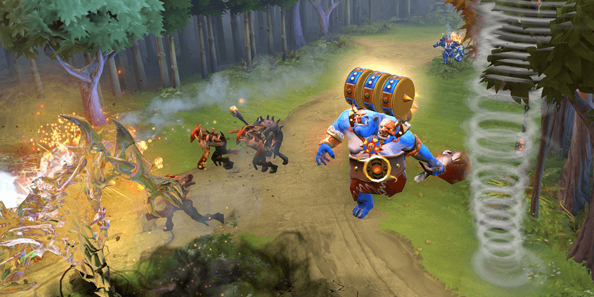

A couple years ago I had a project called BetterDota; basically, it was an idea I concocted to make my journey to get better at Dota 2 into a narrative more palatable to an audience.

It was an answer to a pretty simple question: "as someone who isn't good at Dota 2, how do I make people want to watch me improving?"

In short, you want to turn that journey of improvement into a narrative. This sounds pretty simple on the surface, but I find that without planning, it's a lot harder to make the experience of your journey consistent.

Figuring out what you need to do to illustrate this starts with another question: what makes people engage with the journey of another person?

1. People enjoy the personality of the person undertaking the journey
2. That person is undertaking something they can't, but wish they could
3. That creator is a lower skill level than them, and they enjoy seeing the same problems they solved be overcome by someone else
4. The creator is a higher skill level than them, and they want to learn from the experience

The underdog story is one that's consistently been a well-received one. People like being able to root for someone who is clearly trying, and when you finally _do_ triumph, your audience feels rewarded for investing in the journey.

When I was pitching this to a couple friends, I framed it in the example of someone who had never run before starting a running blog.

That person would write or create media around _every_ run they went on, tracking their progress, how they felt, and the results they saw. The thing is, it wouldn't be all roses: the failure and the "picking themselves back up" would both add much-needed **authenticity** and realism to the story. This, obviously, shouldn't be faked.

Even the most seasoned runner would enjoy the idea of a blog that would chronicle someone's journey from the couch to going out for the first time, hating it, but persevering and growing. The person could run a 5k, fail, set goals, fail more, but eventually achieve that thing they wanted; since the audience had been there the entire time, they saw the struggle and the effort it took to overcome it. It would almost be like having a friend writing letters to you talking about their day-to-day progress: personal, genuine, inspiring.

Again, even if you think your story is generic, it depends on how you present it, and how authentic you are. I stress that authenticity because that's what draws us into streamers, vloggers, and even reality TV: we see a little of _ourselves_ in these people. If a product is overly forced, manufactured, or over-dramatized, people tune out.

Your product doesn't have to be anything over-the-top or extravagant; it just needs to have your voice explaining your experience in a way that connects. How jaded, disappointed, or sad you can be also depends on what that brings out in your story: few people want to read a daily or weekly update of how someone just _hates_ that thing they're doing.

Obviously figuring out the balance isn't the easiest thing in the world, but there are ways to get started.

## Planning

The way I divided up my content was three slices: immediate term, short term, and long term.

**Immediate** content was things like streams themselves, and tweeting out summaries of how well I did on that night's streams. If I played 5 matches, I made a social media template to show which characters I chose, what statistics I finished with, and what my overall record was.

This allowed people to be reminded that I was currently doing the project, and gave them an easy way to catch up if they were interested but couldn't come out to the stream. The tweets also allowed reflection in my experience that let that voice pour through. If I was frustrated, happy, or celebrated a milestone, people would know it. This would (hopefully) lead them to either coming out for streams, or investing in the other two content pillars, because one piece of this immediate content piqued their interest.

This content goes on platforms you want to grow: Instagram, Snapchat, Twitter, Facebook Pages and elsewhere give people an inside look at your project, and the minute-to-minute progress of it.

**Short-term content** allowed me to further reflect on how I was doing, feeling, and learning, but was aimed more at people who either had a busy schedule, or could not actively seek it out. For the BetterDota project, I created a weekly blog post with a summary of what went on that week and the next week's plans, but also made an e-mail newsletter that allowed people to be **reminded** that I was putting stuff out.

I figured that since not everyone paid a huge amount of attention to Twitter, e-mail was still king for a lot of things. Having a newsletter is a pretty one-way method of communication, and it enables people to feel like they're getting this exclusive digest of a story to read on their phones on the commute to work. Nothing too long or involved, just trying to condense the feeling, rather than the raw stats. The newsletter and blog also gave them links to my upcoming schedule, and ways to catch up on the "story" if they were new.

This content was also made to be easy-to-produce, because...

**Long-term** content is what you'd call a "cornerstone" type of project because it is essentially where you're hoping your main numbers are coming from. Immediate and short-term content are there so you are building a strong enough brand to be able to get people to invest deeper. You are trying to get people to _believe in your cause_.

This is your planned YouTube combo videos, your guides, your vlogs — the things you are putting effort into and want the most amount of traffic to go to. This is what leads people to really appreciate the effort you're putting in, and it is less week-to-week reporting of how things are going. This is your reflection, your growth, and your triumph/failure.

By building up this fan base with _consistently good content_ that **doesn't slack off**, you are telling people that you will be sticking with this and that their time is well-spent. You start to see regulars who are interested in your progress, and may be tracking it on their own. You may have higher-level people wanting a guest spot for coaching or interview. You may have your own memes or in-jokes develop, which are _great_ for merchandise.

You're building goodwill by providing value, and then leveraging that in a balanced way.

## More notes

As a caution, this long-term content may take a while to get going, and it can feel like the immediate and short-term content aren't actually _doing_ anything. However, you're looking at the issue from the audience's perspective: if they don't see a story to engage with or invest themselves in, they won't.

This means that yes, you need to figure out a reason for people to keep being interested in you. You need to break down your practice, local competitions, or online grinding into stories that you can tell regularly. A good way of looking at it is to think "even if today completely sucks, how can I do something around that?"

You need to essentially always have something to update people with, even if it's you doing slightly better than you did before because of a slight tweak to your practice. This stuff _matters_ because people want to _care_ about how you're doing this. This is why we see so many podcasts and tabletop RPG streams doing well with ensembles: they make us invested in what's happened, what's changed, and the people playing.

By remaining authentic, you make people _crave_ that little stuff. You make people want to see _you_ do better. You form good habits about illustrating your journey, and you **create value** for those who want to make a similar one, or just spectate.

Creating value is all this is; you're rewarding people with something they can believe in after you put in the work.

If you're interested in more of my work around content planning, you can pick up my new ebook, _**Event Content Planning for Esports**_ on Gumroad. It contains more of this type of planning and questions that you can use to answer the question of what you're strong at.

_Stock images on this page come from Pexels and have a CC0 license._
