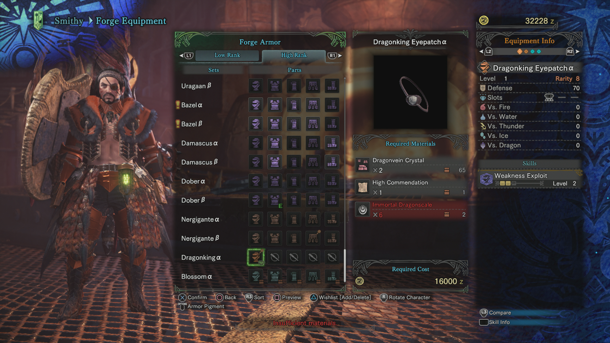
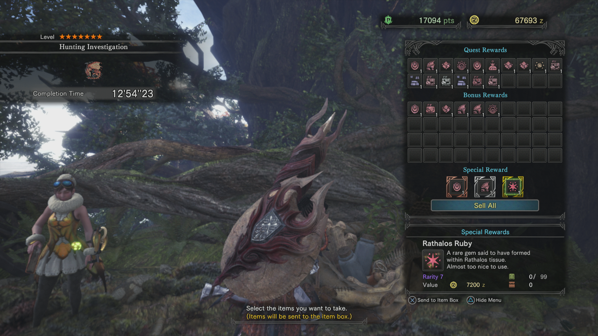

_RPGs are my favorite genre, and I wanted to write about them from a more zoomed-out perspective than just dealing with their stories. Also, I wanted an excuse to post the "Rich Rump" picture._

I’ve become more cognizant of what people call "gameplay loops" lately. They're pretty simple: you figure out what the main cycle of play in a video game is, and that's the loop. In sports games, it's "play, score, win/lose, repeat." In RPGs, it can be "fight things to get stronger, and once stronger, move to new areas in order to repeat."

In the latter case, things like progressing story are incidental to the loop. They're _there_, but when you zoom out and simplify a video game, it can be eliminated unless the story is absolutely essential to how the player plays the game _at all times_.

<!--more-->

I establish this concept because I've found the _Monster Hunter_ series to have a pretty blatant gameplay loop: kill things, get materials from capturing/killing them, construct things out of those materials, and then use the new items to tackle more challenging monsters.

The newest title in the series, _Monster Hunter: World_, is my introduction to the series, and I’ve found that the sense of progression you get is unique because it's semi-permanent. Your stats and abilities are tied to the items and weapons you create, not to your character. There is no formal “level up” that might happen in other RPGs, and putting on lower-quality armor is as good as knocking you back in time.

I found this out the hard way when I tried one of the game’s “Challenge” quests, which outfit you with a pre-determined set of armor and weapons. It felt weird, because the only thing that I was bringing into the fight was the experience I had gathered in my time playing the game. I couldn't grind in order to conquer the challenge because there was nothing _to_ grind. Despite passing by the monster I was fighting tens of hours ago, it still gave me trouble because my gear dictated my strength.

While _Monster Hunter_ will draw comparisons to the _Dark Souls_ series because of their similar styles of combat, the latter will give you a chance to upgrade stats with no permanent regression. In _Dark Souls_, killing monsters gives you souls, and dying will drop all that you have on hand. Dying while trying to get them back means they vanish forever, but in that case you’re just left at square one; there’s nothing stopping you from killing monsters, re-spawning them, and upgrading that stat that might give you an edge in battle.

This way, even the worst _Dark Souls_ player can triumph if they put in enough time. While not everyone has the patience, hypothetically, the possibility is there.

With _Monster Hunter_, there is a definite ceiling to that grind, as there’s only so much you can prepare. While there is a large tree of possible weapons and armor, there comes a time where the materials you might need may come from the encounter you’re walled off at. At that point, there is nothing you can do besides improving at the core act of gameplay, and this isn’t exactly the large, semi-masochistic badge of “get good” that people will be proud of earning. _Monster Hunter: World_ makes it easier to feel accomplished by putting yourself in the **role** of the hunter.

Each monster has weaknesses to elements, or statuses like paralysis and sleep. They might even _attack_ with certain elements, which means you can make armor that resists them. Knowing these things means researching through the game, or online; you might also take into account _where_ you’re fighting them, or whether you can drink potions that negate environmental damage that might build up.

All these things made me feel **amazing** when they came into play. For example, I found a certain fight frustrating because my main weapon, the Lance, could not keep up with the monster’s mobility. It made me switch to the Sword and Shield, which had options the Lance didn’t. Fighting another monster in a field of poison mist made me fail from constantly running around to mitigate it; stacking a resisting skill meant that it was no longer a factor.

In other games, this kind of preparation can be seen as cheesy, cowardly, or not worth the time. Here, I found myself not caring because at least I could pass where I didn’t fail before. I captured the monster and got my items — it might’ve been ugly, but it worked. On to the next.

Itemizing for the encounter (unless **specifically needed** for something special) means a potential loss of damage from optimal builds. In team games, this could mean your group’s success or failure. With _Monster Hunter_, this adaptation is built into the game. Because the failure state of most missions is dying a certain number of times, it’s usually a good idea to do what you can to stay alive. It also brings a certain flavor to the world, and enhances that gameplay loop; you know that all the time spent going out into zones to harvest materials that make you lava-resistant will really pay off in the end.

Over time, your actions, rather than your level, leads you to predict movements better. You start recognizing fight mechanics or exploitable animations, which means less time chugging potions and more time poking at the monster. I felt this really hard last night when I went back to help a friend with something he needed from a an encounter in the middle portion of the game. Something that would one-shot me or combo me into death before felt sluggish, predictable, or just non-threatening.

I could _feel_ how much that experience paid off, and that’s not always something that comes across as strong in video games. As I grow older and have less time or patience for hardcore grinds across numerous titles, I can appreciate something that’s finely crafted to the point where the carrot-on-a-stick of progression gives you a little nibble now and again.
