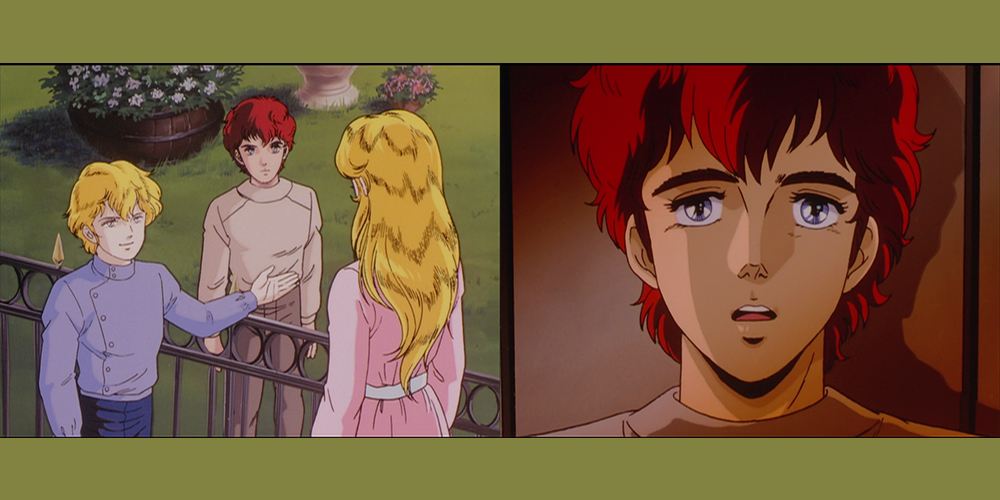
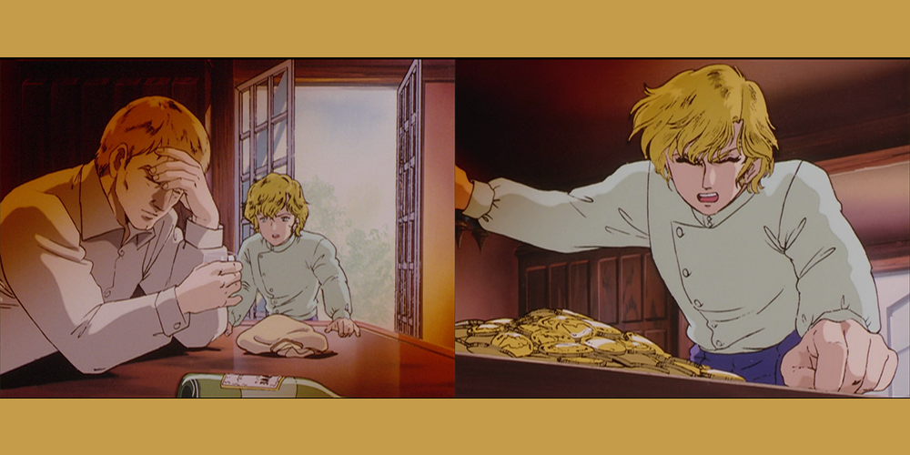
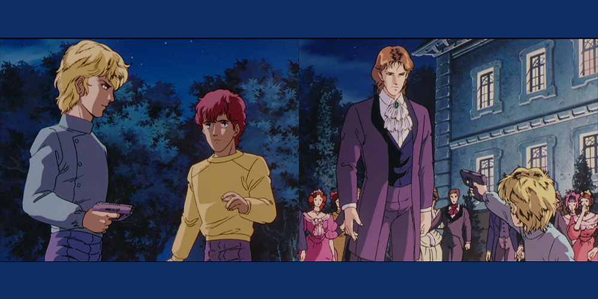

After a nice jaunt back to the FPA in the last episode, _Legend of the Galactic Heroes_ pulls the opposite and brings us into the Empire's neo-classical clutches.

**Spoiler warning, as usual.**

| # | Episode Name | Original Air Date | Focus | Wiki Link | Watched Version |
| --- | --- | --- | --- | --- | --- |
| S01E04 | "Empire's Afterglow" | 1989/01 | Flashbacks | \[LINK\] | Central Anime |

◄ See previous episode | See next episode ►

This episode is important because it subverts who we expect is going to be the protagonist on this side of the conflict. After being introduced to Reinhard Lohengramm, we expect that the majority of the time is going to be spent with him; I was really refreshed when we got so much of a backstory from the eyes of Siegfried Kircheis, the Robin to his Batman.

Kircheis is interesting to me because he seems to be almost along for the ride. He doesn't know how to process his attraction to Annerose because he's so young, but is able to channel that into a pact with Reinhard when the latter decides that he's going to take down the Goldenbaum Dynasty from within. He's also meant to be explicitly middle-class in a world where the aristocracy reigns supreme, and seeing how close he is in stature to the lower nobles of Annerose and Reinhard almost says that they might as well be equal.

I wanted to come back to Kircheis/Annerose for a second. It's so fascinating to see animators working with what they have to convey emotion; it kind of snaps into my understanding that Kircheis doesn't know how to process what might be attraction. He's scared and nervous, and his first instinct is to run away from it. This attraction doesn't seem to be acted on, and Kircheis doesn't seem like the selfish type.

His association with Reinhard seems out of loyalty to **Annerose** more than anything else, and I find it interesting that there's almost a ceding of what **he** might want out of his life. Reinhard has a dream, and Kircheis is not _quite_ as enraptured by that dream as you might think; unlike, say, _Berserk_'s Griffith, we don't see an explosion of charisma that brings Kircheis into Reinhard's umbrella. Instead, it's almost a single-minded respect of a simple direction: keep Reinhard safe.

We don't see the same fury and fire coming from Kircheis as we do Reinhard. Instead, he's colder, calmer, but not so "Vulcan" that he would immediately discard the notion of seizing power from the dominant hierarchy. Coupled with the next episode, Kircheis is probably my favorite part of this beginning stage of the story. I want to see more of him, and see more of the internal monologue that goes along with where the story is headed.

I'm not sure how to feel flashbacks in general; sometimes they're crucial to keeping things rolling and telling us things that might not come up in exposition, but at other times they can be clumsy and plodding, taking forever to get to their point. This entire episode is one giant flashback, but it's a prologue that needs to happen.

Seeing Reinhard's fury at Annerose's sale as a concubine to the Emperor contextualizes why he's going so far to get revenge. We see the relative weakness of spirit that his father displays, the problems with the latter's alcoholism and his ultimate capitulation to a large enemy that he cannot face; it's easy to see why Reinhard would be frustrated by his father's inaction to the point of wanting to take matters into his own hands. His father represents the weakness that he cannot become.

Something about this feels almost too romantic to be treated seriously — I'm not sure if it's intentional. These kind of plot progression points in Reinhard's all-encompassing love for his sister and the plot to take her back by gunpoint seem almost fairy tale-like.

This kind of stuff seems surreal; on one hand I want to trust that the anime is presenting what is the truth, but it might also be a bit of unreliable narration that we can chalk up to childrens' memories being a bit dramatic and having the tendency to gloss over/combine events.

I don't know; is that the point of _Legend of the Galactic Heroes_? To tell a fairy tale? This seems to clash with the political stuff that we saw last episode in tone quite loudly, but maybe that's the point — it could be another point of contrast between the Free Planets Alliance and the Empire. It could also just serve as a point of comparison later; the wistful vision of the Empire could be far from it in reality.

It's weird, because the last review I did was something I wrote while I was re-watching the episode, side-by-side and capturing screengrabs. This blog came almost completely from memory with a bit of a free-flow structure, and I think I almost like that more.

Thanks for reading, as always.

◄ See previous episode | See next episode ►
