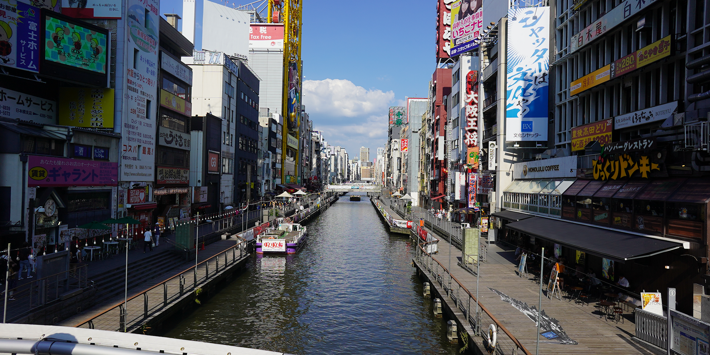
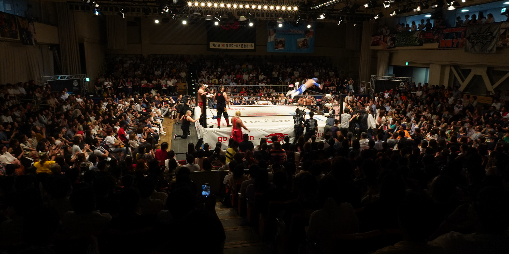
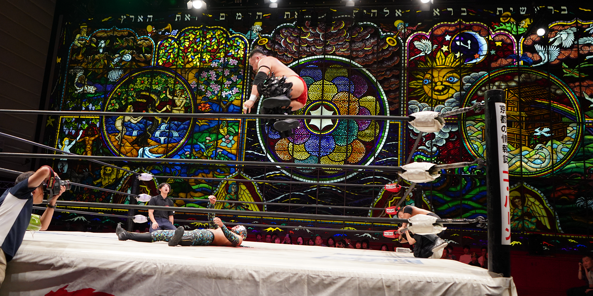
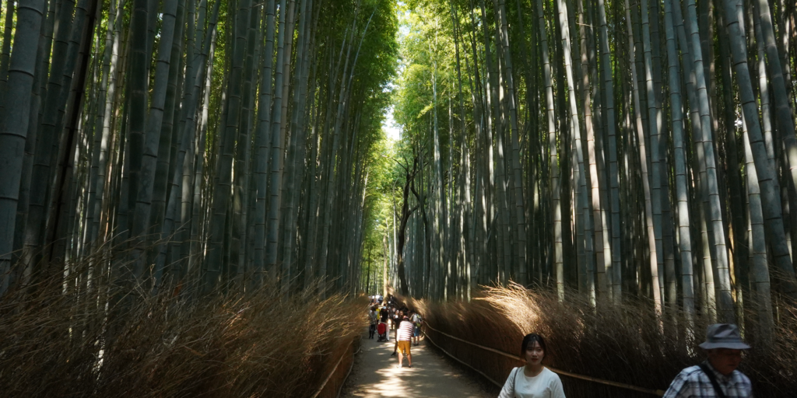

I've been putting off writing something about my Japan trip, mostly because it's hard to know exactly where to start. This probably won't be the only thing I write about it, but I feel it's the most important thing for me to commit to a post.

<!--more-->

I planned this trip mostly because I knew that the longer I put it off, the less likely I was to go on it. I knew that the longer I waited, the less like I was to take a chance on going as big as I did into the country, too: I'd probably end up regretting that.

I know that sounds like a whole lot of FOMO talk, but I think it was emblematic of the whole trip; Japan taught me a lot about taking opportunities as they presented themselves to you, without feeling obligated to.

You've probably heard or read those inspirational Instagram posts that urge you to "say yes" to more things, and take more chances. I feel like there's something important about balancing that impulsiveness with actually knowing what your limits are, and that's something I was forced to confront, too.

In planning this trip, I wanted to do a couple things for sure, and booked enough time to definitely get them done. One of my anxieties, though, was the time where I _didn't_ have anything planned: I was worried that either I would do _nothing_, and later view that time as a waste, or end up _bored_ in a foreign country, which I felt would say a lot about me.

Both are things that didn't happen, and now that I'm thinking about them, were kind of dumb to overthink.

I've admired Japan culturally from afar, and most of the things I wanted to do reflected that admiration. I didn't want a "tourist" experience, which I'm not sure is something _anyone_ really wants anymore - we're all chasing something that feels genuine, and that feeling of being pandered to in a controlled environment doesn't exactly ring to that.

Besides the things I definitely wanted to do, the happiest times I spent in Japan were when I took the chance to just pick a direction and wander. The idea of choosing a landmark to see or an attraction to visit meant that there was so many more interesting things _around_ those locations, and that kind of stuff could eat up a whole day.

However, there was still a bit of loneliness that crept in, mostly because I made the decision that this trip would be a solitary one. I struggle to travel with others because I feel hesitant to share the things that I want to do (that other people may find weird or dislike), and I also find myself deferring what I want in order to satisfy others. With a trip around the world, I didn't feel like that was something I wanted to take a chance with.

That left a fairly isolating experience, especially when you kind of get a second-hand observation of what you see is people having a good time with people they care about. I want that kind of connection with someone, but found that traveling alone here gave me more time to focus on myself, for better or worse.

One of the things that people consistently told me when I reconnected with people back in North America was that they were proud of me for taking the trip, especially alone. While I could understand the first part (I'm a bit of a workaholic), the second part kind of left me a bit confused; I didn't exactly understand what was admirable or unique about doing this kind of thing by myself.

After more thinking, it kind of clicked a bit: I kind of realized that it takes initiative and a sense of... bravery? (probably not the best word) to be able to just say "I am going to do this today, and I'm going to figure out how I do it as I go along." Taking a step back, yeah, I could see how people might see traveling alone to a country that doesn't have English as a primary language intimidating - even more so when the primary things that are going to keep you afloat are stressful to maintain in that foreign environment. Google Maps and Translate were _essential_ to keeping my head on straight, and being able to navigate the train system to get to certain places could leave people baffled.

I'm not stating this to say "hey, I'm awesome"; it's more that I am not the type of person to give myself _any_ credit when it comes to growth, or things that might build my confidence. I've been trying to work on this to the point where I can build some kind of positive self-image that I've been lacking.

I think that's what stood out to me the most about that time alone; I felt laser-focused on how I presented myself to the public daily as a foreigner and a tourist. This amplified the confidence issues I already am struggling with: I felt fat, and unattractive, and like I should be trying to do anything _but_ match the annoying, weeby, intrusive, ignorant outsider stereotype.

This also made me reflect on that reflection (because anxiety tends to spiral); it made me realize that I don't really _love myself_, and that would be something I would need to work on just out of a sense of long-term health.

This mental storm didn't exactly keep me from seeing and doing the things I wanted to; it just made me more self-conscious in the moment, and sometimes I felt like almost apologizing for my presence or intention.

It took me some time (and maybe some annoyance building up), but I realized that this was incredibly unhealthy, because in most of the situations **I wasn't being a problem**. Instead, I was basically punishing myself for having needs that were perfectly valid. Fighting for those needs and being okay with having them are more difficult that just deferring them and punishing yourself for having them in the first place; it takes courage to be able to face them and fight for yourself.

I've rambled a bit, but maybe that's where this post needs to end. This trip taught me the importance of fighting for myself, and seeking out things that make me happy unapologetically. A lot of my mental health issues stem from feelings involving guilt and shame, and pushing myself into situations where I'm forced to confront that feels like a healthy place to start to heal.

I'm hoping I can go back to Japan one day. By that time I want to be healthier, and more comfortable in my own skin.
