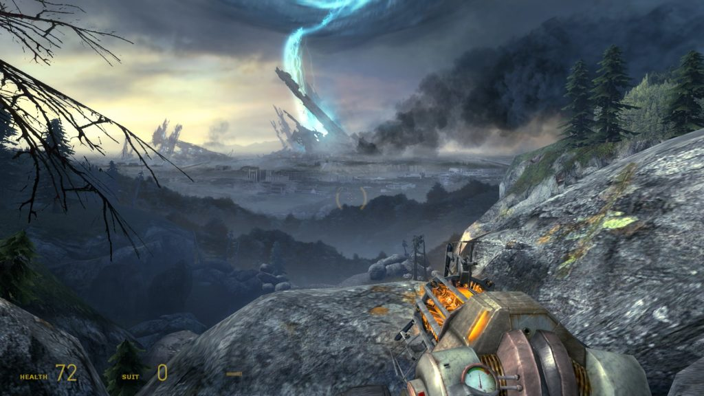

I've been finding that I've been oddly focused with my gaming time lately, and have knocked a few things off my backlog. This is pretty uncharacteristic for me, because I feel like I'm pretty resistant to just closing the door on things; I'll usually pick up new RPGs impulsively, and with each one of them being several dozen hours long, it's not like I'm sticking with them until completion.

<!--more-->

This leads to a cycle of burning myself out on games, leaving them to rot, then almost feeling like I need to restart them to "get the real experience." That prospect just leaves me not wanting to come back to them at all.

But hey, I've actually completed some things recently, so let's write about them.

## Doom Eternal

I've picked up and put down _Doom Eternal_ a couple times, and I almost feel a bit sheepish admitting that I preferred _Doom (2016)_ instead. I went into this on the podcast, but I feel like the direction that the game has taken pushes me into a playstyle I don't particularly care for.

_Doom Eternal_ focuses on giving the player a steady stream of new mechanics, and then eventually expects you to enjoy the game a lot more when you have mastery over all of them. You have a wealth of different movement options, are notably more fragile than the previous game, and have much, _much_ less ammo.

This is to encourage you to have to balance ways of restoring health, armor and ammo along with keeping yourself alive long enough to do so. Setting enemies on fire (usually at the cost of a cooldown) means they spawn armor pickups on damage and death. Melee executions restore health, and chainsawing enemies fountains out ammo from their corpses.

In theory, this means that when you finally nail the movement and flow of combat, you're switching through guns as they run low on ammo, and to match a gun up to a specific weakpoint on the game's many enemies. Enemies do a lot more damage because the player has more tools to restore it, but this doesn't necessarily make things _fun_.

Instead of finding a couple guns that I enjoyed and adjusting my playstyle as needed, you're kind of _shoved_ into using the entire cast of guns at the expense of efficiency and mostly annoyance. Some enemies need to be staggered or dealt with in a very specific way, or else it's just painful — at best, it'll take a long time, and at worst you'll either run out of ammo for the gun you like using, or you'll die in the process.

This matching game ended up feeling way too gimmicky, and despite tasting that flow state a couple times, it wasn't enough to keep my attention. I kind of feel _bad_ about dropping it because a lot of people regard it highly — while it definitely **is** a good game, it isn't really a good game **for me**.

## The Way

I've never been into point-and-click adventure games, mostly because they expect players to enjoy the trial-and-error or logic puzzlings of "I know what I have to do, but how do I get the tool or method to do it?"

Sometimes, the game can be very obtuse, and other times it just feels mechanically clunky. _The Way_ falls into that latter camp, mostly because the game's puzzles demand a certain precision that the engine doesn't offer. Influenced by games like _Out of This World_, you're set in a sci-fi environment and find that you're _very_ fragile. Falling damage was probably my most common death type, and you die instantly.

I won't spoil the story (because it's actually pretty good for a hard sci-fi game!) but the controls and jankyness of hit detection can make this a really frustrating experience. One particular set piece has you sliding down a hill with spike traps of rebar sticking out from the ground; one hit kills you, and the game's physics system when it comes to jumps just makes the entire sequence a pain. Dying means you do the entire thing _again_, and when multiple sequences just feel like dumb luck, it becomes very demotivating to have that progress erased.

Feeling like you're getting lucky once in a sequence is fine, but your _overall_ success feeling like it requires multiple successful luck rolls just makes me tune out.

## Half-Life Series

With _Half-Life: Alyx_ out and me not getting a VR headset any time soon, I fgiured it was time to revist the _Half-Life_ series for nostalgia's sake. I'd never played _Half-Life_ 1, and once I read about certain story spoilers for _Alyx_ I found myself really wanting to experience that world again.

I've always read conflicting opinions as to preference between 1 and the _Half-Life 2_ games, and I wasn't sure about which side I took. I almost wanted _2_ to be better, because it was something I enjoyed. However, after finishing _Half-Life 1_, I can see what people mean.

Guns are just better across the board. Playing with HL1's SMG and shotgun and going to HL2's just felt like a downgrade, and trying to kill with any kind of precision in 2 just ended up more frustrating.

In terms of environments and pacing, I also felt that _Half-Life_ had a much better sequence of levels, and it really nails the progression of telling a story without cutscenes. When I played _Half-Life 2_ again, I had trouble feeling like there was a sequence that felt like the game was done spinning up: it never really felt like "okay player, you've seen all the stuff we're setting up. Now it's time to go and enjoy normal gameplay for a bit." You could argue that this happens around Nova Prospekt or the return to City 17, but these feel done almost too quickly, or they're too short to actually enjoy.

Maybe I'm just bitter about the boating and driving sections. I'd always defended those as "not that bad" in the past, but it's kind of just driving from one set piece to another, and all that time spent navigating is just padding.

I _did_ go through Ravenholm with just physics objects as weapons, which was really fun. I think headcrabs and other small, parasitic, jumpscare enemies are my worst matchup in terms of maintaining my composure, but the more I played the better I got with them.

I'm still going to grenade every vent I have to travel through, though.

## Streets of Rage 4

I've always liked beat-em-ups in theory, mostly because they're better with friends. Two of mine pinged me on Discord the other day and asked me if I wanted to join them playing _Streets of Rage 4_, and I was actually pretty happy to try it out.

When I read the features list for _SoR4_ before this, I felt like I would pass on it, mostly because it didn't have any kind of persistence or growth from your characters that I wanted. However, in playing it, I found that the combat system was fairly deep despite being only really three buttons (punch, special, jump), and with more people you can get really creative with bouncing people off the scenery and juggling them.

I guess I feel like a lot of my games need to come with some sort of permanence now, because spending $30 on a game with 12 stages (that play out the same way) feels like a bit of a waste. Sure, there's difficulty changes and characters to encourage replayability, but for some reason that doesn't do it for me; I would never play _Streets of Rage_ for fun on my own, and the format doesn't hook me enough to challenge myself with those difficulty levels if I'm not enjoying it with friends.

_Streets of Rage 4_ falls into this weird category of games that are bringing back older properties "right" for new audiences. While I can understand the hype for a "good" Streets of Rage, I never really had enough attachment to the old titles to really get excited for this one. It's a very fundamentally-solid beat-em-up with great character designs, fun combat, and great art for the backgrounds and bosses. Still, though, the system of the game itself doesn't seem more than a novelty for me.

My ideal beat-em-up is a modern version of the Capcom Dungeons & Dragons games, which had an experience/level-up system, and a degree of persistence. That's kind of what also led me to really enjoy _Castle Crashers_ and be interested in _Gauntlet Legends_. Having a character that you can build up over time and make your own makes me vastly more interested in playing.

It also confuses me that the online is limited to only two players when a lot of marketing really emphasizes playing it with more. My friends and I were able to play with Steam Remote Play Together, which allowed me to "couch co-op" via streaming my friend's game and emulating my inputs across the Internet. It actually worked surprisingly well, but I can mostly chalk that up to both of us having gigabit connections. I actually couldn't tell that it wasn't something that was playing on my own system, and that's some props for Steam.

Thanks for reading! I know these were some quick little snippets, but I figured they weren't big enough thoughts to demand their own posts. I hope you all have been having a relatively stress-free lockdown; I know that's a bit of an oxymoron, but hey, it doesn't hurt to try to be optimistic.

_Header photo by **Soumil Kumar** from **Pexels**_
