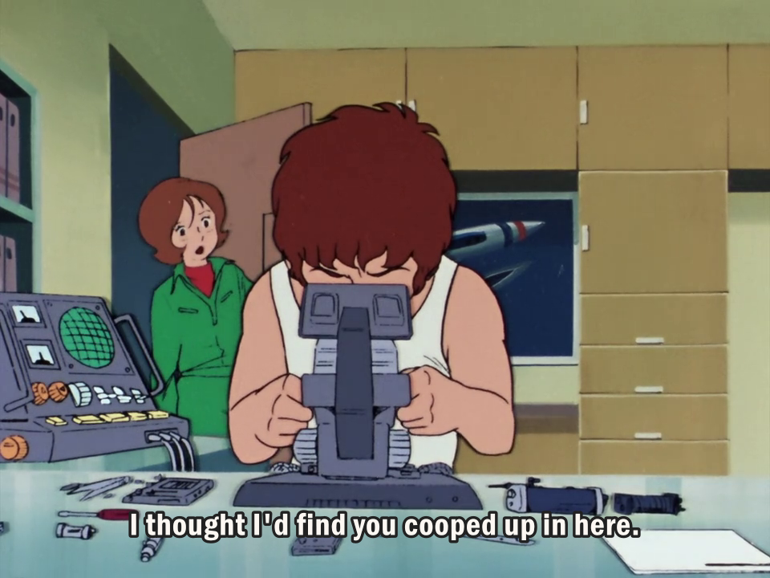
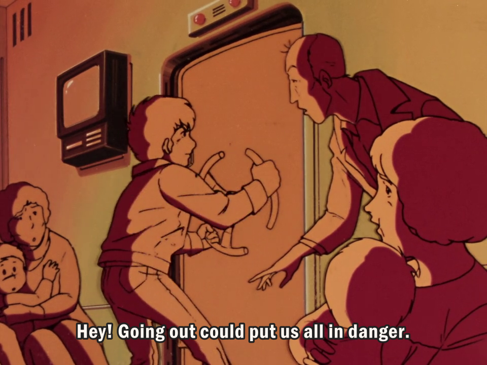
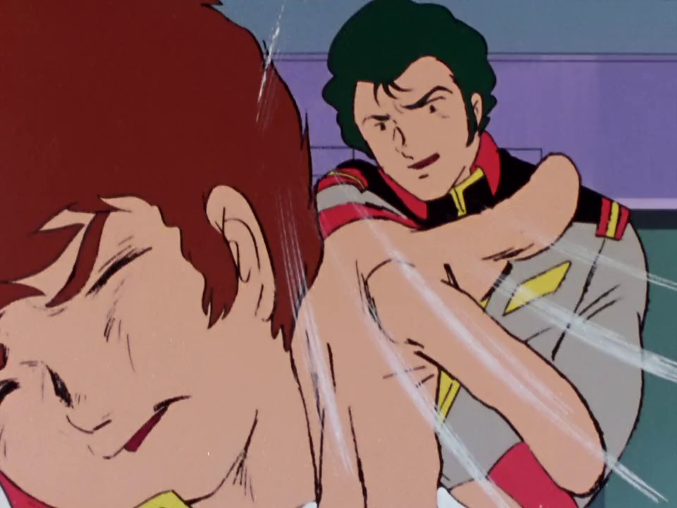
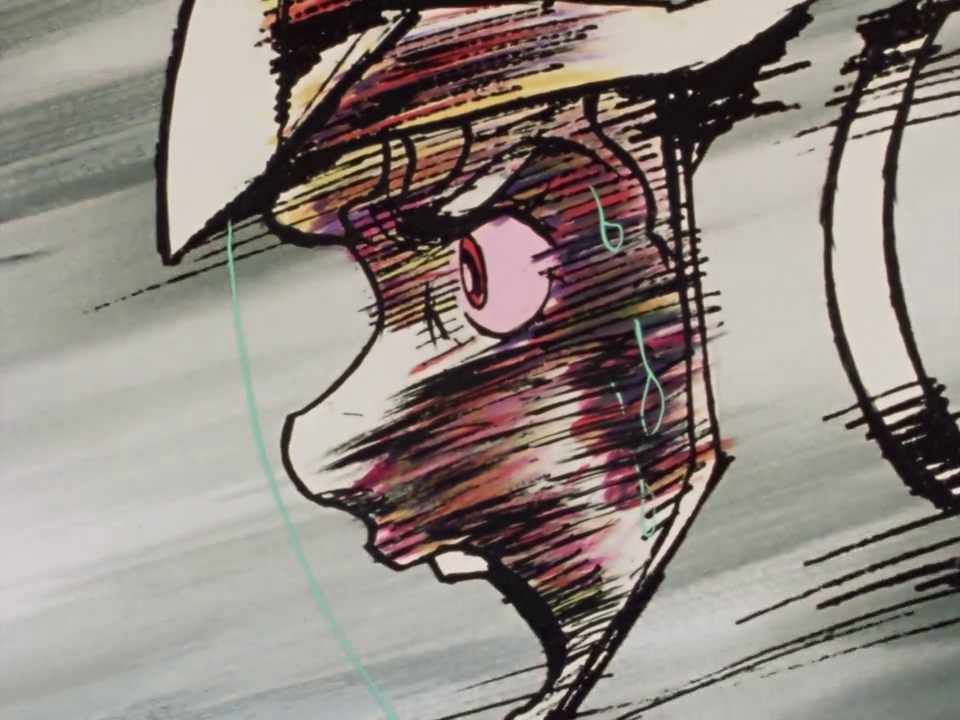
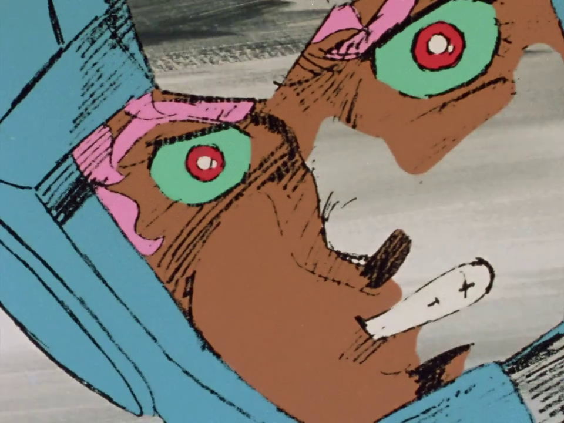
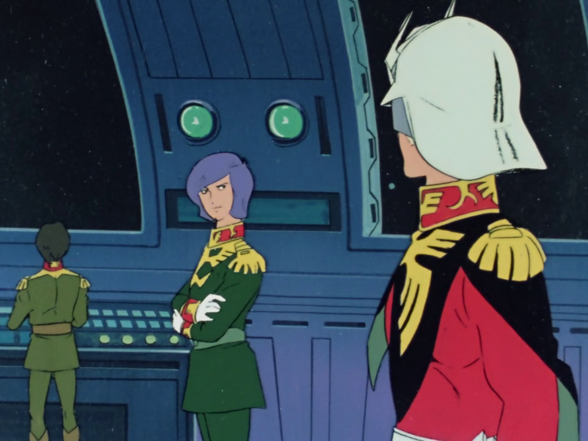
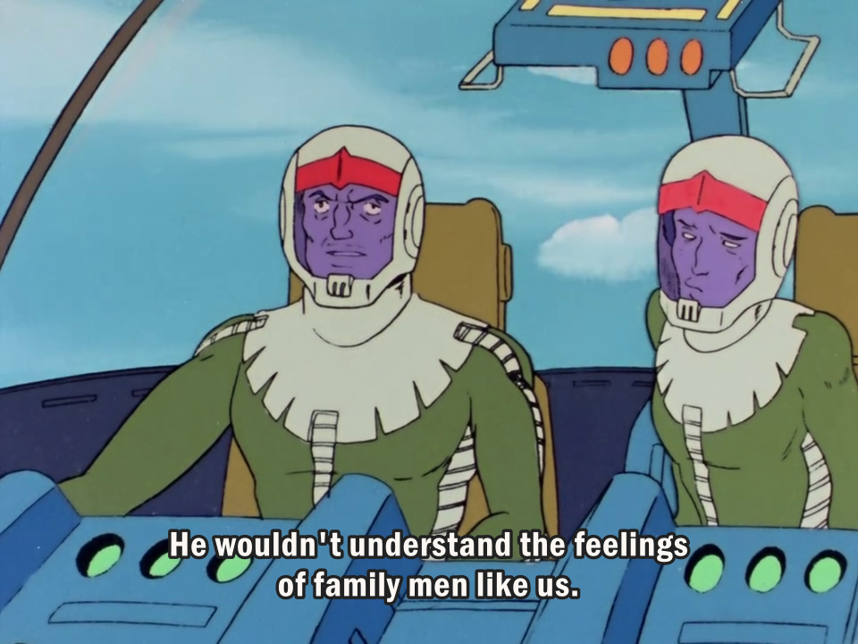
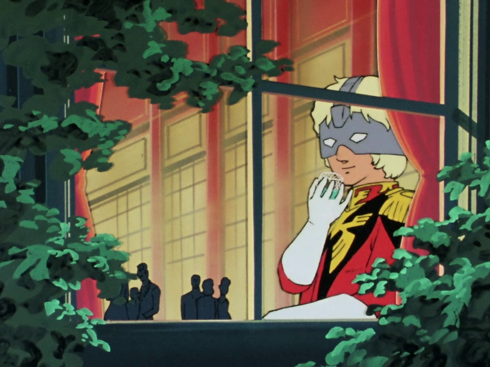
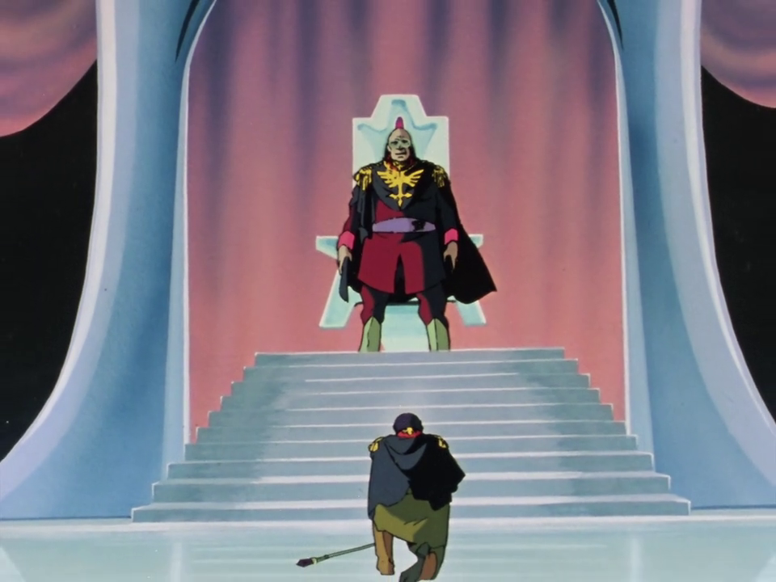
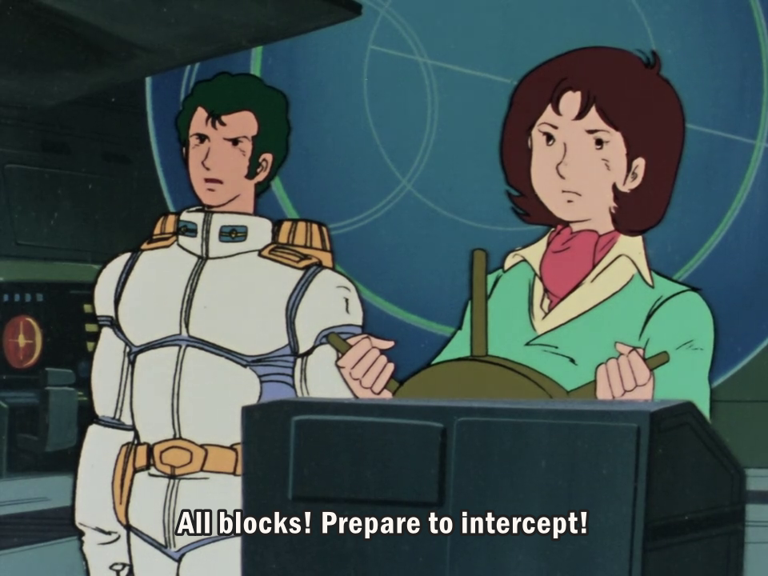

#### Spoiler warning

If you haven't watched _Mobile Suit Gundam 0079_, this article will go pretty heavy into spoilers for the first ten episodes (duh).

**If you're interested in an audio/video reading of this article, patrons on my Patreon get those as a perk.**

Check out my Patreon!

* * *

I've always had trouble sitting down and watching new films or TV series; this goes double for anime, or otherwise-subtitled media where I can't just plop it on another monitor and passively absorb it.

This is a problem, and something that I want to fix. I feel that it's gating me from some things that I'd otherwise like to enjoy, and it signals a problem with being present with just a single thing at a time.

Since losing my job mid-November I've been making strides to improve this, mostly through pursuing programs around mindfulness and meditation. I've also been unable to bike to the gym like usual, so I needed something to do while on the treadmill or bike. These two things kind of aligned, and I decided to just start watching something I've been meaning to for a while: the original _Mobile Suit Gundam_, or _Mobile Suit Gundam 0079_, to distinguish it from the others.

Like many other kids growing up in the early 2000s, we had the pleasure of seeing the dub of _Gundam Wing_ on TV. I never watched it all the way through (and I think I've only seen pieces of _Endless Waltz_), but I remember owning a couple figures, and otherwise enjoying giant robots blowing each other up.

Growing older, I've looked at Gundam at the distance like I would other "legacy" series, like _Super Sentai_, _Ultraman_, _Kamen Rider_ or _Godzilla_ movies; people who are into them are _really_ into them, but they're also so immense that it can seem impenetrable. After traveling to Japan and seeing the scope of Gundam fandom that's present there, I thought that "hey, maybe it's time to just crack the seal on it and see where it takes me".

So, after ten episodes of _MSG0079_, I figured I'd write a bit about what I found.

## War!

In most cases, _Gundam_ has been about war, and the effect it has on people. Some involve the soldiers, other involve civilians, and _MSG0079_ has the benefit of not having any real expectations to follow. Looking into prior series that Yoshiyuki Tomino directed before _Gundam_, they seemed to still be in that feeling-out phase of giant robots, and figuring out exactly what was appealing for them.

These series and the robots themselves served as power fantasies; they were able to act as tools for characters to exact revenge or their dreams, and for their audiences, it was a way to strike back at perceived evil with overwhelming force.

_Gundam_ opens with a similar kind of feeling. Amuro Ray is a boy who enjoys technology, and like many protagonists before him, is thrust into the driver's seat of a previously-secret project, the Gundam RX-78-2 ("the classic Gundam") in order to defend his home space colony of Side 7.

As Side 7 discovers the Gundam and its brother mechs, the Guntank and Guncannon, along with the _Pegasus_\-class starship the White Base, it's thrust into an adventure: they need to get everyone off the Colony, defend themselves from chasing enemies, and figure out what the hell is going on.

In the first 10 episodes, there isn't a lot of downtime, mostly because the Principality of Zeon is constantly on their tail. We're also introduced immediately to Char Aznable, the famous masked rival for Amuro, who, as we see, has motivations of his own.

The pace sets this frantic feeling because the White Base is constantly on the run. The crew of the spaceship is forced into an incredibly disadvantageous position in manpower and leadership, as civilians are forced to use things like simulator training or heavy machinery licenses to fill in for more capable people who are dead.

This feeling of "young overtaking the old" or "trust in the younger generation" is very common in these kind of works, and I imagine this is a continuation of that. The actions of the previous generation are being dealt with by the next, whether they want to or not.

Their inexperience is covered for by the overwhelming power of the mobile suits and the White Base itself; so far, we haven't seen much in the way of what can threaten any of these characters with death. Instead, the threat is capture, and the status of the refugees on board.

I guess the important thing to note is that there's still _fear_ associated with what they need to do, and there's still scenes of the stress that comes with being thrust into a combat scenario with no training. People who've never thought about combat are suddenly urged to kill, and I think that's one of the things Tomino is trying to get across: war isn't a game.

In what I've seen so far, the crew are being carried by how powerful all the technology they've discovered are; the mobile suits haven't really been damaged yet beyond a destroyed Gundam shield — the White Base has had some damage, but we haven't seen any lasting effects of taking those hits.

I somehow doubt we will, because, well, it's a pioneering anime; while we've seen resupplies happen on both sides, things kind of get magically repaired in the process.

\[video src="https://mattdemers.com/wp-content/uploads/2020/12/Gundam\_E02\_Clip.webm" mp4="https://mattdemers.com/wp-content/uploads/2020/12/Gundam\_E02\_Clip.mp4" loop="on"\]

There is still this shock and awe associated with the Gundam, because it severely outclasses Zeon's Zaku mobile suits — they're still running machine guns while the Gundam packs a starship cannon in a gun. I like this idea of Zeon suddenly being on the back foot due to the lack of resources and power, but the White Base not having the experience to suddenly just crush Zeon with no resistance.

## Amuro's growth

Over 10 episodes, Amuro hasn't had much chance to grow, mostly because the necessity of him piloting the Gundam have put a lot of demands on him. While I know the intent is to show his maturing as a person, we're still in this phase of him being bratty and headstrong at times, while shouldering his responsibility in others.

In more modern anime series, I think we would see a lot more inner/outer dialog about his feelings towards his situation, but right now I haven't seen a ton of work being done into developing him as a person.

The change _has_ happened, but it doesn't feel explained; even the infamous moment of his commanding officer slapping him across the face for his selfishness isn't solved with him maturing: it feels in that moment, the thing to snap him out of being a baby is facing off against Char, not growing up.

It also kind of puts the audience in a weird place. We see how hard Amuro's been pushed, but scenes of his fatigue don't hit as hard as they probably should. Tomino also is telling us that his protagonist status doesn't matter (for now, I guess); war doesn't stop, and Amuro's talent means he has a **duty** to keeping these people alive. Using it as a bargaining chip or to play power games isn't acceptable.

The Char/Amuro relationship has been written about at length, and I can definitely see where the analysis of a homosexual attraction come from. If a battle is happening, Amuro is sure to mention Char, and his interest in facing him (or at least proving himself) overtakes a lot of the other motivation that the rest of the crew exhibit. Char himself only mentions "the enemy mobile suit", but has a separate set of issues to worry about.

I'm hoping that Amuro has a greater amount of development, and the rest of the crew does, as well. We haven't exactly had that scene where the former-civilians have confronted what they've become.

Amuro's sequence in Episode 6, "Garma Strikes", strongly reflects his growth from teenager to warrior; whether it's fatigue or mental trauma, his bloodlust moment has some surreal imagery, and probably signals to the audience that he's starting to think about battle in a different way. Him hacking away at scrap metal until he kinds of burns this berserk out shows that there's still something human in there, but it may be disappearing.

<figure>

<figcaption>

The drastically different "scratchy" art style helps to drive this moment home as different.

</figcaption>

</figure>

While the point of keeping them on the White Base is that "they know it best," we only really see everyone operating "like a warship should" in Episode 10, "Garma's Fate", where we finally get to see just how powerful the ship is. Up until that point, we only see them adapting to things on the fly, at a disadvantage, or running, running, running.

Eventually we're going to need a reason for this ship and its crew to stay together — I'm willing to accept "well, they're the protagonists of the show" as a reason if that's what it turns out to be, but it would be nice.

## Garma Zabi

I wanted to devote some space to Garma Zabi because I think he does a great job of serving as a turning point for the plot as a whole.

When Garma is introduced in Episode 5, we have someone to point to that represents the ideals and flaws of Zeon; this is especially true as Char is revealed to have some ulterior motives by Episode 10, when Garma dies.

Through Garma, we learn that Zeon is not a flawless empire, and still falls prey to things like hubris, pride, and politics. Hearing about Garma's siblings and their respective station, as well as his desire to impress them, gives us a sense of where he is on the Zabi totem pole.

He's not jokingly incompetent, and it takes Char's inner narration to say that he's especially hubristic. He actually is calmed down by Char on multiple occasions and has the clear head to listen to what his friend has to say to him, and it comes from a position of trust. He isn't mustache-twirlingly evil, and his entry into the series means a couple moments away from combat where we're reminded that Zeon has relatively normal people working within.

In Episode 8, "Winds of War", we meet two pilots who escort our heroes as a temporary ceasefire is called. Civilian refugees from the White Base want to be dropped off, and the pilots are there to keep an eye on things. As a mother and child struggle to find their former hometown, there's a moment where the Amuro and other main characters tense: are the pilots going to bomb them? Is their plan at subterfuge foiled?

No, the space nazis decide to drop a capsule of supplies for the mother and child, with the main pilot remarking that Char and Zabi have a blind spot in their compassion, as they're not family men.

<figure>

<figcaption>

Nice eyes, bro.

</figcaption>

</figure>

Unfortunately, this compassion somewhat bites them in the ass as they're shot down by the Gundam, but at least Tomino had the sense to have them survive the crash. Seeing the rank-and-file have the potential to have decent _moments_ (even if they aren't decent _people_) continues to explain how war and the people involved are more nuanced.

I was reminded of similar scenes with the rank-and-file in _Legend of the Galactic Heroes_, and some moments in _Gundam_ _0079_ definitely make me think "Oh, _LOGH_ definitely was influenced by this."

The second scene I wanted to mention involves Garma, introducing his love interest, Icelina Eschonbach, in Episode 10, "Garma's Fate." At a fancy ball, Garma is fawned over by the ladies until Icelina is introduced; both lament their current situation, but Icelina seems much more inclined to leave behind everything to pursue their love.

While Garma is sympathetic to her, he's clear that his loyalty to Zeon is strong, and he still has the motivation of capturing White Base to prove himself; it's only if Zeon **denies him status** after doing so that he will consider abandoning them.

As we see Char look on from the sidelines, we can see the wheels turning. By the end of the episode, when we see Char gloating about leading Garma into a trap that leads to his death, the stakes have raised considerably for him, **and** White Base.

For Char, despite getting off scott-free, we're introduced to his motivations and how far he's willing to go for revenge. We now know what he's capable of, and will always be watching to see if he's going to screw over Zeon in some way.

For White Base, we've gone from fighting a small group of Zeon lead by Char, to being introduced to another named character in Garma. White Base have had their moments of insecurity and running, but are able to tactically maneuver themselves into an advantageous position (with an assist by Char); as we learn in Episode 10, Garma was a member of essentially the Zeon Royal Family.

There will be consequences, and the White Base is going to be taken even more seriously as a threat and target from now on.

Garma kind of is pitiable in a way, because he didn't necessarily _do_ much evil besides wanting approval from his superiors, and being vaguely narcissistic. I see Garma as kind of a powder keg/catalyst for the rest of the events in the series, and almost a tragedy of war in his own right. The titular "Garma's Fate" isn't necessarily his death, but more that he's merely a stepping stone for White Base, as well as for Char.

## Random Gundam thoughts

I figured I'd list a couple things here that wouldn't merit their own sections, but still deserved some space.

- Minovsky Particles haven't been explained in detail yet, but I think their inclusion is necessary to the series. Explaining why the military has moved to mobile suits (because radar, guided missiles, and many other electronics don't work), and how White Base can keep running (because Zeon needs visual contact) means that we can progress to future technology without the series being a war fought behind screens.
- I like how big a deal Zaku are, and how they're sold as a huge threat (because at this point, the Federation don't have reliable mobile suits yet). The Gundam is supposed to be _the_ equalizer on that front, and I appreciated the shift from what I was used to in _Gundam Wing_ (endless Leo/Taurus/Virgo cannon fodder). Even two or three Zaku joining a fight is a scary sight, and I doubt this will last as Amuro gains expertise.
- The animation of the series has held up surprisingly well, and there hasn't been many instances of re-used footage, like I was expecting. I think I was putting _MSG0079_ on the same level as like, the _Spider-Man_ TV show, _Rocket Robin Hood_ or _Speed Racer_; both were made in the 60s (a full decade before _Gundam_) and it's clear that there's a lot that's improved in the process. There's been some pretty funny off-model sections and some obvious looping backgrounds that aren't cut the smoothest, but to be honest I can give that a pass.
- Mirai and Noa Bright are my favorite characters so far; I usually like characters "on the bridge" more than I do combatants in sci-fi.

<figure>

<figcaption>

Sometimes you just thrust into the role of pilot and captain of a carrier, y'know?

</figcaption>

</figure>

I like the series a lot so far, and I'm curious to see **how** it goes, mostly because I know **where** it goes from occasional wiki reading and general cultural osmosis.

I've also watched the first episode of _Space Runaway Ideon_, which is Tomino's follow up to _Mobile Suit Gundam 0079_, and I think I'll be saving the rest of it until after I'm finished. I can definitely see what he's learned and developed, and it's interesting to see the tropes of the mecha genre solidify.

Thanks for reading, and see you next time!
