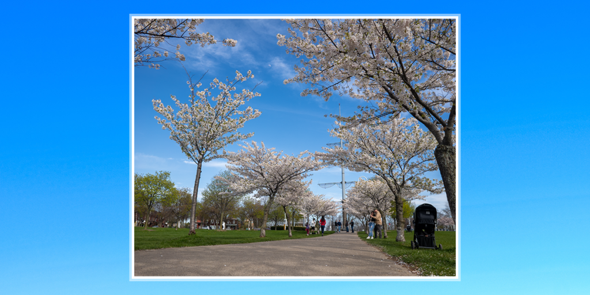

I haven’t published anything in two months.

That’s a long time for me.

I find this “six month check-in” exercise a bit weird these days, mostly because it’s clashing with what I’ve learned, and where my brain is going. Looking back to 2016 or 2017 editions of this post, I feel like I’m looking at someone a lot more vulnerable, a lot more open, and a lot more… attention-seeking.

That’s not the right word. Let’s back up.

2022 was… a year? I did a lot of the same things I did in 2021 and 2020: I searched for work, I went to therapy, and I spent time and honest effort trying to deconstruct myself at a base level. These teardowns happen regularly, constantly, and unrelenting. I feel they’re there because I’m searching for some kind of “click” moment where I’m not _fixing_ myself, but more _understanding_ my brain process.

Typing that out, it feels very strange that there’s a plurality of states, actions, or responses; each of them are governed by contexts, moods and momentum.

In November and December, I had a decent breakthrough in a number of places:

- I realized the extent to which I self-censor myself in requests for support. I’m still working on what _kind_ of support I’m looking for — this is hard to quantify.

- I’m having honest conversations about the relationships that I’m trying to develop, which just aren't possible. I’m still working on learning how to mourn them, but I’m not self-blaming as much as I was before.

- I have a better understanding of the benefits of my ambitions, and I’ve made peace with being _proud_ of those wants, rather than ashamed of “wanting too much”

- I’ve started to really grasp the concept of my bandwidth, energy levels, and limits of caring. In situations where I would beat myself up for “apathy”, I am now thinking “there is a limit in how much I can push myself when my fuel tank is drained, or completely empty.”

- I’ve done more reading about ADHD, dopamine, brain chemicals and how my “failings” might be more out of my hands than I thought. Even just _admitting_ that something is "out of my hands" and not my responsibility is a challenge.

- I am becoming more conscious of spirals, overreactions, “out of dopamine” moments and other brainstates. I can **identify** them quicker. I’m still working on the reactions to those things.

Reading that list, I think I’m doing pretty alright; it doesn’t fit into the nice year or six-month-long arc that I’d like it to, but who cares?

## On therapy:

A few times this year, people have come to me to tell me that me being open about myself has encouraged them to go to therapy. This fills my heart incredibly, but at the same time, I feel like I’m in a period where I’m trying to decipher why I’m still going, myself. My issues are nowhere near “fixed” (and unlikely to ever be), but in some cases I’m getting the message that I, myself, am the only one who can plan, implement, and process my change.

Which, I mean, is good, right? I don’t think that a therapist can (or maybe should?) hold your hand to drag you to the exact steps you should take, all the way through. I think that robs a person of a certain dignity that comes with knowing _you_ made the right decisions _for you_ to get better. That end result doesn't feel like a fully-realized person.

I think this feeling comes from either being in a chaotic, transition state of “not being able to get what I need” from a therapist, **or** the personal, internal chemistry change that I’m going through is conflicting with the previous connection I've had with my therapist.

It spits me out and says "this isn't working for you anymore", and is probably influenced by joblessness stress. I've often characterized my issues as "parts of a giant Venn Diagram", and this is one of those overlaps; is this just a part of focusing too hard on **all** the relationships I have, because some others are in the crosshairs?

That also could all just be something temporary, and I could feel differently next month, but I guess that’s part of the process:

1. Observe - “How am I feeling?”

3. Consider - “Why might I feel like this?”

5. Speculate - “Will changing \[behaviour\] help?”

7. Experiment - “This feels clumsy; what can make \[changing behaviour\] easier?”

9. Reflect - “Did this really help? Do I feel better?”

That’s the kind of the general process I’m going through on a daily basis when attacking my depression, anxiety, personal relationships, and the way I’m interacting with the world at large. I don’t consider this process especially deep; the only thing that’s changed is that I’ve been more willing to give myself compassion for having to navigate that with ADHD, and catching myself to say "You don't need to, or can't, figure this out right now."

I would like to be able to conclude that _somethng_ is moving internally; I want to give it more time, though.

## On compassion:

For me, the most difficult part of self-compassion is cracking the belief that I didn’t deserve it. The idea that I would become lazy or entitled if I _did_ loosen the slack on my brain’s leash has been firmly embedded for a while.

The irony is that through understanding dopamine/ADHD/focus a bit more, I can point out the irony of having that strict mentality but not being able to live up to it. This just creates a self-perpetuating cycle where I’m too tired/exhausted/distracted to do what I “should be doing”, then chastising myself for doing so.

That chastising feels like **doing something**, and when so much is unsure or not understood, doing **anything** feels better than nothing.

But slowly, _slowly_, I’m changing that. It’s been incredibly difficult, and a very isolating experience.

The irony is, I used to consider myself much more open and more prone to longwinded, venting discussions with firends about stresses, anxieties, and problems. I feel like I’ve closed myself off considerably since then, partially out of fear of alienating those people, but also from a mentality of “I’m going to lock myself in with my feelings, mostly because I think that will force a change in how I process them.”

It’s kind of a gamble. I’m banking on my brain realizing that the self-flagellation isn’t sustainable and productive, and the **only alternative** is to shift towards something more self-loving.

I think this might be the equivalent of a “eat less, fatty” poster when on a diet. It’s a different kind of beating-yourself-up, but it’s still a negative act.

As I’ll tell anyone — I’m working on this.

## On honesty:

I want to write more. But I don’t know when that’s going to happen.

I want to create and build. But I realize that a healthier Matt has to come first.

I want to escape my bubble, read some weird crap, and not be _scared_ that people might be seeing me do that exploration. This is an extension of that “I only have so much bandwidth to care” that I mentioned earlier.

I want to feel _authentic_. I feel that’s almost becoming a personal buzzword, that isn’t defined or practical. I need to codify what that actually means.

I had a lot… shattered about myself this year, for good _or_ bad. Twitter’s basically shown me that 95% of my Twitter followers don’t see my posts; while I’m ashamed to say, this rocked my confidence a bit, because at least I thought I had a measure of progress (even if it was by my own internal, fucked up metric).

I don’t. And I get to make the choice how I handle that.

I’m handling that by essentially… “rewinding.” I’m looking back to Matt of a decade ago, who was hungry and stupid, and didn’t have the extraneous distractions of “managing an audience”. Maybe I never had one, and this is the culmination of a years-long swerve off the highway. Maybe I’m just finally getting back on where I should be. Going back to the opening of this post, that discomfort with "attention seeking" is me looking back to that "old me" and going "what changed? Was it good? Bad? Or did you just lose your way?"

I really can’t know, and I really can’t waste the time beating myself up for that. I can be _disappointed_, but that eventually has to be placed (gently) on a shelf and moved on from. It’s just as easy to feel the need to continually apologize for yourself, and I really can’t do that anymore.

## On confidence:

Just like with the idea of “how I used to be” about vulnerability, or how I ask for support from other people — I have to throw out the idea of doing so much brain-work “beforehand”, to try to mitigate the effects of failure, disappointment, or frustration. The idea of spending effort thinking about those things felt _right_; it felt like if I “cracked things”, I’d be able to move forward with confidence.

Maybe all I really wanted was _safety_ — that I could pre-plan pain, discomfort or disappointment, pre-process it, and then be more “okay” with what I had to do.

Ironically, this is just falling back on old habits; all that “pre” everything is to avoid the awkwardness that comes with saying “I need to take up space. I have needs. I’m here, and you’re going to have to deal with me.”

A lot of things that will _truly teach me_ aren’t things that I can solve ahead of time; they have to be things that I approach openly, with courage. That courage doesn’t have to be the same as confidence — I’d argue that’s more solidified through getting _through_ the experience intact — but it can be a building block to start. The friction between all of these elements, even if it makes this feel difficult, is good thing.

So yeah. That’s probably a good place to end. Courage. Dignity. Acceptance. Boundaries. Read more. Sleep more. Openness. Self-love. All things to work on.

I hope, regardless of whether you’re making similar changes, you get something out of your time with my work. There’s going to be more of it to come.
