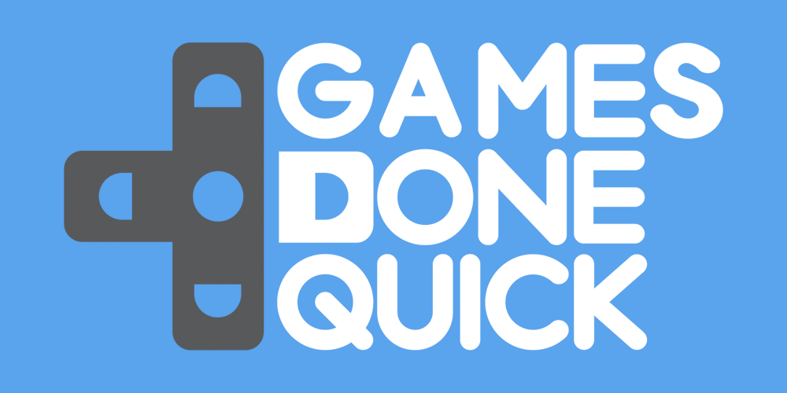
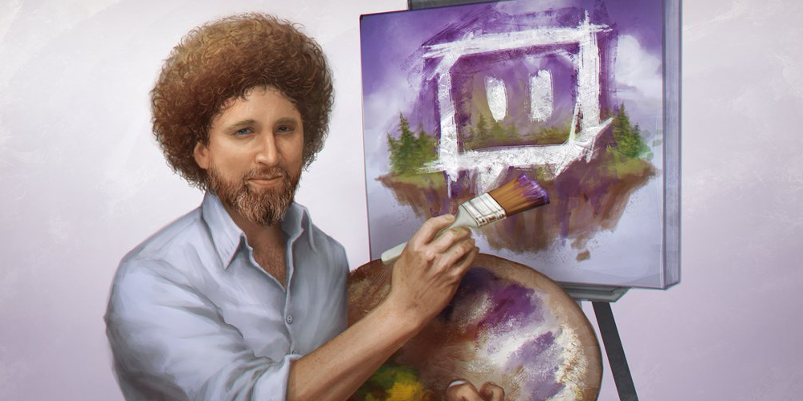

While Twitch has made huge strides in terms of user engagements, the past two years have seen the rise of a form of entertainment that deserves special mention: the marathon.

Watching something for long periods isn't exactly something new: before Star Wars: The Force Awakens came out, people decided they needed a refresher on the series, and many more people will make the twelve-hour journey through the Lord of the Rings Extended Editions. However, what makes the Twitch brand of marathons interesting isn't so much the content, but the factors that allow them to thrive.

I've been thinking about this subject for a while, mostly because it flies in the face of what many analysts will tell us about the consumption habits of the modern viewer: I mean, how many times have you heard of millennials' short attention spans when it comes to Twitter, Vine and Instagram?

<!--more-->

Twitch has proven that the marathon model is successful through a few early examples that have morphed into a more refined science. I firmly believe that both the company and its creators have embraced it because it fulfills a number of goals that build community, raise money and engage viewers like no other.

## Start9

Tons of people have written thinkpieces on Twitch Plays Pokemon, and one of the most interesting thing to come out of the event is the creation of a culture around it.

As many streamers can attest, having in-jokes, memes and customs attached to your brand is a gold mine, because it's a signal that people are emotionally attaching themselves to what you're producing. Twitch Plays Pokemon has a whole wiki devoted to the extended lore around the marathon, and in that regard it rewards people for sticking around to see these things develop organically.

The magic of TPP came from the community-driven play, but also its ability to reward those who were committed to watching it: hypothetically, if it started on Monday and took a day or two to spin up in popularity, it could be assumed that by Wednesday or Thursday it would reach a peak in "hey, look at that cool thing people are doing."

By then, social networks, the gaming press and just person-to-person talking would bring it more attention, and it could then be consumed by groups of friends and the greater community **together**. When TPP beat a Pokemon gym, people would tweet about it, sharing the reaction with other people — when it beat the game, I think people realized that the shared experience was special, as it was non-committal, entertaining, and the longer your participated, the more juicy memes you could joke about with friends.

## Going Fast

I would have written this post sooner, but I've spent the last week addicted to Awesome Games Done Quick.

At its heart, AGDQ (and its counterpart in July, Summer Games Done Quick) have morphed from a niche speedrunning marathon to a juggernaut of marketing, promotion and donations. It doesn't matter what eSports or game you participate in, because you can usually appreciate a speedrunner destroying your favourite game.

As a stream that had 100,000+ viewers at all hours of the day for seven days straight, AGDQ represents not only the same cultural development as Twitch Plays Pokemon, but also an opportunity for speedrunners to jump-start their own channels' followings.

By taking part in a GDQ — which are curated when it comes to who can perform — and being entertaining, streamers can expect spikes of people looking for more after the marathon is done; streamer Noir, who ran Half-Life 2 this year, gained nearly 10,000 followers after his well-received appearance, and a boost of hundreds more viewers than usual.

Because the marathon schedule is posted ahead of time, people can plan out their week, staying up late or waking up early to catch games they want to see. There's also a pseudo badge of courage to sacrificing your sleep to catch something cool; after all, the bragging rights of seeing hype moments **live** as opposed to a VOD are a very real thing.

The GDQ marathon means that for one week you have a chance to turn on the channel and there will be a reasonable guarantee that something entertaining will be on. Coupling that with the communal viewing experience through Twitter and other social media, it's very easy to become invested.

My philosophy when it comes to Twitch success is pretty simple: either you're entertaining, or you're good at what you play. For the speedrunners of Games Done Quick, they're usually both, and that makes for a good formula.

## KappaRoss

Source: Twitch user Sohlol | **Link**

The final case I wanted to bring up was a bit of an oddball, but after it finished, thinking about why it was successful sparked the rest of this post. To celebrate the launch of their Creative section of streams, Twitch decided to marathon the entirety of _The Joy of Painting_ back-to-back.

This was an extremely cheap event to host, besides whatever they paid for the rights to stream the show; while I can't find it at the moment, there was a tweet of a laptop running a VLC playlist with all the episodes with a Post-It that said "Bob Ross stream, do not turn off."

For Twitch, the communal experience, coupled with the exposure for their art-and-music vertical, definitely made the experiment worth it. However, it's important to realize that Twitch stepped outside of its own comfort zone for this one: they both took licensed, non-live, non-interactive content and made it work.

Twitch.tv/BobRoss, despite a Twitch employee denying it when I originally tweeted the thought, represents the company testing the waters with "old" media; by leveraging the "Netflix binge" in practice, it can put its own unique spin on things. As bad as a reputation Twitch chat gets, it doesn't seem to stop people from enjoying it; from my experience, both staff and admins are just an inclined to spam emotes as everyone else if the situation calls for it.

What all three events have in common revolves around the communities that spring up around the **shared long-term experience** of the event itself. People get new memes, people get entertainment, and people get to share the reaction of cool things happening nigh-instantaneously on social media, which in turn tells people not hooked in yet that they should check it out.

In short, it's the perfect storm of what Twitch wants out of its events, and when the marathon finishes, they get to drown in piles of money from the advertisers and sponsors who see the length of the time the average user spends viewing the stream.

That metric, while nice from a vanity perspective, also allows for more valuable ads to be bought and sold within their network, increasing the value of Twitch viewers as a whole. While I'm sure Twitch is happy building a community of loyal viewers, that facet cannot hurt too much, either.

As for the marathon's future, it depends on how quickly it reaches its saturation point and jumps the shark. While GDQs won't go out of style any time soon, part of the reason is their scarcity: if they happened every month instead of twice a year, people wouldn't get the chance to cool down and remember how awesome it is when it comes back.

It's kind of a fault of the communal experience model: if you want _everyone_ to enjoy it ("everyone" being the Twitch community at-large), there better not be too much else that divides the attention. Scheduling is imperative, and if there are multiple events demanding the same amount of investment to get reward out of it, the effect muddles fast.

For now, though, I'm looking forward to seeing how the model evolves over the next year: who knows, we might see more older TV shows finding new life on 24/7 streaming channels, or the whole phenomena might fizzle by 2017.

I think Twitch would like to hope, though, that people are in it for the long run.
