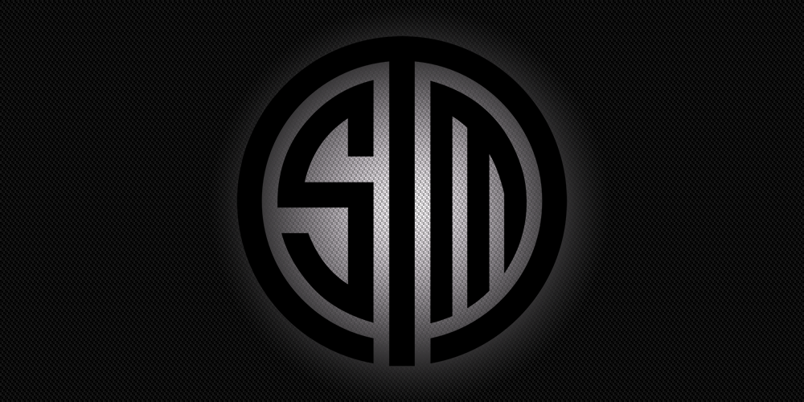

_Disclosure: I worked at theScore eSports from Jan 2015 to Nov 2015. I worked with Rod Breslau and Tyler Erzberger during my time there, and edited their work. Darin Kwilinski edited my work while I worked at Azubu from April to June 2014. All three now work at ESPN._

ESPN, the largest sports media company in the world, launched an eSports vertical today. This is obviously a big deal for a number of people, as the opportunity of writing somewhere stable will enable more people to make a living from eSports.

It's important to note, though, that the writers aren't the only ones who are going to be looking to get in the company's good graces; for many eSports teams, ESPN's entrance marks huge potential to catapult themselves into a whole new audience.

If you're familiar with enthusiast journalism (like with gaming, comics or film), you know that relationship-building dictates a lot of your success. You need to be able to give reasons for people to visit your site, and in most cases, this comes in the form of exclusives — things you have that no one else does, or things you have first.

A big thorn in any publication's side is the building and maintaining of relationships so these kind of exclusives can flow freely. In most cases, leaks will be attributed to a nameless source, in order to protect that person from backlash within their company; however, this means your readers' trust is often only as strong as the length of time since your last mistake.

In eSports, the lack of a players' union means that leaks and exclusives that may paint people unfavorably can result in a loss of trust, punishment or straight-up blacklisting. If a team can't find anyone to punish, they might just go after the publication themselves, denying them access to players or statements. I wrote about this in 2013.

ESPN thankfully doesn't have to worry about any of this, because they're ESPN.

Let's put ourselves in, say, TSM's shoes here, for a second.

I'm Andy "Reginald" Dinh, owner of Team Solomid. I've built up probably the most successful Western brand in League of Legends, had a respectable CS:GO team in the past, and currently sponsor a number of smaller players in other games upon which I make a decent return. However, I've realized that I've started to hit a bit of a wall.

With the eSports or general "gamer" audience, my brand has become huge. Because I'm at the forefront of many of the games I sponsor, I've seen my acquisition of fans plateau. However, there's only a limited amount of people that I can hope to convert to _new_ fans, as there's a good chance that anyone who knows eSports knows who we are already.

So, where do I go from there?

What ESPN represents in a new acquisition stream for eSports, as not only will industry fans be checking it out, but legions of **new** people, as well; if they were on the fence about the hobby's acceptability or viability, they likely won't be now. If TSM positions themselves as "the people's team" in the games that ESPN covers by providing exclusives that place them prominently, new fans will see them as a logical jumping on point.

Ask any new NBA, NFL or football fan: if they're new to the game, they're at least going to know who the Lakers, Patriots or Real Madrid are. They know because their players are famous, and the teams have a good shot at either going far in the playoffs, or winning the whole league. They have bandwagons that can fit whole cities inside of them.

While many will look at their local sports teams, there's only so much heartbreak they can take (ask Torontonians); fans, especially new ones, want to **feel like they are part of something special**, and there's no more special feeling in sports than seeing the team that you're cheering for win the big one. That feeling turns to loyalty. That loyalty turns to money.

This leaves us with ESPN having substantially more leverage than arguably any other eSports publication before it, because they take the present arrangement of teams usually having larger followings than the people who cover them and flip it back to what large media is used to. Historically, musicians, artists or organizers would _want_ their stories in the news, because the exposure was always worth it.

Due to their mainstream audience, resources and the respectability that comes with being covered by ESPN, the network now has something to offer top-tier eSports teams. Instead of teams producing interviews themselves (which keep the ad dollars and followers generated in-house), there is reason to let someone else in.

From my experience, teams _know_ the current arrangement, and will use it to their advantage; they know that anyone asking for interviews do so because their players will drive traffic. This is why the TSMs, the Cloud9s, the Fnatics and the Evil Geniuses of the world are rarely going to turn down the BBCs, the CNNs and the HBOs: they represent an opportunity to make themselves into a friendly, well-spoken face for the new eSports fan to attach themselves to. The trick is making sure they don't leave.

I'd like to wish ESPN well with their entrance into eSports journalism, as I hope the organization has the patience to see the vertical grow. While they likely won't be flawless (no one ever is), they will likely enjoy an advantage that most publications don't: they'll be the hot girl without a date to the prom, rather than the ones holding up the wall.
