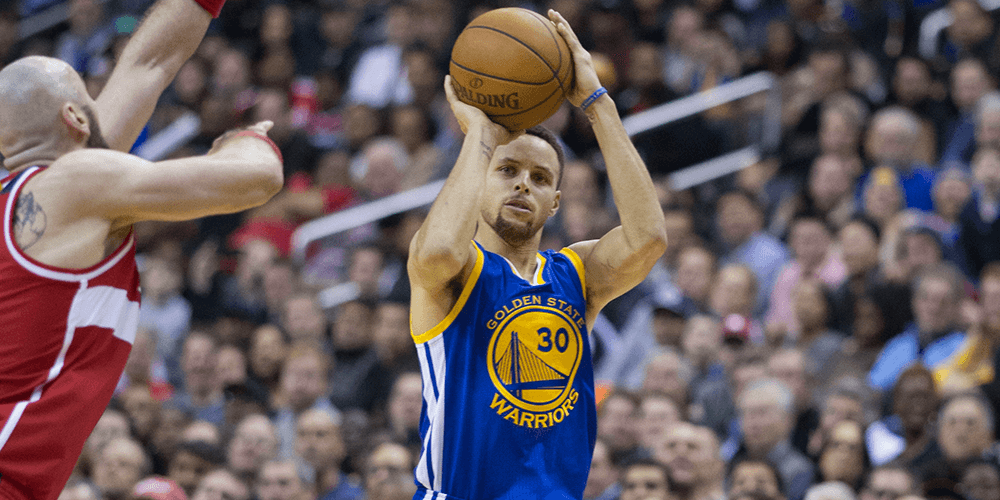

Apparently the 2015-16 Golden State Warriors have had a pretty good NBA regular season. To list some of their accolades:

- They had the best start to the regular season in both the NBA and _North American professional sports_, winning their first **24** games. The previous NBA record was 15, set in 1948-49 and tied in 1993-94. In **1884**, a baseball team set a record of 20-0.
- They became the first team in NBA history to score more than 1,000 three-pointers in a season, finishing at 1077. The next-highest was 933.
- They finished the regular season with a record of 73-9, breaking the previous record held by the 1995-96 Chicago Bulls of 72-10. They did not lose to any team twice over the whole regular season, and never lost two games in a row.

When you look at these facts, they have the making of one of those storylines that basketball fans and historians will talk about for a long time — or until someone else tops them. If you look at star player Stephen Curry (PG), the statistics get crazier:

- Of all the non-free throw shots Curry took over the 78 games he played (out of the 82 total), **50.2%** of them went in.
- He had the **second-highest** minutes-per-game played at 34.2 on the Warriors. The next-highest was 34.7.
- He had the highest points-per-game of the Warriors (30.1); the next highest was 22.1.
- He **broke his own record** for successful three-point shots by **116**, finishing with 402. The previous record was set the previous season at 286.

Looking at all this paints a picture of a dominant organization that knows how to play a specific game and make it work for them; there is no doubt how good they are, because they've literally set records in the process.

However, what happens next is what separates esports and professional sports like basketball, hockey, or football.

## If the NBA were the LCS

One of my favourite ways to contextualize esports for traditional sports audience is to bring up the concept of patches; esports athletes have to adapt to a changing game on a monthly basis, as strategies, concepts and game-defining fundamentals can be changed in a way that alters how they play.

If the NBA were subject to a patch system that changed it as often as esports did, it is likely that the Warriors would not have been able to finish their initial 24-game streak of wins to begin the season: the way that they play would have likely been deemed "unbalanced," anomalous, or otherwise "out of line" with what the developers had intended. In gaming terminology, a "nerf" would be weakening an aspect, and a strengthening a "buff."

The natural way to fix the problem of the Warriors would be to look at a core mechanic that the team was able to exploit — say, Stephen Curry's talent for three-pointers — and attempt to balance it. This might mean moving the three-point line back a foot, or even two, or expanding the three-point arc to end at the sidelines, instead of having a lane that goes to the baseline at the end of the court.

Instead of happening after the season ended, this would have happened in the **middle** of the season, or maybe started after the All-Star Break. Depending on the game and the team balancing it, patches could change before _playoffs_, leaving the Warriors with a league-leading seed and having to adapt with their core strategy not working as well.

## Time well spent

Let's say that the solution to the Warriors isn't even changing the court, but merely tweaking some numbers: instead of two-point shots remaining at their current value, it gets tweaked to 2.2 points, instead, with the number rounded at the end of a game. This value is arbitrary: it's more to represent how incentives change in esports from patch to patch.

A team that found a strategy that worked for them (three-pointers, defending shooters, cycling the ball to shooters and creating space for them to work) suddenly has to contend with inside shooters being able to get more points than they previously could. A shooter who scores 10 points suddenly scores 11, and having a .6 or .8 at the end of the game might mean that crucial point that gives them a win.

This creates a new series of priorities for a team, a new way of emphasizing their strengths and a way for their opponents to "catch up." If another team finds a way to exploit this _new_ system, suddenly the competitive meta-game of basketball has changed.

If the Golden State Warriors' system is no longer effective, their players must be able to adapt; if they can't, the team's investment in the system that once worked may be seen as a waste.

A similar example would be in American football, where touchdowns are worth six points regardless of whether they are caught in the endzone or ran in. If the NFL decided to make thrown touchdowns worth more than ran-in touchdowns, teams with a better passing game could rack up more points, and teams who had previously invested in running would have to adapt.

In esports, this creates a demand for two types of players: ones that are so good that they can adapt to what is currently "strong", or generalists that are never affected in the first place. It also — sadly — creates the possibility of teams that were dominant one month to fall off the next, without recovery.

While the NBA _does_ modify its rules, a lot of them revolve around the logistics of calling time-outs, how fouls work, or the implementation of Instant Replay to contest calls. Before the 2015-16 season, the NBA apparently considered widening the lanes to prevent player injury, normalizing the amount of break time between quarters, and changing how players are handled during free agency.

Despite the potential for change, I'd imagine that the player's union prevents these decisions without their input or consideration, and the game would not be altered to such a radical degree that a player like Curry would become dead weight overnight. A main difference between sports and esports is that degree of permanence, and to some fans, that chaos is alluring.

For the time being, though, I'd imagine that more than a few people think Steph needs a nerf.

_Image Credit: Keith Allison on Flickr via CC BY-SA 2.0 - Remix by Matt Demers_
