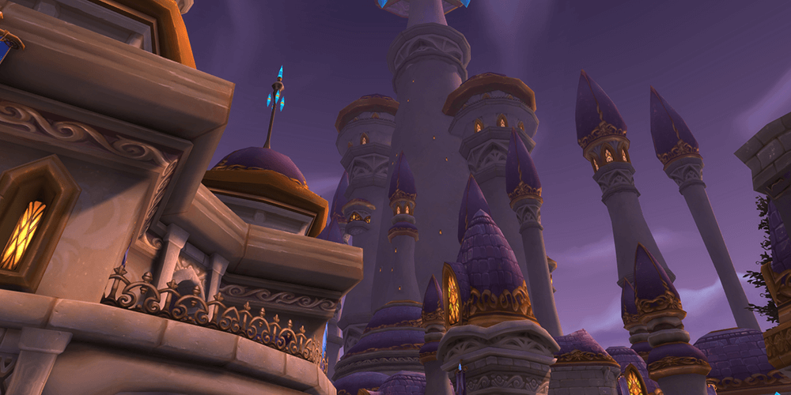

I have this problem, and it began with _World of Warcraft_. Burning out on it killed my ability to be immersed in a game full time, or at least long sessions.

When the game came out, I was 14 — the prime age for a lack of responsibilities and a whole lot of time. I couldn’t get into it myself until I was 15; I started right after patch 1.7, which, according to a wiki, was 13 September 2005. I was in Grade 9, fresh from being bullied in elementary school, and just settling into further awkwardness.

<!--more-->

I remember wanting _so much_ to be level 60, because being 60 meant going on raids, and something about the concept of 40 people working together on epic encounters felt intriguing. Comrades. Teammates. Friends.

As many old-school players can attest, guilds and raids just felt much **closer** socially then, as people were younger, had less to do besides playing the game, and social media hadn’t yet taken a hold as a distraction.

Hell, YouTube had just launched.

So, 11 years later, I found myself with an itch when the most recent expansion, _Legion_, released at the end of August. I felt the same pull when _Warlords of Draenor_ released in 2014, and made the same mistake: I longed for the social interaction and focus that guild-based raiding offered, and saw a lot of my friends purchasing (or planning to purchase) the game on social media.

Not wanting to be left behind on something cool people were doing, and hoping to be able to introduce myself to or strengthen social ties, I bought it. I mean, guilds are forming, people are levelling — there isn’t that disparity with time put in that separates people new to the game from the veterans. Suddenly, due to free boosts that come with the expansion, we’re all on the same level for a little bit.

My problem, though, is that I lust for a feeling that doesn’t exist anymore — well, maybe it still exists, but it’s harder for me to find. People are older, have responsibilities, and the game doesn’t _hook_ me like it used to. Nothing does. And that’s perhaps the crux of the problem.

Like with _Warlords,_ I instantly felt some buyer’s remorse. I didn’t _really_ want to play the game as it is laid out: I more wanted to be able to play _with_ the people who were playing the game. This wouldn’t be a huge deal, if it didn't cost me $70 for the game and $15 for a month of paid time.

I played for a day at launch. Then a second. I started an alt to change things up. I played a few days of intense sessions, because it gives me something to focus on besides the depression. The act of questing, grinding, hunting down things — it all felt familiar and safe. I had a direction. A goal.

I suddenly start going to bed as people are leaving for work, and waking up as they get home. I start realizing no one is really talking - or more likely it’s just me being quiet. I think of all the things I could’ve wrote or “where I could’ve been” in the time I’ve spent. My boosted character feels boring, so I'm not pushing him to the max level to begin raiding. I feel like I can't justify the time to get where I’d want to be with the game. The purpose is defeated.

This isn’t the game’s fault. There are plenty of people who play it, enjoy it, and balance it with their regular lives. I’m projecting a _need_ onto my experience with the game, which ends up setting myself up for disappointment when it doesn’t reach it. I think of it in terms of what it can **do** for me; I’m not sure this is a healthy approach.

The more people talk about the escapism of gaming, the more I feel like it can be a cliff face that’s dangerous to fall off of. Playing _World of Warcraft_ (or well, any MMO, as I’ve had the same cycle happen with _EVE Online_) presents me with a way to turn off my anxieties, but ends up replacing them with others. It ends up representing a hollowness I feel as I sign out, taking stock of hours I play without it really mattering. Does gaming as an escape accomplish anything if it prevents you from confronting yourself and growing as a person?

Maybe I’ll find out the answer to this in two years, if another expansion comes out.
