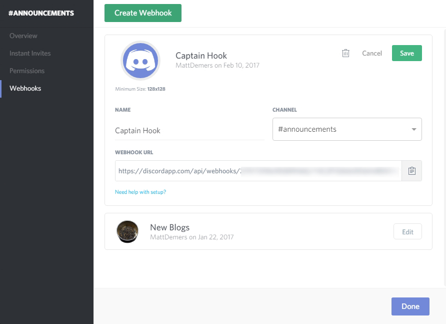
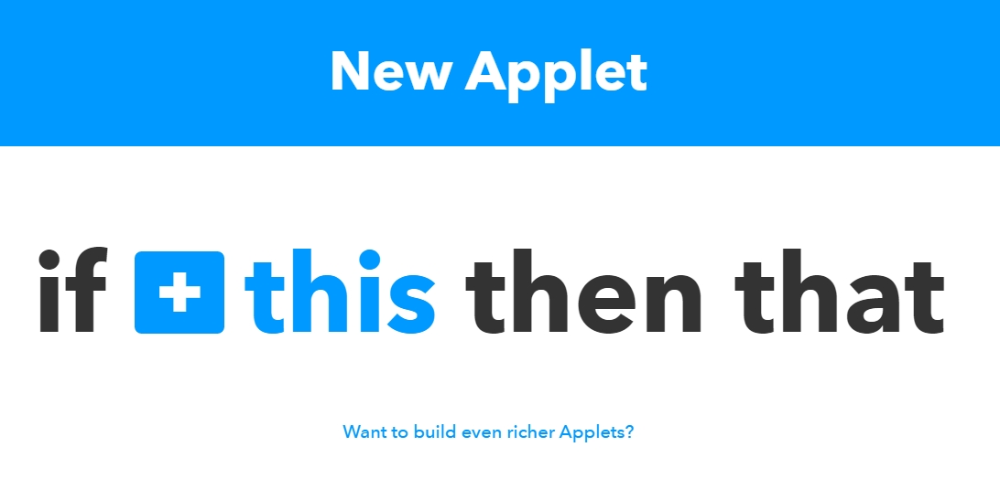
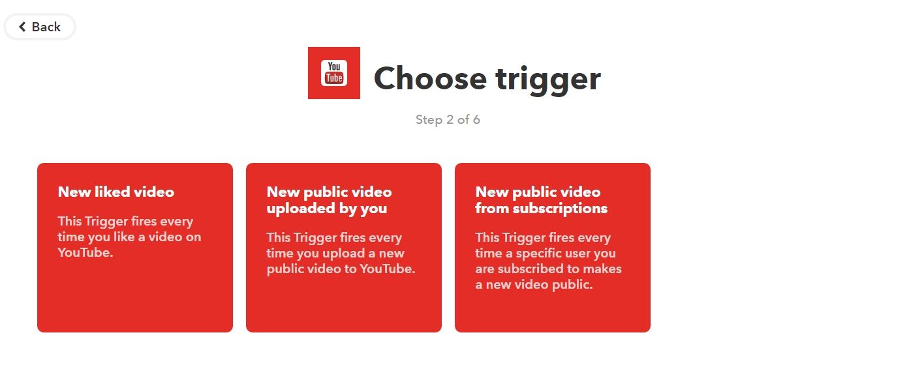
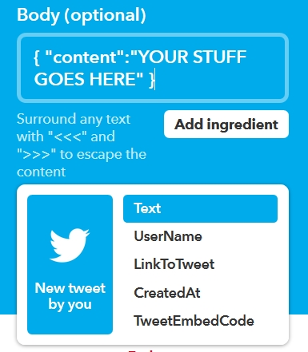

Discord has become a great hub for a lot of creators to center their communities. However, it adds one more place that people need to publish content when it comes out.

While there are many bots that can take care of these things, I wanted something really simple **without** having to add all the other functionality that comes with it: I wanted something to monitor an RSS feed and then post a notice to a channel when something changed. The idea is that I wouldn't have to remember to let the people on my server know when I made a new YouTube video or published a new blog; it would just kind of happen for me.

I found a solution to my issue by using Discord's Web Hooks feature and a service called IFTTT, which automates many actions online with multiple services. I use this method because I do not know how to code my own Discord bot, and I dislike adding a completely new bot just to add one function that the one I'm using doesn't do.

## Step 1: IFTTT

You can sign up for IFTTT on their site. A previous version of this guide used Zapier, another service that was limited in its free usage; IFTTT doesn't have that problem, but still may rate limit your webhooks if you're using it too much.

## Step 2: Get a Discord URL

In Discord, go to the channel you want to post your messages to and click the gear icon beside its name in the menu. Go to the "Webhooks" menu at the bottom, and click "Create Webhook."

From there, you can give your hook a name (this is what the name of the announcements will show up as in the chat) and choose where it will post. The URL at the bottom is important because you're going to be using it in Step 3 and 4 below. Keep that on hand.

## Step 3: Make a new Applet

Going to "My Applets" at the top of IFTTT when logged in and clicking "New Applet" will bring you to a screen that asks you "If this, then that." You can click on the "this" to choose a trigger and "that" to choose an action.

For this example, I want a message to be posted when I post new YouTube videos. In the search field, I search for YouTube and choose it; I then choose the trigger "New public video uploaded by you." Other triggers may ask you for deeper options, like setting custom parameters.

Next, we choose an action by clicking on the "That" in "If This, Then That." Once there, type in "webhook" into the search to bring up "Webhooks." From there, choose "Make a Web Request" as an action.

## Step 4: Customizing the web request

The web request part of the recipe is a bit complicated, but I'm going to go through it step by step. There are four fields for you to fill out in order to get the process working.

**URL (required)**: this is the Discord URL you got in Step 1. Input it here.

**Method**: This should be set to POST

**Content Type**: This should be set to "application/json"

**Body**: This is where you put the message you want to be sent to the Discord channel. Below you will find some templates to include in your Body section depending on your usage. The previous version of this guide was in error when it came to the Body message; this has been fixed with help from the IFTTT Discord and JayReddin (thanks!).

You want to place your ingredients into a template: `{ "content":"YOUR STUFF GOES HERE" }`

Essentially what is in the quotes will be a generated message, and whatever you use in the "Add ingredient" menu will be pulled from the tweet, video, or post itself. This allows you to play with the message you want to send to Discord, since it recognizes both Discord emotes (`:heart:`, etc) and text-anchored links (following the format of `[textgoeshere](urlgoeshere)`).

So a sample for Twitter could be:

`{ "content":"Check out my new tweet at: {{LinkToTweet}}" }`

This will say "Check out my new tweet at:" and then paste the URL of the Tweet, which will then auto-generate from IFTTT.

What is imported and what your post looks like depends on the ingredients you pull into it, and your creativity. **Each option in the "Add ingredient" menu will be different depending on the service (Twitch, YouTube, Twitter, etc).** Some ingredients may not work, depending on whether Discord supports them (for instance, the TweetEmbedCode will not work, because Discord can't parse it).

## Step 5: Enjoy and experiment!

After completing the process, you can turn your Applet on and the event should happen every time the triggering action does. Right now, my Discord server will create messages when I post a new blog, video, or specific tweet.

You can find setups for mine below: I encourage you to mess around with what works for you! Keep in mind that every app has its own unique settings, so you may need to pay attention (gasp) to what it's asking from you.

_Wordpress_:

- Triggered on "New Post"
- Wordpress was signed in using a sign-in
- "Any new post"

_Twitter_:

- Triggered on "Search Mention"
- Using Twitter's query operators, I can specify that I want tweets only from **me** that have "http://twitch.tv/mattdemers" in them to trigger. I enter "from:mattdemers http://twitch.tv/mattdemers" in the "Search Term."

_YouTube_:

- Triggered on "New Video In Channel"
