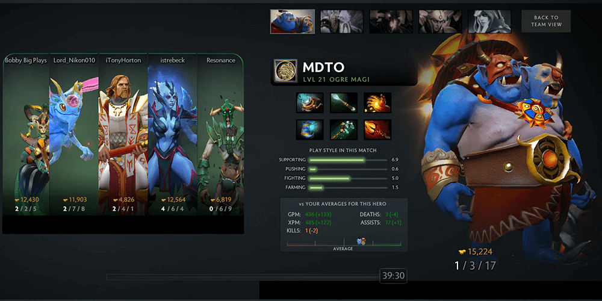
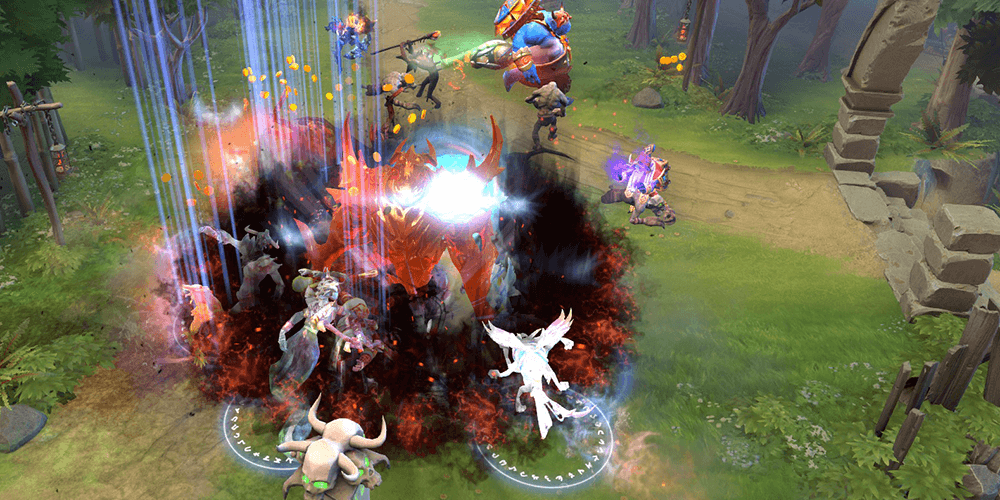
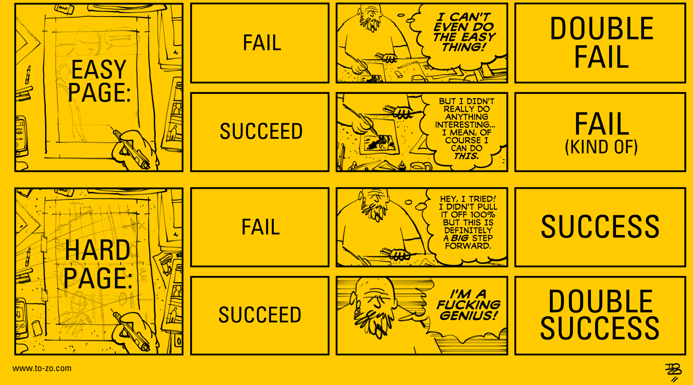

Panic is a common problem in multiplayer games — you’re faced with an innumerable amount of choices with limited information and only have a small window of time to maximize results with an.

Multiplying that by _dozens_ of opportunities a game, this can get pretty stressful, pretty quick. I've written about it before.

Last night I had a practice session with a friend of mine; he coached me while I was playing Dota 2. I was playing a non-ranked game (you can’t have a coach in ranked) and was partnered with a stack of four non-English speaking players. This was essentially perfect: I couldn’t really be raged at, and since MMR wasn’t at stake, I could try to break some new habits.

Under his guidance, I broke every average stat I had for the hero, and cruised to one of my more confident victories in Dota. Even though I was solo supporting, I felt like I truly had an impact on the game.

<figure>

<figcaption>

Not bad, right? Game for evidence.

</figcaption>

</figure>

When the game was over, my coach asked me if I had learned anything, and I was hesitant to say I had. While I _did_ try new things in this game that worked out and while I _did_ use my resources more freely than usual to better effect, I don’t think I would have unless he was directly telling me.

That’s coaching, of course, but I wasn’t sure I **had** learned anything. Again, if he wasn’t there reminding me what to do, I likely would not had taken the initiative that I did.

When people coach or spectate me, a lot of the advice that I’m given is met with a “I can _do_ that?” response. I know that sounds weird, but you have to look at it from my position: if I take a risk and it blows up in my face, the nature of Dota means I’m likely to cripple myself (or god forbid my team) and likely catch some flak for it.

So when someone says “abandon your carry, he seems fine by himself, and go rotate mid to harrass,” a part of me is thinking about how wrong that could go, or whether it would waste my time or negatively impact my teammate.

Once I get there, I’m not thinking about what my opponent is going to _do_. This all sounds kind of stupid, but it’s a symptom of having a little bit of a one-track mind: you need to stun Character X. You need to silence Character Y. And then all of sudden, you’re wondering how you possibly fell for Counter-play Z because you were too busy panicking or concentrating on **not** panicking that you didn’t see it coming.

Dota is a complicated game, and it seems to get worse every time I play it; there’s an immense pressure to just _be better_, and tacking on a lot of things to remember just seems to increase it.

<figure>

<figcaption>

Shadow Fiend Aghanim's Scepter + BKB + Dark Seer Vacuum = four enemies dead instantly.

</figcaption>

</figure>

Just before this coaching session I went back to the gym for the first time in about a month. I had hurt my back and gone to physiotherapy for it, and a large amount of why I hurt it was I wasn’t engaging my core properly to stabilize my body when I was lifting. I kind of took it slow and just experimented with how I could remember my core, my breathing, my form and actually lifting the weight.

Before, I was intimidated by this list of things because I wasn’t sure I could possibly remember them all, and the consequences of doing so seemed dangerous. I didn't want to hurt myself again. When I was standing in the squat rack, though, and just thinking “okay, core,” it seemed to be a nice place to start. Then, when I knew what that felt like, I could tell it **made sense** and then added breathing back in. Then, other things.

That gym trip went _great_, and I suddenly feel like I have a new appreciate for how these lifts work and how much better they feel when all these smaller things add up. It was similar to that Dota game, where roaming, warding, farming (even as a support) and coordinating were still all possible, and led me to being richer and farther ahead than I had ever been in the role.

So I guess from here I just need to make a list of those things, remind myself that I’m capable of carrying them out, and gain some confidence in what I’m capable of. That confidence is probably what I'm lacking right now, and that keeps me from acting in the moment due to fear.

Stuff to work on. Will keep you guys in the loop. I'll leave you with this great post I found about the "Bulletproof Argument for Trying Harder Things:" Tonci Zonjic has a great archive of similar issues called "Not/But" which is full of great ways to reframe your thinking.

