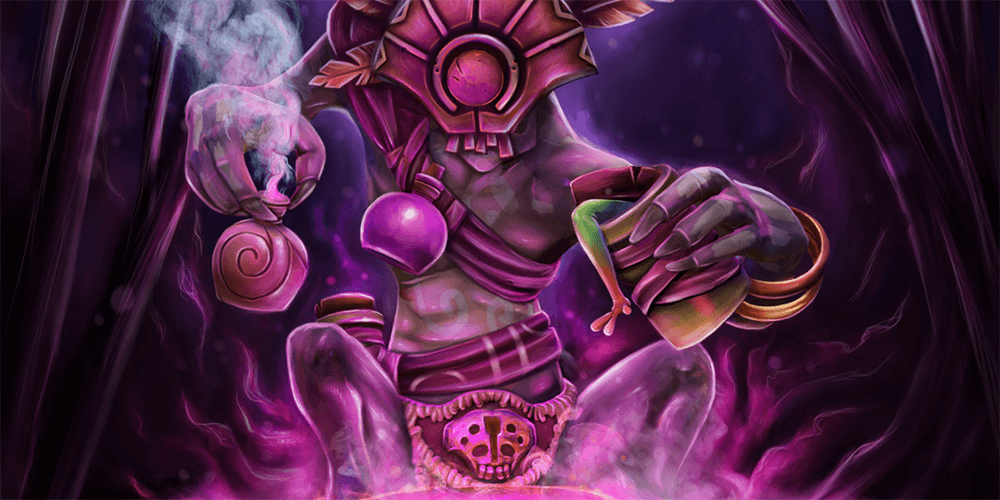
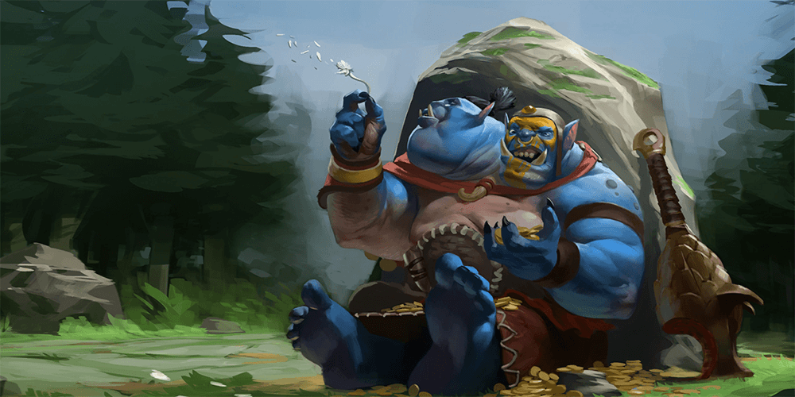
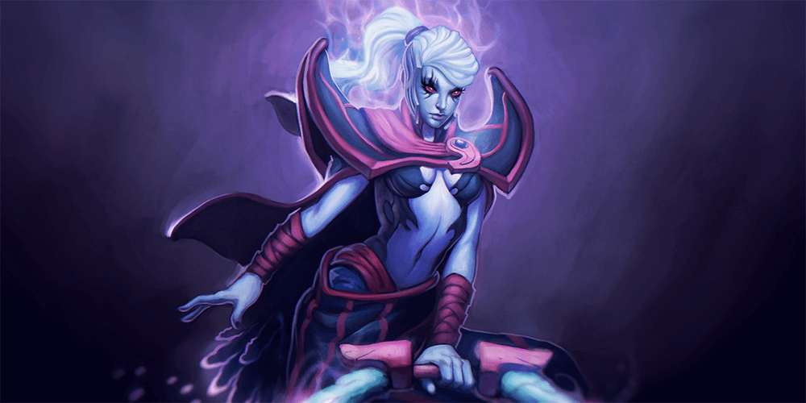
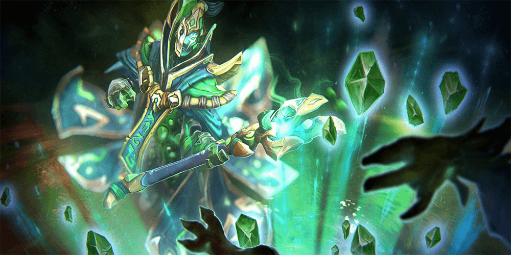
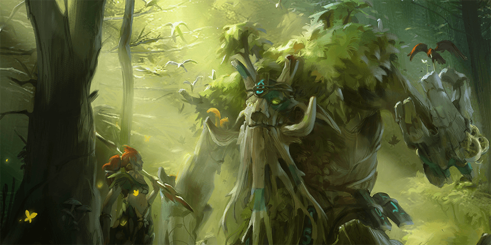
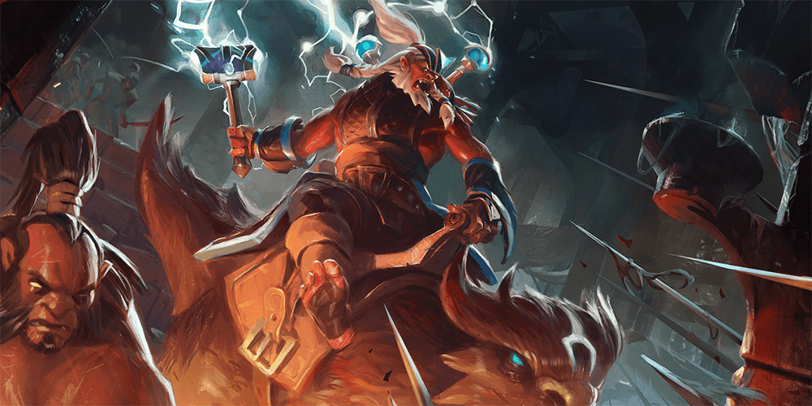

The last little bit of my Dota career has been frustrating; I seem to be hovering around the same MMR without any improvement, and no real consistent growth that moves me forward. I've come to the conclusion that this is my own fault, as I haven't been setting concrete goals.

Before, with BetterDota (my previous Dota project), I had set up a list of heroes that I was going to work on, and my justification for doing so. I figured I'd do the same here for the support heroes I play, because that's the role I find myself in the most.

The reasons for picking these are primarily based around a few things:

1. How useful are they going to be to the team?
2. How easy are they going to be to execute? Alone? With farm? Without?
3. How many holes in typical pub-base drafts are they going to fill?

The last part is pretty essential because I'm usually noticing that drafts at my level usually lack a lot of utility. I've adopted a pretty simple mantra in that **more stuns can't be a bad thing**, because it hedges your bets that execution errors are going to happen and players who are locked down won't be able to play around it.

Even if this is a rather short-sighted drafting strategy, I find it to be better than none. To expand a little, I think that I need to start picking things that will offer the team as much high-impact utility as possible. This came after some dreadful Bounty Hunter games the other day, where I contributed a lot to vision and Track gold/experience, but was woefully lacking in damage and couldn't decide how I wanted to build.

I guess there's a bit of a hierarchy of how useful utility can be. Keep in mind, this is based of my 2.7k experience, and higher levels will obviously have different priorities:

1. Providing buffs and immunities (physical/magical) to carries
2. Providing crowd control, allowing for saves or lockdown
3. Providing healing, allowing them to survive longer
4. Providing vision or other macro benefits (Track, gem Nightstalker/KotL, which can be risky)

The thing is, at my level I get the feeling that even if you provide resources on a macro level, people may not know how to use it, and the way heroes' kits work may leave you dead weight on a team unless you can snowball. That gets me thinking that it is better to have something reliable (buffs > stuns when BKBs happen, but it's nice to have both) than something that requires a specific set of circumstances and people working together.

So, without further ado:

* * *

**Witch Doctor**

WD is my most-played hero for a reason: semi-dependable stun (depending on how it bounces), a heal that promotes sustained pushing (and is hella buffed after talents) and early game killing power with Death Ward and Maledict. I used to always de-prioritize Maledict because I wanted more survivability for my carries, but after seeing other Witch Doctors do a lot of damage with it, I'm starting to recognize when/why you would skill it more.

Weaknesses include being pretty squishy late-game, which puts more emphasis on positioning. However, getting Aghanim's Death Ward is great for late game due to it being Physical damage (goes through BKBs) and bounces through the chaos of a team fight.

**Ogre Magi**

Ogre works at my level because you get to "do Ogre things:" run up to offlaners, throw down Ignite on them, and hit them until they leave. However, he becomes a more enticing pick because I've started to realize just how silly Bloodlust is when you have multiple auto-attacking carries (as some pub games do) — **60** bonus attack speed at level 4, with a potential to go up to **100** if you get the level 25 talent.

Multicast is nice, but obviously unpredictable; long cooldowns mean casting my stuff and staying out of the fight becomes a larger priority, but becomes attainable with Aether Lens. Ogre kind of falls off once BKBs make his stun useless and the long cast time makes him less of an initiator, but Bloodlust makes carries hit and move faster. I usually grab at least a Force Staff to make sure I have an out from melee range; there's the problem of not being a good gem carrier because of no way to scout uphill, though.

**Vengeful Spirit**

If you die, you give a negative damage debuff to who killed you. Works for me: free deaths, right?

Jokes aside, a nice stun that does good damage, a Nether Swap that goes through BKB and a great scouting/armor debuff in Wave of Terror makes Venge pretty safe. If required, she can pick up some Agility items to hit harder, but you kind of never want to get to that point. Swap means that carries can get saved from a pretty long range, and at my level I get the feeling opponents kind of underestimate their safety zone.

Venge is kind of the "oh, no one is picking? This can be safe enough."

**Rubick**

A bit more risky due to his nature: you need to be able to survive to use the spells you steal, and Blink Daggering in may mean you die pretty quick. However, picking Rubick early in a draft may discourage the enemy from picking big teamfight spells, which is a cool psychological tool I didn't think of before; limiting choices (these skills are usually pretty low-execution) may mean forcing people onto uncomfortable picks.

Rubick is probably someone I'm going to break out when there's a solid initiation team behind me, and I can focus purely on positioning.

**Treant Protector**

I really like Tree because he can cover a lot of deficiencies in your team. Getting Aghanim's Scepter late means free vision (including Roshan), Overgrowth can be a great engage/disengage tool that disables Blink effects (including Storm Spirit/Ember Spirit escapes), and Leech Seed is a great "HEY HIT THIS GUY" indicator that sometimes you need. Living Armor is great to reduce downtime for carries, and healing buildings can be frustrating.

He lacks in some areas: mostly you need to get creative and ballsy when the other team might actually buy detection, and melee range means you either feel useful or you die. I still feel like he's a niche pick for me, but I've been surprised lately at just how useful late-game Overgrowth (especially overlapping multiple Eyes in the Forest trees) is for damage.

**Disruptor**

I feel like Disruptor is the go-to "Hey, you need CC? Hey, you need to make sure people don't escape? Let's go." hero. I generally consider this guy when I'm facing Storm/Ember Spirit, Slark or anyone else that is slippery and gets wrecked by a good Static Storm. He's also a good gem carrier due to Kinetic Field giving vision uphill, and being ranged to hit things.

The major issue is that he's a bit squishy, and needs a Scepter to get that amazing "mute" quality that keeps people from BKBing out late game. Whether he'll get that amount of farm is variable.

* * *

I've noticed a little bit of a trend; mostly if they have a lot of crowd control, they tend to be squishy heroes, and if they're beefy enough to survive trades, they have a tendency to fall off later. This is what I want to avoid, due to games at my level being lost due to the inability to close them out while ahead. People want to style on others, taunt them with luxury item choices, and generally make others suffer — I won't lie, I've done this too, and paid terribly for it.

The thing is that all you really can do is keep pushing towards making that game more effective, and herding the cats in the right direction so that you can clinch the victory. Hopefully now I'll be a little more focused on that; feeling like picking weird heroes is a trap I fall into because I want to "have fun," but losing terribly due to those picks feels worse.
