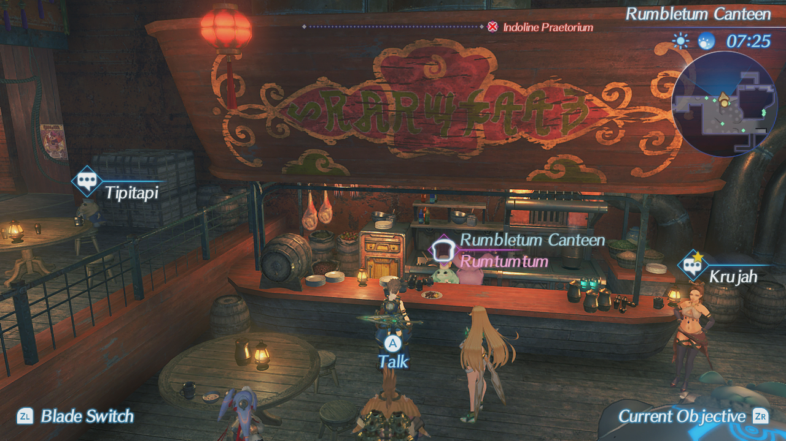
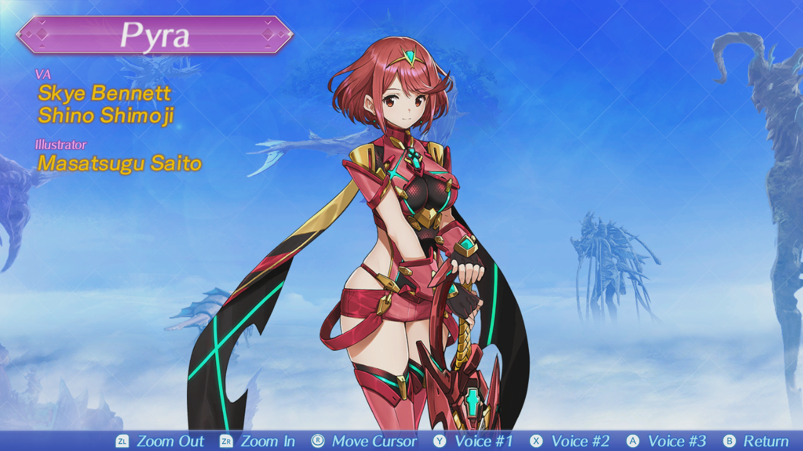

One of the first posts that I published when I launched this blog was my impressions of _Xenoblade Chronicles X_, a WiiU title from Monolith Soft. Despite really liking it at the time, I grew more frustrated with it the more I tried to play: the game's internal systems just didn't work for me, and it demanded a time commitment comparable to an MMORPG to "get to the good parts."

Because of that, I was nervous when _Xenoblade Chroncles 2_ was announced for the Switch, because I was hungry for a good RPG and didn't want to get burned again. I barely played the first _Chronicles_ for the Wii, but it checked a lot of boxes for me: RPG, decent AI partners, relatively deep equipment/stats system, satisfying combat, town building, and a lot of cool environments.

Eventually, after a couple watches of a friend's stream, I took the plunge into _Chronicles 2_, and I'm happy to say that it's been something I've really enjoyed. So far, I've dumped over 60 hours into it, putting it close to the length of my _Persona 5_ run without going anywhere near the amount of completion: I've still got a lot to go, and I'm feeling comfortable about going into post-game challenges because I like the game that much.

I found that this game taught me a little bit about my taste in media as a person, and maybe about how I've grown up a little.

The discourse around this game is a bit... interesting, mostly because _Xenoblade Chronicles 2_ is a pretty blatant example of fanservice. In blunt terms, there's some major T&A in this game's designs; Pyra, one of the main characters, has some pretty unrealistically-proportioned assets, and you'll find the camera panning to them _often_.

The thing is, this didn't necessarily bother or _offend_ me. While I don't think I've ever been the type to play a game specifically for its sex appeal, it just had me thinking "I'm a bit too old for this." It became something to laugh about: "Jesus Christ, that's so dumb," was something that I thought at numerous points during cutscenes, but it didn't necessarily ruin my enjoyment of the game.

My opinion is that fanservice is sometimes a necessary evil, and sells games/manga/anime — however, its implementation and subtlety affects how much it bleeds into the main product. You still (hopefully) should have a solid product underneath, because otherwise it feels hollow, boring, and a waste.

I think that _Xenoblade_ avoids that problem because of it executes being an RPG, but it highlights that "waifu baiting as a marketing strategy" is getting more and more blatant. A good game will drive towards emotional attachment and engagement with its audience, but I feel like the easiest and most shallow version of that is "I want to fuck/marry the female/male lead."

In this case, that becomes such a loud portion of the game that you can't really suspend your belief. A number of your pseudo partymates (which you acquire either through the game or randomly) feel like they checked boxes for the usual "anime crush" stereotypes; some mechanics that involve affinity-raising to unlock questlines or secret cutscenes feel like they could be out of a dating simulator.

This doesn't cause me to hate or dislike any part of the game, and I'm not about to play authority on what should and shouldn't be made. I just noticed that the sensation of "huh, this definitely wasn't made for _me_" was just a very unique and loud one this time.

If you're looking for a straight-up review, _Xenoblade Chronicles 2_ isn't perfect, but it's imperfections aren't really deal-breakers. The English dub leans heavily on its Scottish/European accents, and sometimes the inflection or reading of the lines are off, or comical. In battle, voice narration is triggered when special attacks are started, which means you can sometimes have 3+ voices all layered on top of each other.

The original _Xenoblade Chronicles_ was lauded for its EN dub, and while I think they wanted to replicate that here, I feel it's hard to re-capture that lightning in a bottle.

In other games, this would probably be enough to frustrate me, but for some reason it isn't harming my experience, and at times it's entertaining. I don't know how to explain it, but it's still a _good game_ without being a _good game_ in the same way _The Witcher 3: Wild Hunt_ is. The latter is a very cinematic and carefully-produced, with amazing lip syncing, faces, environments and mechanics. When you look at it, you can see a well-crafted product.

Here, you just see a different _kind_ of well-crafted product that opted to spend its resources elsewhere. Its flaws are tolerable because they fall lower on my hierarchy of things they needed to get right.

_Xenoblade Chronicles 2_ does a great job of creating worlds, and continues the tradition of giving you huge, wide-open vistas that have a ton of content and reasons to revisit areas. You never truly feel _done_ with any of the locales in the game, and that gets you attached to the difference towns and regions because you spend so much time in them.

NPCs update their dialog with lines and new sidequests unlock as the story progresses. _XC2_ also does the gacha "roll to collect random elements" well with new weapons, and essentially has constructed something that feels closer to the single-player RPG experience while retaining MMORPG features.

The problem I had with _X_ was that I didn't want to play through my least favorite parts about MMORPGs (leveling, grinding, collecting, lack of a deep story) if I wasn't getting my favorite parts (raiding, social elements, guilds).

_Chronicles 2_ feels like Monolith Soft realized that they went too far in their experimentation in trying to make a single-player game with very specific multiplayer elements (passive benefits, and co-op quests). There aren't any multiplayer or online features here; we've got more than one town (unlike _X_), a narrative that you actively take part in, and a focusing of the systems. I don't feel like I need a wiki constantly open to enjoy _Chronicles 2_ like I felt I did for _X_, and it gives me a reason to care about my party. That's a good upgrade.

The game still chugs in its first 10 hours; combat feels absolutely frustrating until you get party members that fill the tank and healer role. It shouldn't take that amount of time to get comfortable and reward you for fighting things, but I'm willing to forgive it when the game opens up and becomes fully playable post-tutorial.

<figure>

<figcaption>

Each non-generic "rare blade" in the game comes with its own album page, mentioning the VAs and designer. Some designers come from other companies, which lead to varied designs.

</figcaption>

</figure>

But I'd like to go back to the waifus for a second.

It's a weird feeling; I've talked numerous times about _Dragon Quest VIII_ as one of my favorite video games, and it has a similar phenomenon. Jessica Albert is a great character, but it's hard to ignore her design and who she's obviously geared towards.

It makes me think that there was some meeting where the developers and designers were talking, and saying "well, we can make a good game that will capture players' hearts, but we're leaving something on the table if we don't hedge our bets with tits." Again, I'm not saying sex appeal can't be a part of a game, but it shouldn't make me feel that the company has less confidence in their product if they weren't there.

_Dick jokes as a battle transition. (Click above to start)_

Surprisingly, _XC2_ actually has some risque humor that you wouldn't really expect from a Nintendo pillar title; one cutscene has a pretty on-the-nose dick joke, and from what I read of a translation, there's a "sell my body" reference elsewhere, as well. It all comes off a bit silly and lighthearted, and I think I enjoy that more than them trying to be completely serious while making the design choices they did.

I guess that's what we're left with: something that kind of breaks expectations in weird ways, and maybe ways that I wasn't expecting. _Xenoblade Chronicles 2_ is what I want from an RPG on the Switch, and if you're interested in one, it isn't a bad purchase. There's no forced online, no microtransactions, and tons to do with satisfying systems in amazing atmospheres — it's funny the first two are such strong points, but it's really nice to have something so straightforward.

_Xenoblade Chronicles 2_ brings the series back into its former place as a flagship franchise for Nintendo; I get the feeling, though, that people may appreciate the first game more in the long run for being such an out-of-nowhere surprise.

On a scale of "completely forgettable" to "changed my life," I think it'll sit comfortably in the middle: it's something I enjoyed playing immensely and appreciate, but ultimately is aimed at an audience that isn't me.
