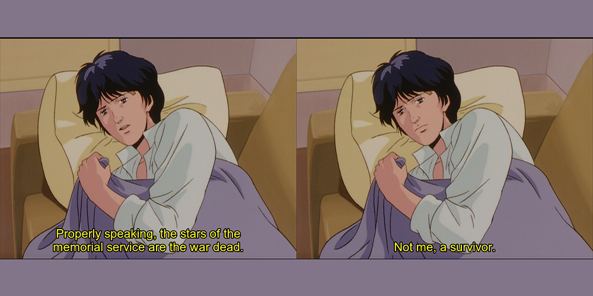
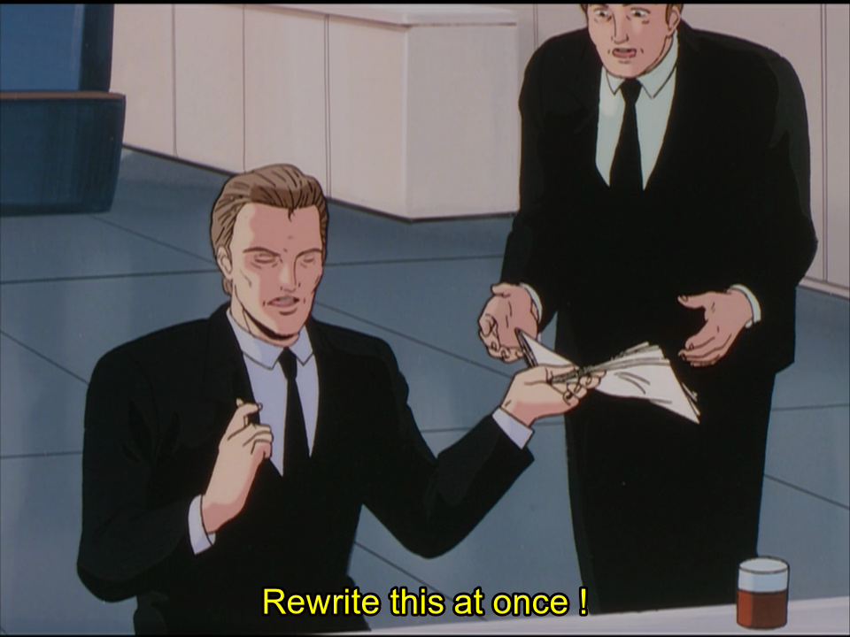
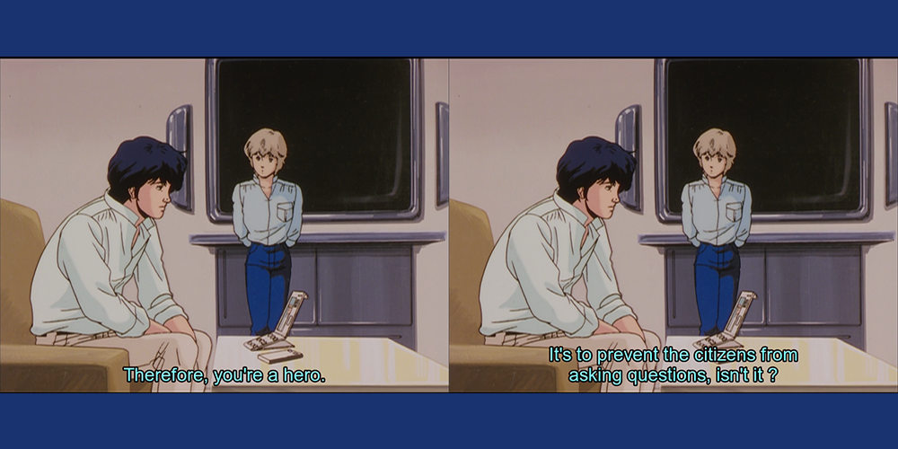
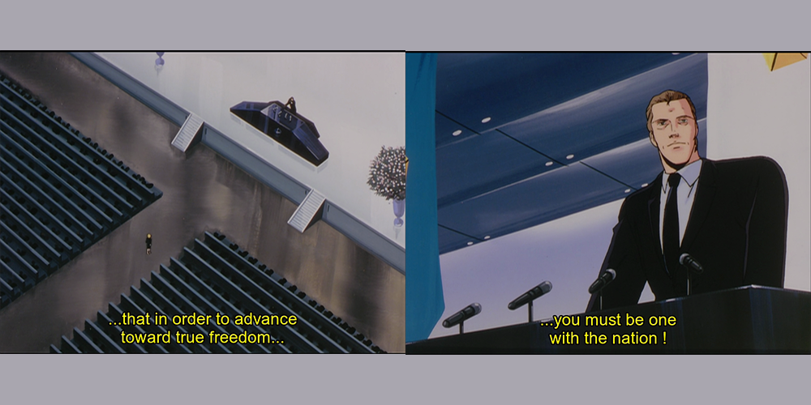
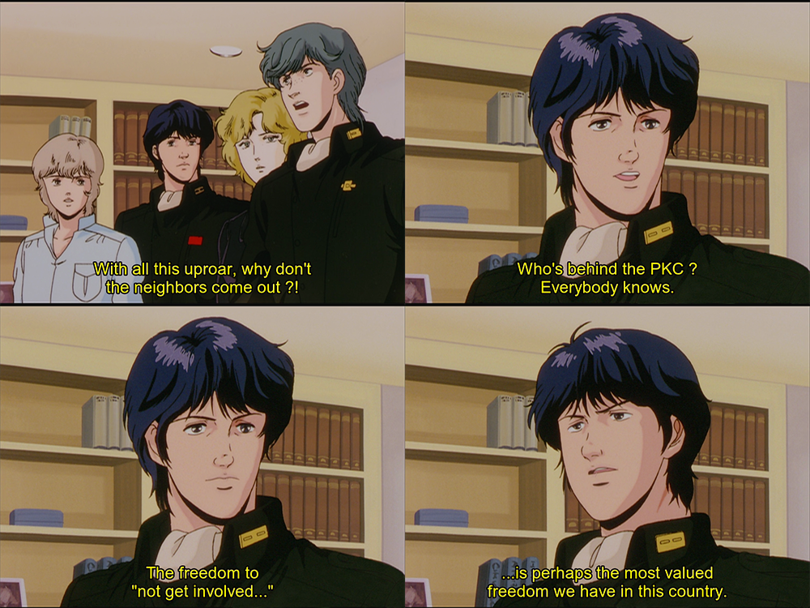

Hey hey, we're back again with more _Legend of the Galactic Heroes_, and we're continuing to spend a lot of time with Yang. If you were returning to the series hoping for more space battles, boy howdy are you going to be disappointed.

Again, **spoiler warning** for those who haven't watched yet. Certain characters and concepts will be **highlighted** in regards to their faction (so remember their names!)

| # | Episode Name | Original Air Date | Focus | Wiki Link | Watched Version |
| --- | --- | --- | --- | --- | --- |
| S01E03 | "Birth of the 13th Fleet" | 1989/01 | Introduction of conflict | \[LINK\] | Central Anime |

◄ See previous episode | See next episode ►

I came away from this episode feeling like it should have started with a giant splash screen that said "so you want some POLITICS, do ya?"

This obviously isn't a bad thing. Not only does it give _Legend of the Galactic Heroes_ something to work with in terms of non-combat plot, but it also serves to further deepen the characters that it's working with. Seeing everyone's ambitions and how they conflict with others in the pursuit of them sets up a parallelism to the actual war; some things seem petty, while others almost seem grander in scope.

Yang Wen-Li returns from the Battle of Astarte a hero, and we as an audience are given the opportunity to see the consequences of that. We learn a lot about Yang in this episode, mostly through seeing his continued apathy toward the grandeur of his actions; he doesn't want to go to this ceremony partly due to laziness, but also due to a desire to avoid indulging in a celebration of himself that he doesn't feel he deserves.

The episode is incredibly important because Yang's discontent is portrayed alongside the introduction of the darker side of the **Free Planets Alliance**. We meet **Job Trunicht**, the current Secretary of Defense, and we learn that he's a chief player in the FPA political machine. He explicitly plans to use Yang's heroism as a vehicle for himself, and is angry at the latter's absence; I get the feeling he _knows_ Yang's reaction to the invitation, and a lot of his dialog comes through gritted teeth.

This is a pretty cool introduction mostly because the FPA members we've met so far are either rank-and-file, Yang, incompetent commanding officers or Jessica. This adds depth to one side of the conflict: they are not one-dimensional do-gooders who want peace, love and harmony to spread in the galaxy. Some of them want power. Yang, continuing his _lack_ of typical hero qualities, wants nothing to do with glory or celebration — he wants to drink to be able to survive the function, and just wants to be able to study history.

Continuing on with Yang's apathy, we get to see some interesting back-and-forth and learn both his feelings towards Trunicht, and that others (well, at least **Alex Cazerne**/Cazellnu \[former was Wiki, latter is subtitles\]) does as well. All is not well in the FPA, and people know it; Yang's anointing after the Battle of Astarte is to distract the public from asking the question "why did it go so badly in the first place?"

We're given a small window into Yang's large bone to pick with the establishment. **Julian Mintz**, his ward, mentions that _he_ has an interest in being a soldier, and this is what brings Yang out of his slow mood: Yang's offer to pay off Julian's debt feels like it comes from a place of desperation to keep him from pursuing the same road that he did.

I like the way the FPA is played in this story so far because it's not the open-and-shut "good" side. Trunicht's speech, and the rally assigned to it, feel laced with anger and manipulation; it'd be easy to bring up the Hitler reference, but I think this kind of mass event is more common in politics than that. This is a photo op and a reminder that Trunicht is a selfless, utilitarian kind of guy.

The scene's chanting "down with the empire!" makes us think the people may be being manipulated, or at least a bit short-sighted. The way Trunicht posits that disagreement is allowed, but "in order to advance toward freedom, you must be one with the nation!" sends up _immediate_ red flags that something is terribly wrong. Sure, you can disagree, but if you _really_ want what's best for our society, you'll fall in line.

As this is all happening, **Jessica** has been making her way to the stage. Seeing the former Mrs-**Lapp**\-to-be go after Trunicht in a rage reflects how we ended the last episode. We can feel her grief turn to anger, and seeing it directed to someone in such a public forum tells us a lot about her. She isn't one to stand idly by, crying in the audience: she believes Lapp's death was for a cause that is flawed, and that it didn't deserve his sacrifice.

What happens next continues to tell the audience that something isn't quite right in the FPA: Yang and **Dusty Attenborough** immediately know something will come of this, and it won't be pretty. Trunicht recovers, removes Jessica from the audience, then leads the congregation in the FPA anthem. Seeing the anthem played over a montage of Trunicht, the crowd, and an emotional Jessica underscores that the despite the name, there is something brewing underneath the facade of the republic.

Jessica, escorted off the property, suddenly transitions from a scene of sadness into one of tension. We hear footsteps and the sounds of armor, but we don't know the extent of the danger; all we can do is judge it by Jessica's face as her footsteps quicken and her breath grows sharp. Suddenly, she's gone from in grief to in danger, and we learn that there's a specific price to embarrassing Trunicht: a visit from the "**Patriotic Knight Corps**." I liked this transition scene a lot because it gives a feeling of claustrophobia as Jessica's surrounded — we feel as trapped as she does.

This furthers Trunicht's villainy and gives our characters something to fight against. Having a literal _goon squad_ contrasts with his put-together and professional nature; someone has to do the dirty work, and it might as well be someone with a skull mask to keep people oppressed.

Trunicht reminds me a lot of The Smiler from Warren Ellis' _Transmetropolitan_. Reading it as a younger person, it was kind of my first window into the two-facedness of certain politicians, and how far some are willing to go under the facade of a sane, rational individual. The fact that "everyone knows" that the PKC are Trunicht's secret police without him facing repercussions tells us a lot about how far his power reaches, and how scared people are to resist him.

After our heroes' escape and the defense of Yang's house from the PKC, Yang remarks that the "freedom to not get involved" is one that people value the most. I felt this spoke a lot to both the frustration with the public's dislike of risking their own lives, but it was also spoken with the tone of empathy; Yang knows what the consequences would be, and what I'm inferring from his delivery is that he does not blame them too much.

The episode ends with the political game in full motion. Knowing that Jessica is in danger, Yang gives Trunicht what he wants: the hero to be able to distract the public with. We also get a very chilling line that's loaded with a lot of foreshadowing; we don't know if this is Trunicht threatening something, or describing what he'll want in return for Yang's favor.

The PKC member joining Trunicht from a side door after Yang leaves is almost comical, but it's to solidify the direct connection; I can almost picture the goon going "... is he gone?"

This episode is 100% Free Planets Alliance, and I feel that it sets up the next couple episodes nicely because we're reintroduced to Iserlohn. Yang is promoted, and given the **13th Fleet** as his own; he's also been given the goal to take Iserlohn with half the usual ships and numbers of a regular fleet, and he realizes that it's likely hopeless.

I read this scene in a weird way, because I wasn't sure if the admirals actually believed in Yang to take the fortress. It could have just as easily been an early "send Yang to die by giving him a task we know he can't complete," move, but the tone and delivery didn't convey this at all. Again, it felt weird. I'm sure we'll get something a little more direct later.

Yang's exit with Jessica is probably my favorite part of the episode, because it silently explains that she needs to flee for her own safety, and also has the cute moment with the woman's son. Yang, perhaps thinking back to Julian, explains that there will likely be peace in the years to come; part of me thinks he's wishing aloud for something he's unsure will come to pass.

The moment with Jessica also furthers the subtle hints that there's something more to Yang/Jessica's relationship: from meeting at the graveyard in the previous episode to this, there's something unfinished here, and I'm excited to see where it goes.

◄ See previous episode | See next episode ►
