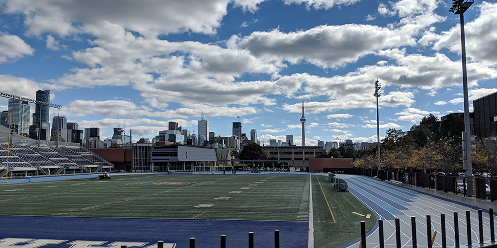
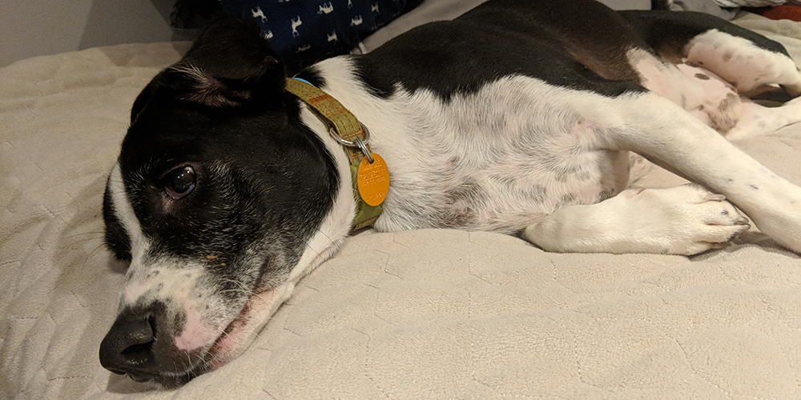

I figured it was time to do my 2018 wrap-up post, mostly because I like writing about this kind of thing. I tend to be big on reflecting over time, and the end of the year is a good enough time to do so.

This year I learned a lot about myself — and well, I'd hope so.

What made 2018 different is that I felt more _aware_ of that progress, and how invested I've become in the _act_ of learning about myself. I've become more comfortable with the search to know myself, and I just describe it in as simple a way as possible. This takes a little bit of the pressure off.

In being okay with that, I'm becoming more okay with being a flawed human. While perfection isn't possible, I've always held myself up to a really high standard, and this year that kind of broke down a little bit. I reached very tense moments with myself in terms of the potential I thought I was wasting, and eventually I became more okay with my own pain being valid.

That last thing was especially hard, because it was almost a cycle: not giving yourself room to be in pain meant that you were more likely to hide it when it happens. If you believe that no one will support you or view your pain with compassion, it becomes worse. I came to terms with the lack of support I've had in my personal relationships, and worked to try to rectify that a little bit.

It kind of came to a boiling point in June, where I found myself drunk, on my floor, and calling my dad. I had a date earlier in the day that didn't go well; I was "killing time" in the afternoon before volleyball, and thought I'd be a cool adult and drink a glass of whiskey. Then another. And another.

And soon I didn't feel very safe around myself. I kind of felt broken, and I broke down. I called my dad, and told him exactly that; hours later, we started to work it out.

The next day, I went to therapy. After that, I checked myself into Toronto's Centre for Addiction and Mental Health (CAMH) in order to just see what my options were in terms of long-term care. Nothing ever came of it after that day, but it felt that urgent: I felt that something drastic needed to be done.

Eventually, I sat down with my mom in her new home's garage, and I kind of just let it all out. It was probably the first time I've been really open and candid about the struggles that I'm going through. There was this shame attached to it, because I was never (and still am not) the type to abuse substances; it felt like crossing a weird barrier where I was purposefully self-destructive, and I really didn't like that. I didn't want it to happen again.

I let her know that through therapy, I found that I purposefully and historically have avoided asking either of my parents for care. It was time to try to fix that; I needed them to do some of my thinking for me, because at that moment, that wasn't something I could trust my brain to do.

So they made the decision for me. I moved out of my apartment four months early, and moved home. Again. I felt like a failure, and a lot of the independence that I had been gaining since I moved out felt like it vanished. I stress-ate, and gained a bunch of the weight back that I had lost through volleyball. I went cold-turkey on my medication and went through a painful withdrawal. I played a lot of Hollow Knight. That last one helped.

That was my summer — working, getting annoyed at my knees for being in pain because of my poor flexibility (and, by extension, something I was lacking in), and playing video games. It felt comfortable and familiar, but it also felt so, so shitty. I had too much time to think, and that kind of spiraled a lot of things outward. I'm still trying to stop stress-eating. I'm still acknowledging how hurt and lonely I am. I'm still in therapy, and it seems to go through a cycle of ups and downs.

But I'm still trying. And I'm still believing that there's the possibility that things will get better. Through therapy, I've found that a large part of self-defeating thinking is not having sparks of hope that make you feel that your work is worth it; that's contextualized a lot of how I feel about things.

It's just turned into something interesting that I've delved into more and more. I've helped more friends with their own issues concerning therapy and medication — it's been humbling and empowering when people see me as a resource, or someone experience that can provide help.

I started playing volleyball in January, and found that I really, really enjoy it. It lights up my life.

I fostered a dog in October, and it taught me that I'm not ready for the full-time responsibility of one. But I will be one day.

I found another apartment in November, and lost a lot of my inhibitions when it came to paying what I thought was "too much." The comfort of having somewhere modern has been great for my mental health, and I feel way more at home.

All these things are positive, but in my head, I'm still working on making them feel like "enough." I'm still working on stopping the pressure to make a large change (like diet, exercise, etc) all at once. I'm still working on just plain **taking care of myself**. I'm working every day to tell myself that turning 30 in July isn't a big deal, that I didn't waste my potential, and that everything is going to be fine.

That all feels intimidating and a struggle right now. And that's alright. It'll come.

* * *

I have some small goals I'd like to do in 2019.

- I want to start a podcast with someone(s), mostly because I like the idea of experimenting with the medium. I feel like it's grown up a lot since it started, and I want to try it out.
- I want to focus on making smaller, positive steps in general towards the "usual" goals I have (streaming, video content, writing, exercise, diet). In all honesty, I'm self-aware of how I tend to defeat myself when I try to make these changes, so really, it cannot hurt to try to tackle them in a different way.

And that's... pretty much it! I don't know if I'm keeping expectations low, or just trying to admit to myself that the brute forcing I've done in the past just isn't working anymore.

I'm a lot more comfortable and balanced with work, and I'm been able to lose some of the bad habits that come with feeling unstable when it comes to income and my future. I'll be with Evil Geniuses two years in February, which is the longest I've stayed in any one job.

Through them, I've got to experience a lot of new things, and it's helped me slow down what I felt was unrealistic goals for "life progression." Sometimes it is okay to just subsist in the moment if it's working for you, and ultimately, you're in control of the struggle and change you take on in your life.

It's weird; instead of an expansion in goal setting and motivation, this year is ultimately going to be about scaling back and slowing down. It's a progression of unlearning bad habits, learning to be okay with feeling, and seeking out support while having more compassion for myself.

Not a bad place to start. We'll see where it goes.
