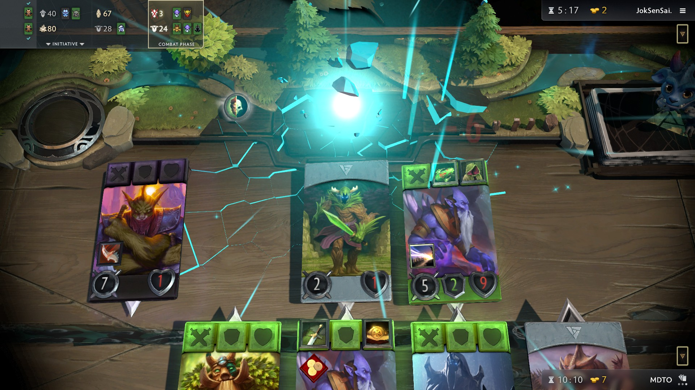
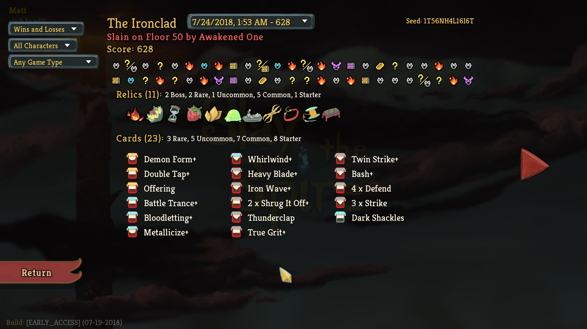

I've been playing a lot of _Slay the Spire_ lately. I've found that it's really scratched the itch for card games in a way that I never really appreciated before, and I've been spending a long time tinkering with how to approach different decks and challenges.

Ironically, I wish I could be doing this with _Artifact_.

When I have to explain to people that I'm not into card games like _Magic: The Gathering_ and _Artifact_, I've started to default to a simple "I'm not a tinkerer." In my mind, you need to be able to consistently workshop decks in order to find what works, and in order to truly understand the choices that you make when it comes to decks, you need to play a lot.

This explains why "netdecking" (or finding a deck someone else made, and playing that) is less satisfying to me in the long run. I have no investment in this thing that someone else has spent that time on, and I'm only really playing it because I'd like to win.

With _Slay the Spire_, I'm finding that there's more chances to be able to restart runs (and therefore resetting the workshopping) and there's the chance for the randomness of drops to give me that nice dopamine hit which feels amazing. The same kind of feelings can be found in _Artifact_, but for some reason, I'm not feeling it taking; it's falling by the wayside in the same way _Dragon Ball FighterZ_ did.

_DBFZ_ stopped being fun when I realized I didn't really enjoy the base function of a fighting game. I didn't really enjoy _playing the game itself_ — playing was just a way to get to the desired outcome, which is winning. While hinging enjoyment on success is always a bad thing when it comes to fighting games, I had a hard time doing the discovery (especially alone) which could lead to another hook. This is doubly true when I have so many other games that I could be playing.

_Artifact_ feels the same way. While the initial spur of drafting and holding small tournaments on a casual scale was fun, I eventually stopped opening it after a couple days. In theory, the added progression system should have helped, but I still found it hard to care about cards I'd be winning in free packs, or the narrative of me getting to be a better player.

_Slay the Spire_ is weird in that it contains many of the same things that aren't hooking me in _Artifact_. Like I said, I can build decks, itch the math/strategy part of my brain, and become invested in a concept of a run — so much that I've had a bit of gamer rage at losses that were preventable.

<figure>

<figcaption>

Y'know, like losing the boss of the last floor.

</figcaption>

</figure>

So I take a step back and I think: what's keeping me from enjoying that somewhere else, or with another game? Why am I fine tinkering here, and not there? Why can I not just picture that the other person playing _Artifact_ is a CPU, like the enemies in _Slay the Spire_? Is it that simple?

I found that once I understood what I was looking for in order to satisfy each _StS_ character's archtype, the game got infinitely more entertaining. Building up Block to avoid threats while using Body Slam (which does your Block in damage) was simple and satisfying, and it gave you things to look for. Suddenly, it was de-mystified.

It felt similar to when I started to "get" _Street Fighter V_, and especially a particularly vivid memory where I could sense the _fear_ I was instilling in my opponent. That opportunity to be creative and feel like I was "actually playing the game" was a bit of a milestone.

<figure>

<figcaption>

My first-ever SFV online win, almost two years ago.

</figcaption>

</figure>

Getting a specific card early meant my brain turned to "oh, okay, I can build a deck around this." Events that threw in good RNG or bad consequences means you have to suddenly play around your good fortune or lack of it. This is the _definition_ of tinkering, and suddenly, it becomes less of a personality habit and more of something... else.

It's that "something else" that bugs me, because I get the feeling it might be somewhat related to that PVP aspect, and how I internalize failure.

It also may have something to do with the generated aspects of the game: if there's RNG in terms of getting certain cards or not, I can blame that for when I fail. That also means starting something over fresh means another chance at success from a clean slate. The ease of which I can abandon a run that isn't working and the speed at which I can start a new one means losses don't have a chance to fester, and there's no negative reflection on the massive amount of losses I've accrued. It's simply there, and _fun_.

So, again, what is keeping me from applying that elsewhere?

Something a bit rambly to think about, but a fun problem to figure out.
