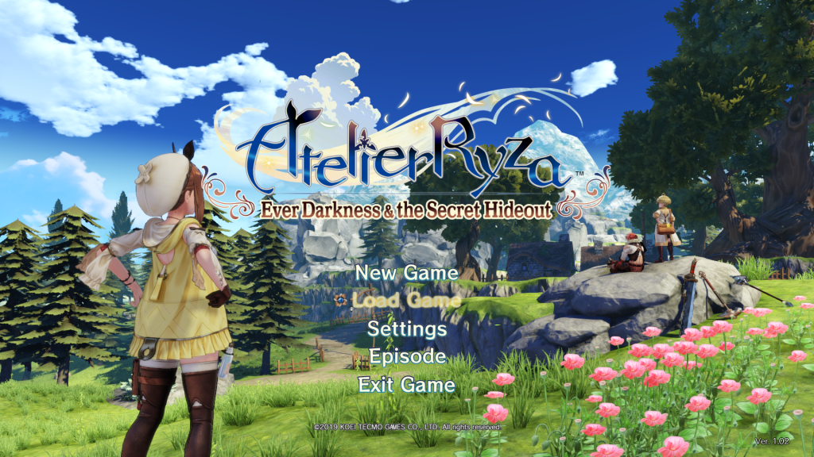
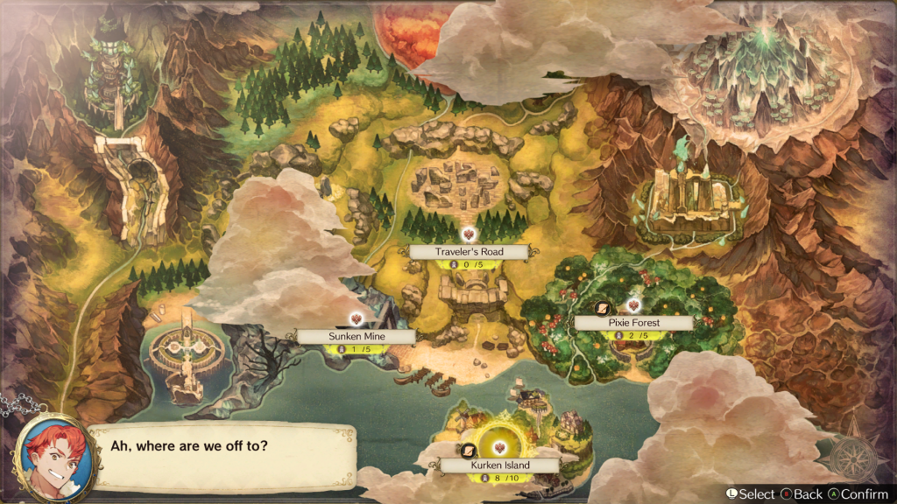
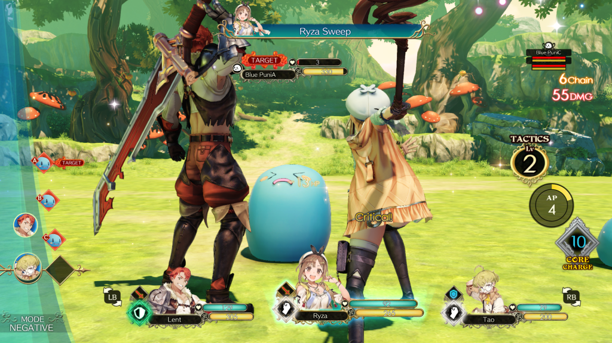
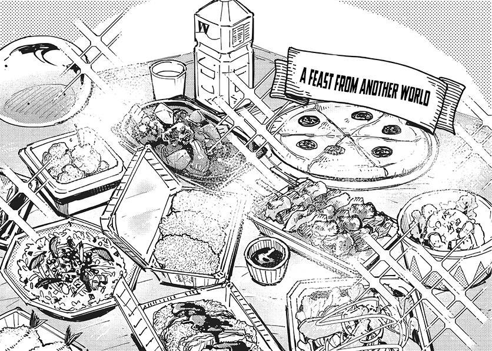
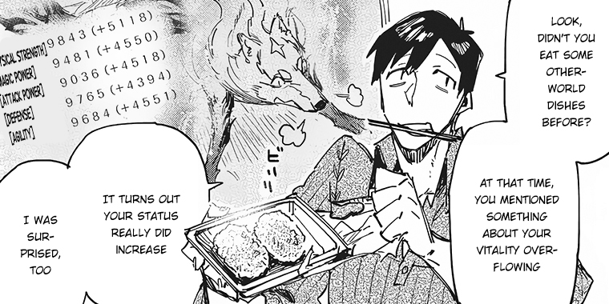
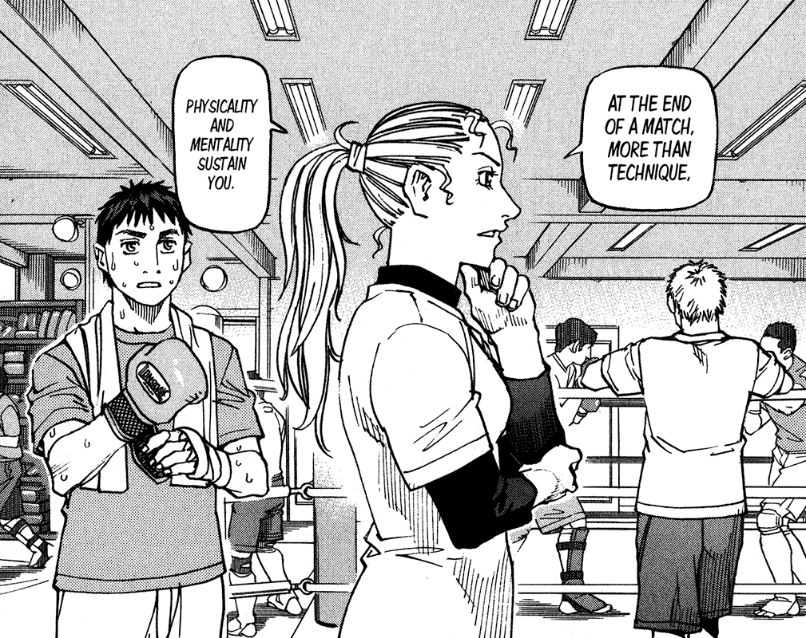
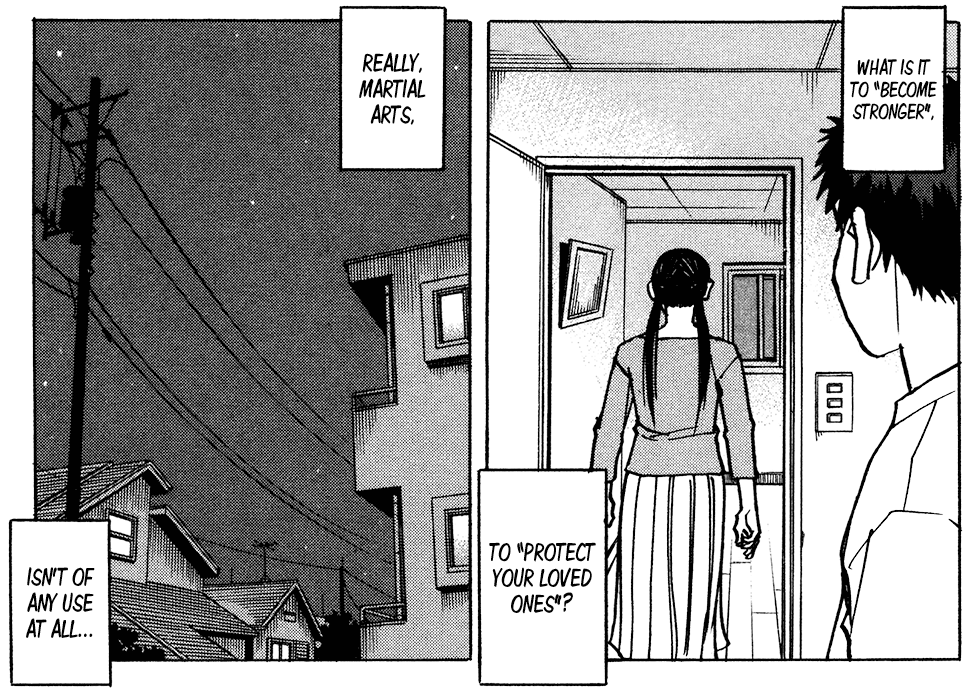
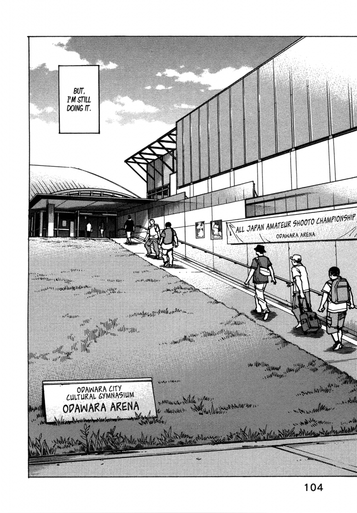
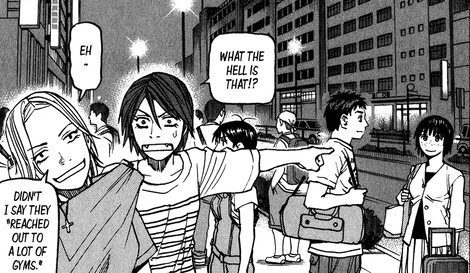
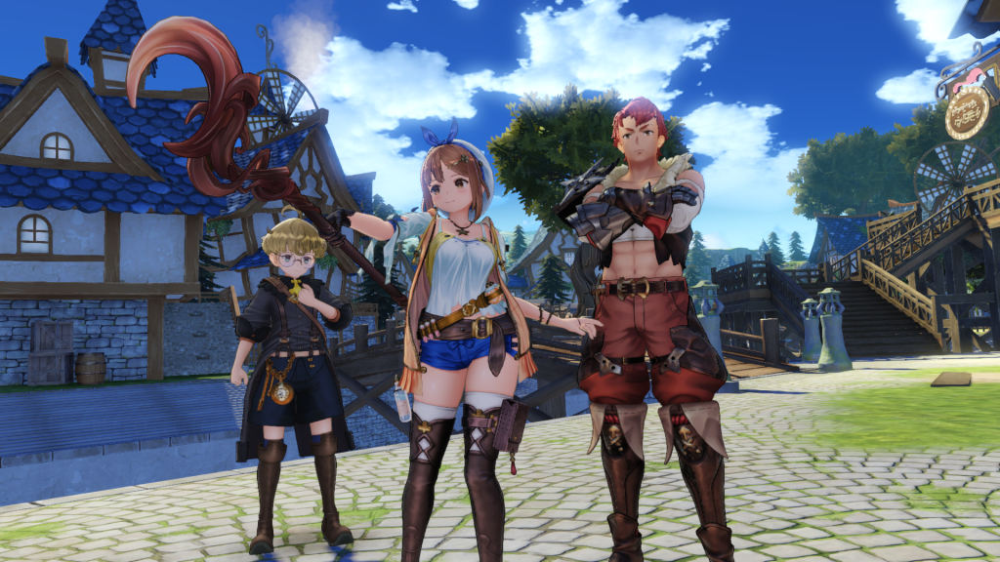

2020 has been off to a slow start for me, mostly because I'm waiting on some (good) job news, and also from personal choice. After taking November and December off after leaving EG, I'm kind of feeling the rumbles inside of me to get working and get creative again.

In 2019 I felt that I was better at embracing my own hobbies and interest for their own merits, and what they mean to me. The alternative is looking at hobbies as opportunities to make money and create content around; ironically this is what kind of kills what makes them interesting for me, as you can't go to them when you need them most (during burnout) without thinking about more work.

## Stir the pot

In a previous post, I talked a bit about how I've noticed that I'll start off liking a series, but lose interest as an over-arching narrative takes hold. I'll long for the simplicity of the days of before the plot taking off, realizing that it's unlikely that I'm going to get that feeling back.

However, this week I've run into a bit of a problem there, because I've started playing a game that's nothing _but_ that kind of thing, and ultimately it's making me lose interest, too.

_Atelier Ryza: Ever Darkness & the Secret Hideout_ was a game recommended to me by a reader (thanks Borduroy) as a strong RPG. While I've heard of the _Atelier_ series before, I hadn't dived into what exact it **is**, if that makes sense; usually if something's long-running without having a huge over-arching narrative, it usually involves some kind of strong concept that gets fans supporting it over and over.

At its core, the _Atelier_ series is almost a prototypical survival genre. It centers around a main character who collects materials to use in alchemy, either to drive the plot, make combat better, or solve problems.

_Ryza_ is that exactly; the Steam page pitches it as "_the latest in the series to depict a new 'Atelier' world, is 'True-to-life youths that develop together, even if just a little bit'._" From what I can tell, it's meant to be a fresh jumping-on point for people looking for something **very** anime.

<figure>

<figcaption>

I swear, this all makes sense in the context of the game.

</figcaption>

</figure>

I use anime as an adjective because this is a game that made me wonder where my limits for weebery are. I usually don't care if my anime has a dub or not (subtitles for life), but there are _so many_ voice lines and reactions in this game, and there's very little subtlety when it comes to fanservice. From the moment you first meet Ryza, the titular character, it's easy to think "alright, she's designed to be some nerd's fantasy girl."

The thing is, this doesn't matter, and it's not something I'm going to put in the negative column; not every JRPG or video game needs to be a milestone of character depth and development. However, when it comes to gameplay, the loop makes me feel a bit... uneasy?

Currently I'm 5-ish hours into the game. In that 5-ish hours, I've explored the main city (with multiple districts in different maps). I've gone into a dungeon, explored a couple field areas, got into lots of combat, and done a few sidequests. I've gathered a _lot_ of resources from nodes, and crafted materials, weapons, and armor. I've built my own hideout, and decorated it.

Despite all these things, I'm somehow feeling like I've done nothing at all, and the plot isn't moving _anywhere_. I will cop to being a speedreader when it comes to in-game text, but most sidequests are what I'd describe as "complete filler" and the main quest objectives seem to be moving at a glacial pace towards _getting us somewhere_.

The game's focus seems to be on getting our party into situations where they're going to be talking, solving problems, and ultimately developing. What's frustrating is that I'm finding myself on autopilot, thinking "alright, yes, we know you're the town black sheep, let's get through another 10 text boxes so we can play."

Even if the plot _were_ to pick up, the game is laid out to always come back to this loop:

1. Fast travel somewhere
2. Defeat monsters or mine nodes to get materials
3. Alchemize your materials to grow your party's capabilities or to fulfill a quest
4. Get new recipes by getting a new quest, buying new books, or unlocking them with your old ones
5. Go to "1"

That leaves me with the weird feeling of "okay Matt, what exactly do you _want?_ You've got a solid, unique setting, a decently-crafted city (which is always something I pay attention to on), a simple-but-not-braindead combat system, an endless impetus to craft and refine your equipment. It seems to be trying to avoid the typical JRPG story pacing formula to focus on character interaction... and you're still getting nothing?"

## Fire up the grill

Taking a hard left turn, I wanted to bring up a couple manga I've been reading to contrast the feelings I had with _Atelier Ryza_.

Typically when I'm looking for new manga, I'm mostly looking to replicate the feeling of being comfortable, getting invested into a (preferably) long and crafted narrative, and getting the catharsis of seeing someone you identify with reaching their goals. This is a common theme in most of the manga I'd consider my favorites: _BECK_, _Space Brothers_, _Haikyuu!!_, and most sports manga share this feeling of adversity, companionship and self-discovery that I envy, and wish I had more of in my life.

_Tondemo Skill de Isekai Hourou Meshi_ (or _Campfire Cooking in Another World with My Absurd Skill_) is an _isekai_ manga where the protagonist is mistakenly summoned into a fantasy world, ostensibly to save it. He is _not_ the traditional hero, has no combat prowess, and his only skill seems to be cooking. Since his "cheat" ability (which is kind of a hallmark of the genre) is that he can buy food and utensils off a "net market", and have it instantly show up; think an Amazon-without-a-wait-time.

Quickly into the story, his cooking saves him and his party from Fel, a legendary, end-boss-caliber monster. Because his cooking is so good, becomes the protagonist's familiar. In the story, Fel rarely has anything that can challenge him, even _without_ the protagonist's cooking giving him incredibly large stat buffs.

Because of this, the protagonist suddenly has everything he needs to survive. Fel can cast protection magic on him, and hunts for him (as long as he cooks). Fel also teaches him magic, and the parts of the monsters that Fel brings back for cooking are extremely valuable. Everyone likes the protagonist, and his cooking is so good that multiple minor goddesses give him blessings in exchange for snacks. He acquires a slime familiar that disposes of garbage for him, and can clean dishes.

Ultimately, this means that the scope of the story is extremely limited, because there are little to no stakes. With what's translated so far, the main goal of the protagonist's party is to basically "find a place and a means to live," which is pretty much accomplished.

So, my question is: why do I enjoy this series when the lack of stakes makes me bored elsewhere?

## Step into the ring

A second series I worked my way through, _All-Rounder Meguru_, is lauded as being an extremely realistic way of looking at Japanese MMA, or _shooto_. While the series has a traditional shonen storyline with the deuteragonist taking on Yakuza for his own melodramatic reasons, there's something still lacking.

When Naruto (well, from _Naruto_) starts his story by saying he wants to be the chief of his village to make its inhabitants acknowledge his skill, you're given somewhere for the story to go. With _Meguru_, the titular character has less of that ambition, but mostly achieves success through improvisation and hard work. He does not know what he wants to do with MMA, and the series is very clear about the small chance of success with the sport from a career perspective.

However, his development happens through interactions with the supporting cast, and him wanting to figure out what MMA means to him. Though he's in high school, and his college exams and prospective future are at risk, he seems to shift his priorities towards MMA success without even really noticing; he develops relationships and romance within his circle of gym competitors, and takes on successive challenges that up the stakes of the story.

This is all pretty standard, but it also adds to that pot of thoughts that swim around in my brain: Meguru's plot doesn't have a lot driving it forward, and the protagonist doesn't even seem sure of what he wants to do. Why is it interesting, and why am I intent on following it through?

<figure>

- 
- 

<figcaption>

Click to make bigger

</figcaption>

</figure>

## It's the characters, dummy

I mean, really, what else is there to say?

Good characters can lift even the most bargain-basement-boring concept into something palatable if you've got a reason to invest. With _Meguru_, I'm less interested in his development as a fighter and more interested in his development as a _person_ — I'm a sucker for romance, and seeing his awkward interactions with his cold female kickboxer teammate as she gradually realizes she's into him gives me something to root for.

In _Campfire Cooking_, the protagonist's interactions with the world avoids what can happen when the author wants to go full wish-fulfillment. Instead of destabilizing the economy with his power to buy good instantly, the protagonist just wants to make enough gold for a roof over his head and find somewhere comfy while the world's conflicts blow over.

Because he actively wants to avoid attention to himself, he avoids falling into the isekai cliche of "my previous life sucked, so I'm going to run wild with a broken power set here." While these stories pander hard to people seeking escapism from their own lives, it's basically junk food — there's no real narrative nutrition, and after a while you get sick. _Campfire Cooking_ isn't perfect, either, but I'd put it at a "fast food chicken wrap" level of nutrition, rather than "snorting pixie sticks."

So that brings us back to _Ryza_.

I've always resisted pushing the writing I do on this site towards pure reivew content, mostly because I think that I'm nowhere near well-read or well-traveled enough to say "I know a ton about video games" or even whittling that down to RPGs.

I can give _Ryza_ credit for hitting a target audience and not just being a soulless gatcha cash-grab, but I guess I'm more curious about how my reaction informs my overall taste, rather than it being something I'd recommend or not.

I figure I'll give _Ryza_ a few more hours of my time in order to see if the plot picks up; there's a couple hooks for the characters that I want to see through, and that will likely be what makes me finish or drop it. I'm more appreciative, though, for how it's informed my taste and made it a little bit easier to acknowledge what I'm searching for: something to scratch the itch of connection, even if it's with a fictional character.
