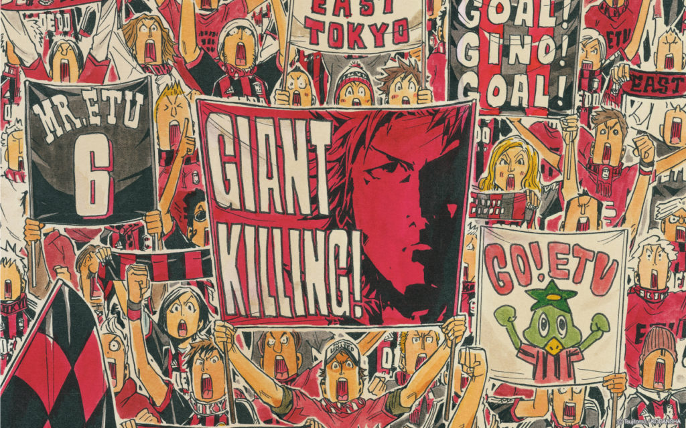
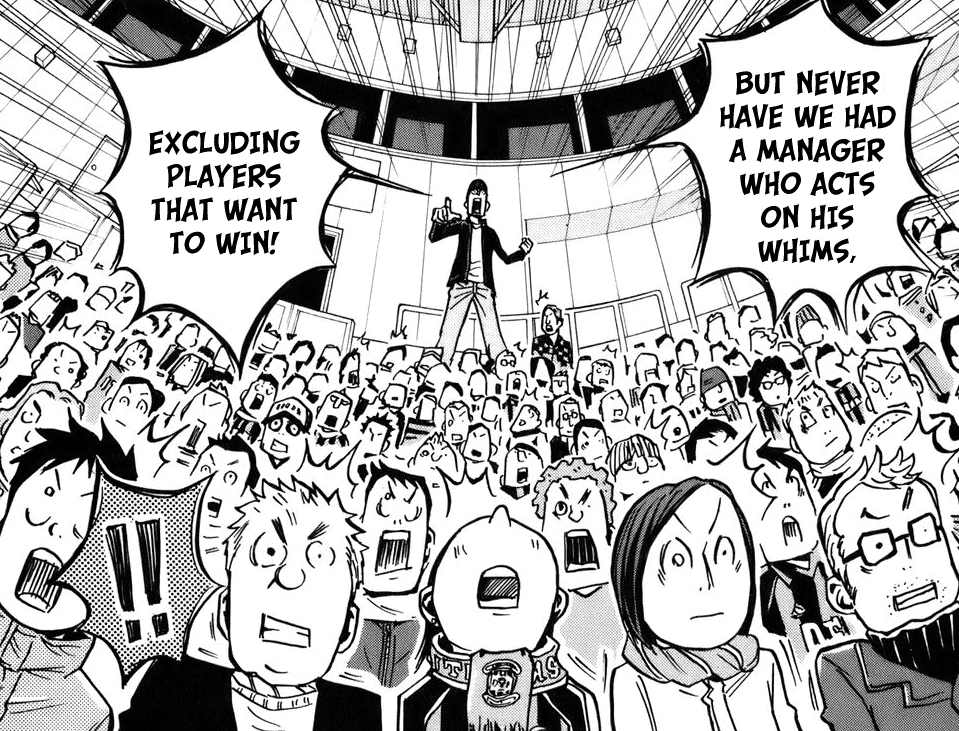
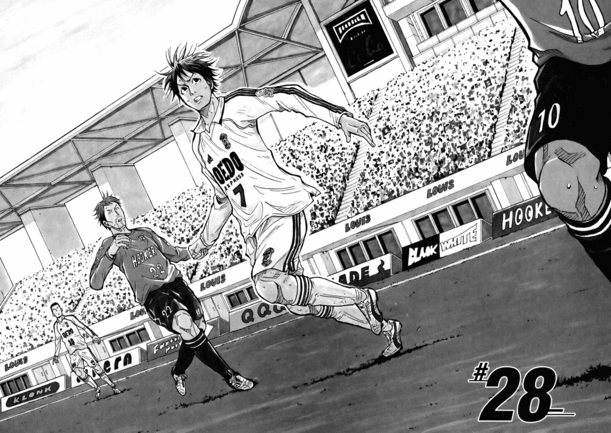
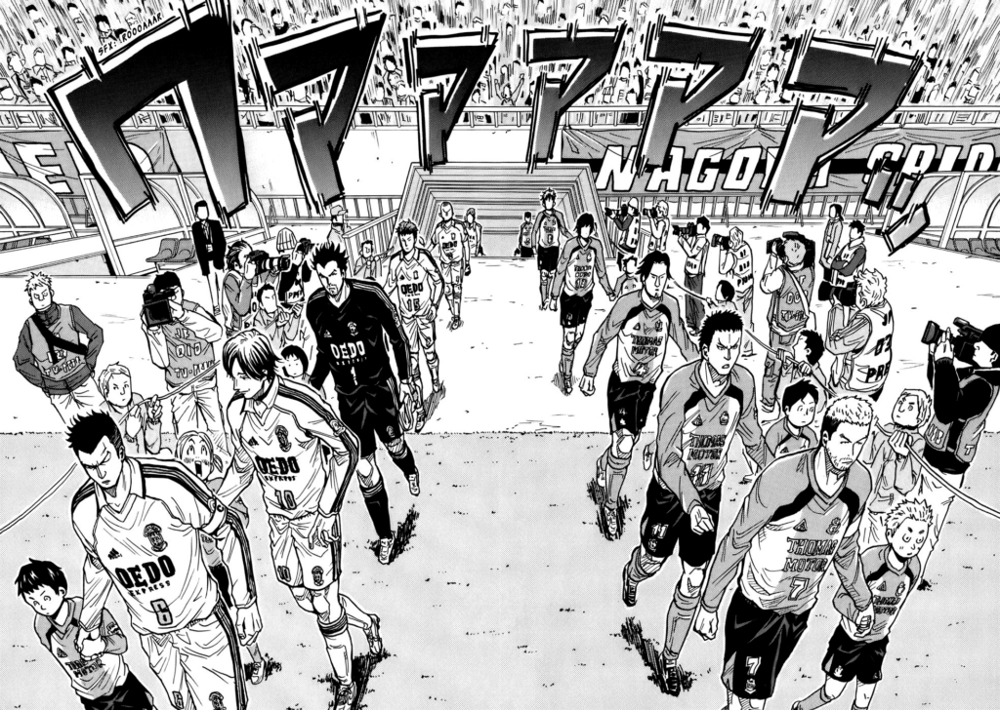
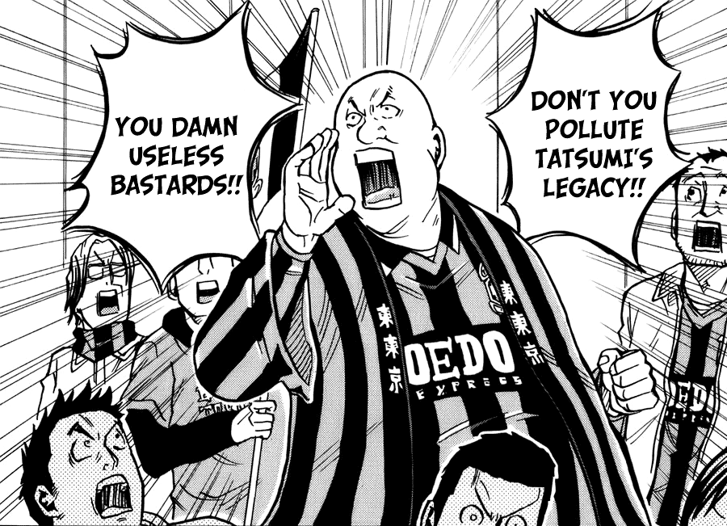
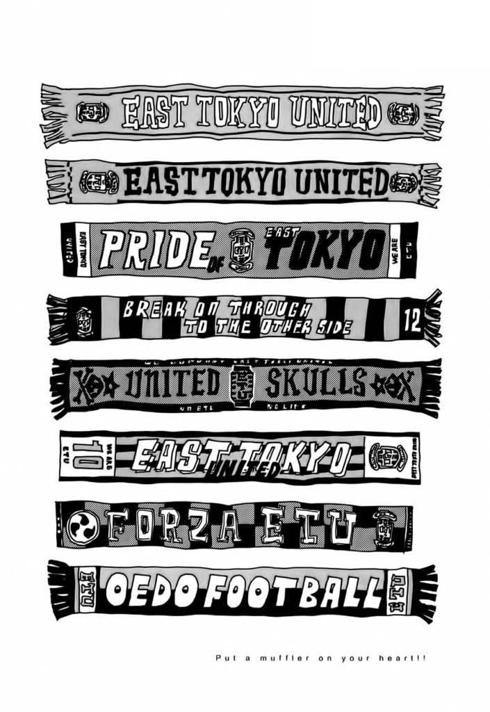
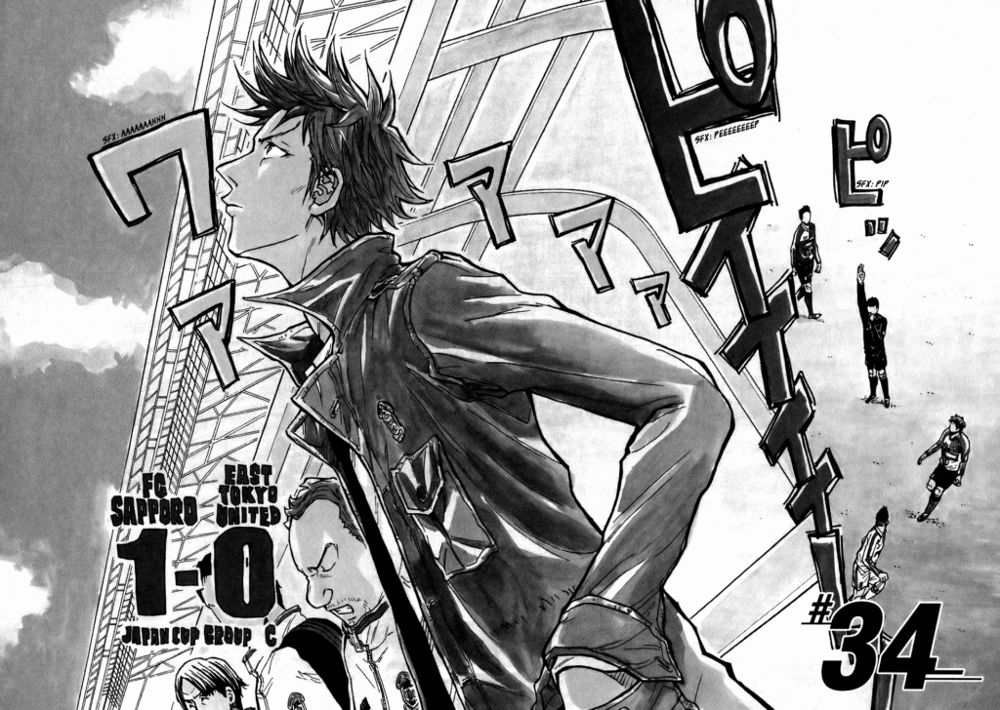
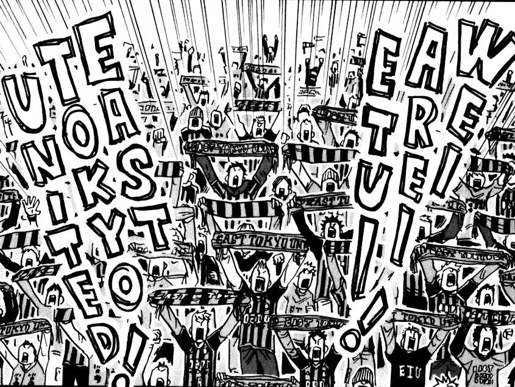

I’ve been trying to make more of a habit of reading before I go to bed, both to get myself away from the PC itself and the social media that I find myself scrolling through. There’s something particularly insidious about the habit of diving deep into reddit, Twitter or Wikis when you’re not fully engaged; it’s really easy to just float in a sea of things that aren’t really going to entertain _or_ help you grow.

Ever since I found out that I can load manga onto my eReader, I’ve been enjoying going through some of my old favorites, and exploring new ones. I’ve already published posts about _Dungeon Meshi_ and _Haikyuu!!_ for this blog, but there’s another that I’ve been meaning to write about.

_Giant Killing_ is kind of an enigma in my stable of regular reads because it feels like something that would be published in _Weekly Shonen Jump_, but isn’t. Instead, it’s a _seinin_ title that hits a very niche topic, extremely well: the _culture_ of sports, and how a professional team handles its players, its fan base, and its opponents.

<figure>

<figcaption>

Plus it has some sick graphic design.

</figcaption>

</figure>

The series starts off with a simple premise: the struggling East Tokyo United soccer team is looking to hire back its former star, Tatsumi Takeshi, in order to have him manage/coach the roster. Tatsumi left to play pro soccer in England, got injured, and had to cut his career short; he opens the series coaching an English amateur team to somewhere they really shouldn’t be — facing off against a “real” professional team.

Instantly, the theme of “Giant Killing” is established, and after bringing Tatsumi home, we’re given more context as to why his exit affected ETU, and how important rebuilding is.

As ETU’s former superstar, him leaving crippled the team, skill-wise. It meant that ETU needed to make a series of bad calls in terms of management and player choices, which further drove off fans and led them to barely keeping their position in the top league of Japanese soccer. For those unfamiliar, most pro leagues have a promotion/relegation system, where a team at the top of “Division B” can jump to “Division A,” and the last place team in “A” can fall to “B”.

ETU narrowly avoided relegation by relying on its chief star, Murakoshi (who was a rookie at the time of Tatsumi’s departure), and Tatsumi coming back after his “abandoning” the team whips up a lot of feelings.

For the fans, there are lapsed fanatics who suddenly have a reason to dust off their old supporter gear; however, they’re met with the Skulls, the supporter group who stuck through the dark ages with ETU, and now have a chip on their shoulder.

For the players, they’re used to a specific way of playing, and Tatsumi shaking up the roster has adverse effects on how they perceive themselves. What happens when Murakoshi, the stalwart captain, is in danger of being stripped of his position?

For the back office, you can tell that this gambit was a risk; they have no money, and they basically have to put all their hopes on someone who hasn’t coached professionally, and will need to produce results.

All of these things kind of coalesce in a way that sports manga usually doesn’t, and that’s why I kind of fell in love with it.

Normally, a typical sports manga will start off with an amateur or a complete newbie, as the reader will need to be educated about the game through them. The newbie will have some kind of freak skill (like say, ungodly speed or stamina) that acts as a crutch — it lets them handle being on the field and useful until later in the story, when they find their love of the game and fundamental skill.

Eventually, we’ll meet the fated rivals, go through leagues and tournaments, and hit a rhythm that’s similar to a battle manga: acquire opponent, fight opponent, grow from winning/losing, repeat. There’s no limit on how much inter-personal development happens in the story, and we usually see the game from one or more players’ perspectives; the characters usually grow as people and players during matches.

_Giant Killing_ kind of takes a different perspective. If a series like _Slam Dunk_, _Eyeshield 21_, or _Haikyuu!!_ takes a **micro** look at the action, _Giant Killing_ focuses on the **macro**. While there’s still individual matches being portrayed and moment-to-moment coverage of goals, fouls, passes, and character development, there’s a greater focus on the bigger picture of how the team operates, and how they affect the people that support them.

With that in mind, besides Tatsumi there’s very few main characters; it’s very similar to a TV series where we ping-pong between different groups who have their own focuses and storyline threads.

- We have the back office, struggling to grow sponsors and keep big ones engaged.
- We have the fans who might be struggling with the guilt of abandoning the team after Tatsumi's departure, or the newer fans who explain how they found purpose in cheering and supporting. Those newer fans are also angry at the older fans who gave up on the team, and the older fans are annoyed that they aren't being welcomed back.
- We have players who were never given a chance being moved to the main roster. We see them deal with being in form or out of it. We see how they deal with injuries and their emotions and how they grow as people. We see injuries happen in semi “real time”, in the sense that they kind of just _disappear_ for a bit, and maybe show up in the chapters between matches where they can develop personally.

It’s very much an ensemble cast, and because of the greater, zoomed-out, macro focus, it becomes very much a realistic (well, maybe _idealistic_) look at how a professional team operates. We see somewhat mundane things like Tatsumi dealing with the press, and we see bigger moments, like the back office of the league picking national/Olympic team representatives.

While the goal of the overall manga is to show Tatsumi helping ETU win again, there’s no greater “we gotta win the big game at the end of the tournament and beat those villains” moment that other sports manga has. It feels like you’re a fan of ETU yourself, watching the team from a much more personal vantage point than the fans in the show, and I can say it feels very refreshing and unique.

I think I fell in love with this series mostly because I felt that its views on fan culture and the love of your chosen game aligned with what I felt during my tenure with Evil Geniuses. During my time there I felt that maintaining passion and authenticity was always paramount, and taking the fans’ feelings into account (even if we didn’t act on them directly) was important from both a awareness and humility standpoint.

Without the passion of others, sports at a greater level isn’t possible. Seeing a series that seemed to capture what just _trying to make your ideals work_ looked like was something that spoke to me very hard.

I like series like this because they tend to give you second-hand catharsis and joy when your team finally _does_ succeed. While other sports manga tend to make wins and losses feel like the biggest deal in the world, _Giant Killing_ seems to do a great job of making them part of a greater growth arc; it’s truly about the season-long narrative here, rather than viewing each match’s opponents as villains.

Hell, ETU even faces teams _multiple times_ due to league play, rather than a “one and done” match like most sports manga go through because of single-elimination tournament arcs. We see how opponents grow and change, and we get to compare that to how ETU has shifted in the interim; players may be injured, or dramatics may have changed the context. A previous win doesn’t mean they’ll win again: I feel invested in the team’s progress, and it is not a positive, linear path. Y’know, just like how life is.

Obviously there’s some hiccups. I’m always hesitant to give manga and comics glowing “this is like real life!” praise because ultimately the creator has control over the events that happen in their story — they get to choose when ETU wins and loses. There’s also some weird art inconsistencies that improve as time goes on: proportions seem cartoonish and spindly sometimes, and later chapters improve the consistency there.

However, I’ll say that it’s rare for a sports manga (or hell, a **series in general**) to get to 300+ chapters and still have a fresh feeling that keeps me hooked as to what happens next.

After all, ETU is only like halfway done their season; there’s plenty of journey left to go.
