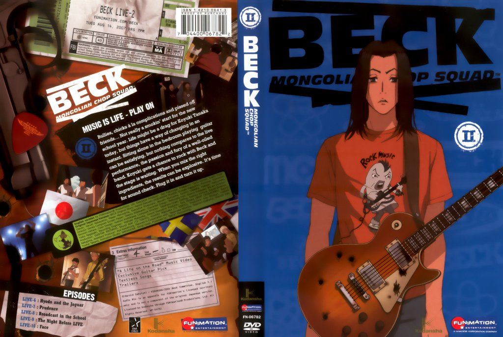
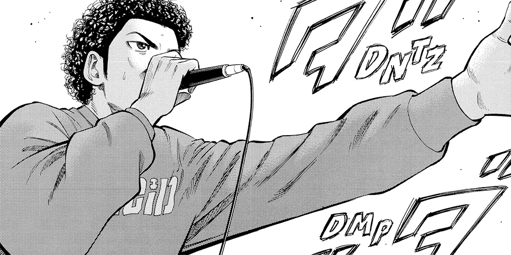
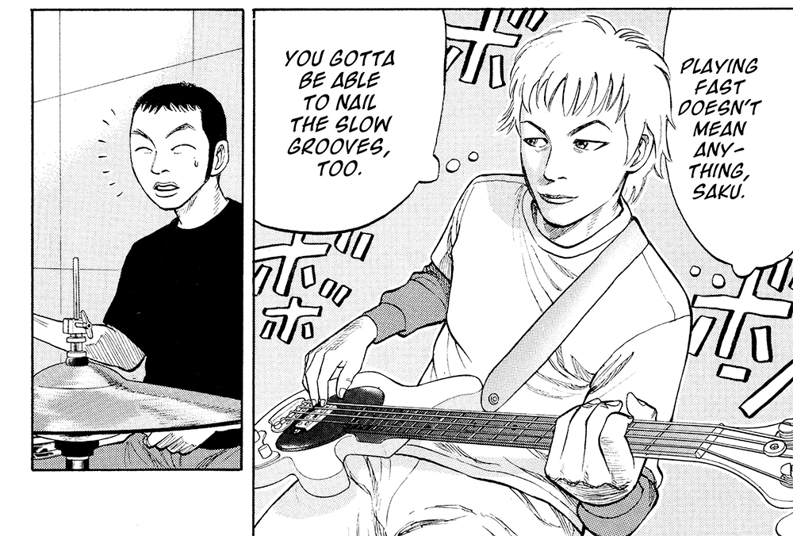
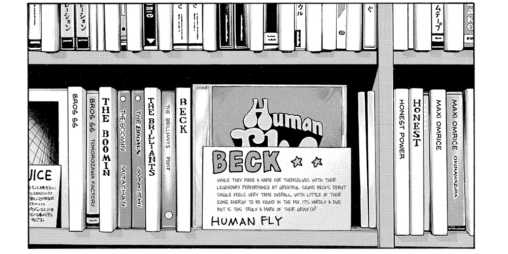
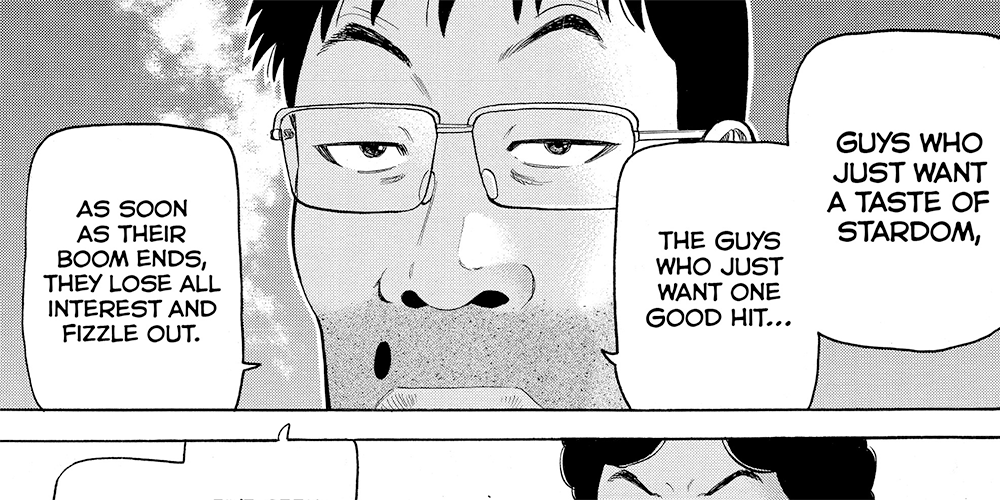
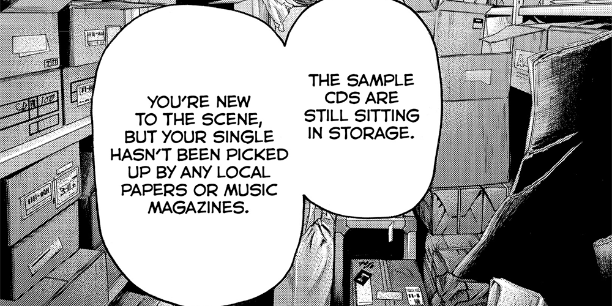
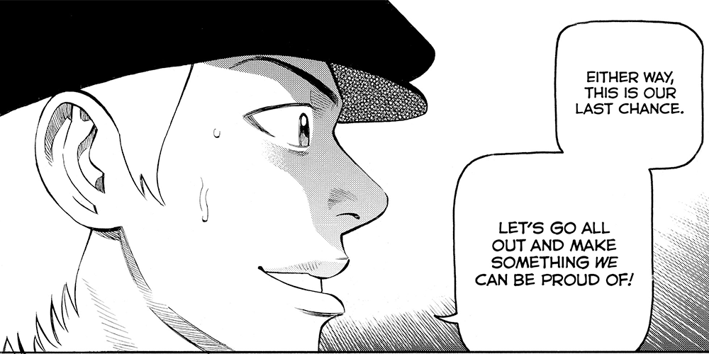

One of my favorite manga, _Haikyuu!!_, is ending soon. The chapter that was published this week let us know that the next would be the "final chapter", which gives me a lot of emotions. While I'm waiting for that (so I can write something properly) I thought I'd write about another series that's similarly influenced my life: Harold Sakuichi's _BECK_.

<!--more-->

Picture this, for a second:

You're me at 17; you're a middle-class white dude that's been bullied for a lot of his school life, and you find yourself lacking self-esteem and confidence. You don't quite know where you fit in. You know that you like a bunch of bands, but you're not quite sure whether this makes you a fan of the _genre_ or not. Something just speaks to you, though; belting out words in the shower or alone in your room is one of the few places you feel like you can be yourself.

You're working at a Wal-Mart electronic section, in what's supposedly your "dream job" for retail. In sorting DVDs, you come across the second volume of a set that has a long-haired anime dude posing with a guitar (one with _bullet holes_ in it), and you think "hey, what's this?"

That was my introduction to _BECK_. I still have those DVDs. I still have the guitar picks that came with them with the _BECK_ logos on them, as if they were real merch. I still think they're very precious to me.

_BECK_ is the story about Yukio Tanaka, 14-year-old _boring_ anime protagonist. He hasn't had a particularly hard life, but he's still dissatisfied about where he's heading, what he's planning to do (nothing), and who he's spending his time with. His idea of a good time is reading manga and listening to a J-pop idol. Something's missing.

He meets, by chance, Ryusuke Minami, a stereotypical "mysterious hoodlum" who just happens to be a guitarist of immense talent. Through a couple encounters, Yukio (or "Koyuki", as a nickname) gets pulled into Ryusuke's (or "Ray's") world.

He discovers his both literal and metaphorical voice; turns out Koyuki's got a decent (if not unfocused) set of pipes. He decides to pick up playing guitar (badly) because Ray is kind enough to gift him one. Koyuki meets Ray's half-sister, Maho. Sparks fly.

Drama happens. Hijinks ensue. Ray pulls together three more band members: mature and funky bassist Taira, spitfire MC and frontman Chiba, and a mellow, yet talented drummer, Saku. Koyuki finds his first true friends after being on the bottom of the pecking order and the subject of bullying; suddenly, things start to change for him.

<figure>

<figcaption>

It's funny to see this scene in the manga get translated to the video below. The addition of music means so much.  

</figcaption>

</figure>

<iframe width="580" height="326" src="https://www.youtube.com/embed/87DnbaoyaUk?feature=oembed" frameborder="0" allow="accelerometer; autoplay; encrypted-media; gyroscope; picture-in-picture" allowfullscreen data-origwidth="580" data-origheight="326" style="width: 750px; height: 421.552px;"></iframe>

Suddenly, that J-pop idol doesn't bring him the same comfort. Suddenly, he's expressing himself more, and standing up for what he believes in. Suddenly, he doesn't feel so alone. And suddenly, he's doing things he never thought he'd be doing.

And that's where I'm going to leave the spoilers (for now).

_BECK_ is a weird anime, because there's a good chance that if you spent time in an anime forum in the mid-to-late 2000s, you saw GIFs of its characters playing instruments. Compared to the quality of the rest of the show, they stuck out as particularly high-quality (probably due to a degree of rotoscoping and 3D modelling). This gave it a weird memetic quality, but they also served the other highlight — the soundtrack.

It took me a while to realize it (and some reasearch), but it turns out that Harold Sakuichi is a pretty big Red Hot Chili Peppers fanboy, and _BECK_'s music style (as a band **and** an anime) reflects that. They are hip-hop rap-funk with alt-rock and strong vocals thrown in to change pace — Koyuki's songs tend to reflect Anthony Kiedis' growth as a singer for _Californication_ era onward, while Chiba's rapping and hype-man abilities reflect earlier RHCP.

This feels weird to comment on, because the fictional band of _BECK_ actually has songs that you can listen to "by them." Similarly to _Almost Famous_'s fictional band Stilwater, you can suspend your disbelief a little and actually imagine that you're listening to the band.

If you're willing to hunt for a torrent, you can find the two-disk OST; the first disk _sounds like something an indie band would produce on no budget_, while the "covers" on the second disk are by "real bands" that bring an element of polish to these things that **mean a lot** to the people listening, reading and watching.

<iframe width="580" height="326" src="https://www.youtube.com/embed/E2UTc2lTjww?feature=oembed" frameborder="0" allow="accelerometer; autoplay; encrypted-media; gyroscope; picture-in-picture" allowfullscreen data-origwidth="580" data-origheight="326" style="width: 750px; height: 421.552px;"></iframe>

This influence really resonated with me, because the anime, manga, and world heavily reflected all the things I liked growing up. When I got around to reading the manga, there were so many wrestling references that I _still_ catch new ones when I re-read it. You can tell that Sakuichi really had a focus on letting his own weirdness come through, and that was something I appreciate heavily.

The anime, unfortunately, goes a mere 24 episodes and covers a very small portion of the manga. The latter goes to a full 103 chapters, and the title theme's refrain of looking to "hit in America" comes true, along with a bunch of other problems for the band.

But something has always comforted me about _BECK_ when I re-read it. It represents change on one's own terms, and it always gave me hope that I'd be able to find a solid friend group like the characters in the band.

The support, affection, creativity and drive that they all share just felt like a kinship I never had access to — despite the conflicts between them that any band would have, they still manage to come together when it really matters, and their growth as people refreshes my hope.

As I spend more time in esports, gaming, and wherever I call home at the time, it's easy to get jaded about the potential of your own creativity and vision. It's easy to think that because what you like or value is _different_, it's not saleable, or it won't support you; this is the kind of thing that keeps you from _trying_ in the first place.

I realize that _BECK_, (and other manga like it, like sports manga or _Space Brothers_) have the advantage that someone is literally the god of their world. The manga author is inclined to give their audience a happy ending, and in real life, not everyone is so lucky.

I've fought with myself about whether I should let this kind of series inspire me because of this. I stop myself, thinking "well, why would I take inspiration from a situation that is 100% crafted, and therefore unrealistic? Why would I hope that I could achieve my dreams, when the creator of the manga gets to choose whether the protagonists succeed or fail?"

It's a weird line of thinking, because something like this isn't a guide. It isn't something that you're expected to _follow the actual line of events_. It also makes a lot of sense to me that in a way, _BECK_ is inspiring because it has made a large impact on a lot of people despite being a very niche project.

Despite winning a Kodansha Manga Award in 2002 (tied with cult classic _Cromartie High School_), _BECK_ still feels like a sleeper success. The anime's single season got an English dub for MTV and MuchMusic in Canada, which I imagine is off the back of Toonami's success with anime in the US.

When it came to licensing the manga in English, _BECK_ never got to tell its whole story; the physical volumes ended with volume 12 (ending with chapter 36 out of 103), and readers had to wait until **2019** for ComiXology to pick up the rights for a digital release.

For a while, I just re-read the series with what I felt was the only "complete" pack of chapters, since there wasn't an "all-in-one" torrent available. It felt cobbled together, but there's still a lot of character in those scanlations, especially since translators loved to note (and were sometimes perplexed by) the more obscure wrestling and music references.

But still, despite this — despite people who saw the anime not getting the full story, and people reading the manga having to hunt for it — it's still loved, and viewed as one of those series where "if you know, you know." They know the GIFs. They know the songs. They might have made their own bootleg _BECK_ merchandise. It might remind them of a simpler time in their life.

Or it might be special to them, like it is to me, because every re-read gives you a renewed sense of optimism and hope. That hope — the one that makes you think you can make it on **your** terms — is a valuable thing, and I will forever be grateful for it.

_You can find BECK on comiXology, or if you have Amazon Prime, you can read it for free on Kindle (or buy it)._

_You can watch the anime legally through Funimation's streaming service in both English and Japanese with subtitles. There's also a "complete series" DVD available for $25 CAD, which I think is a great price, considering what anime goes for these days._
