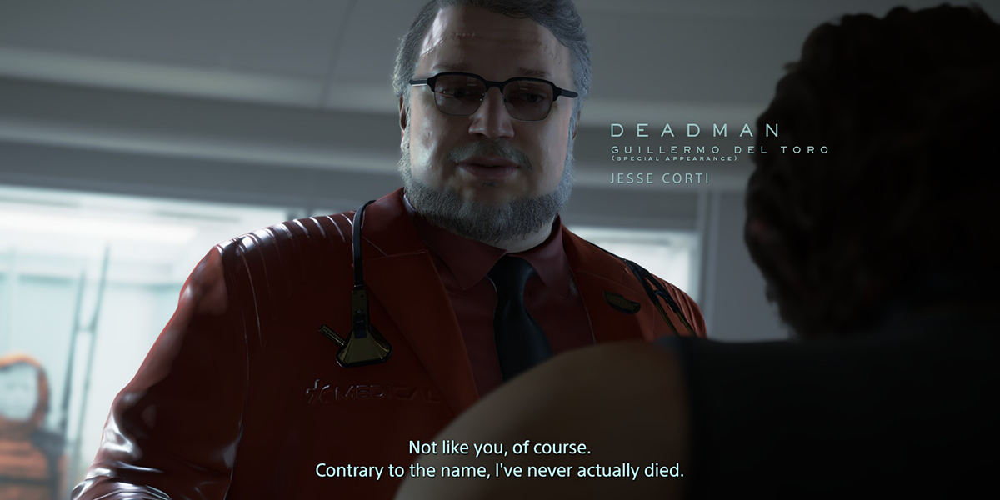
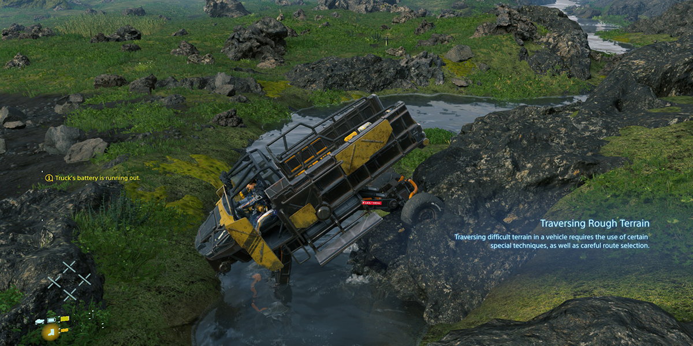
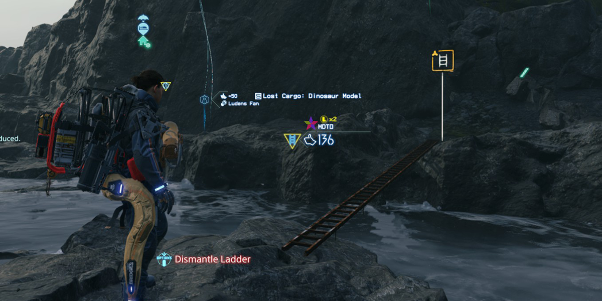
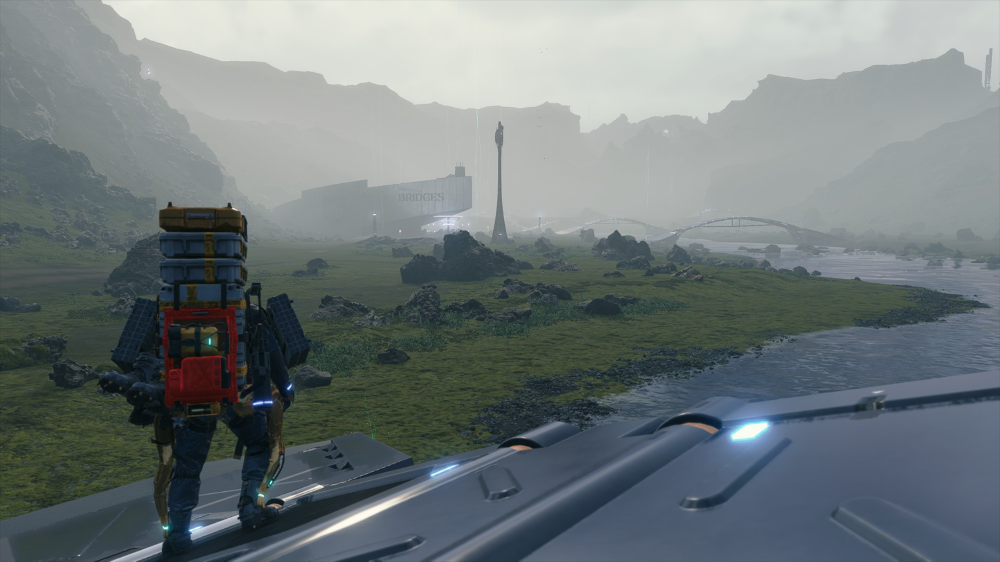
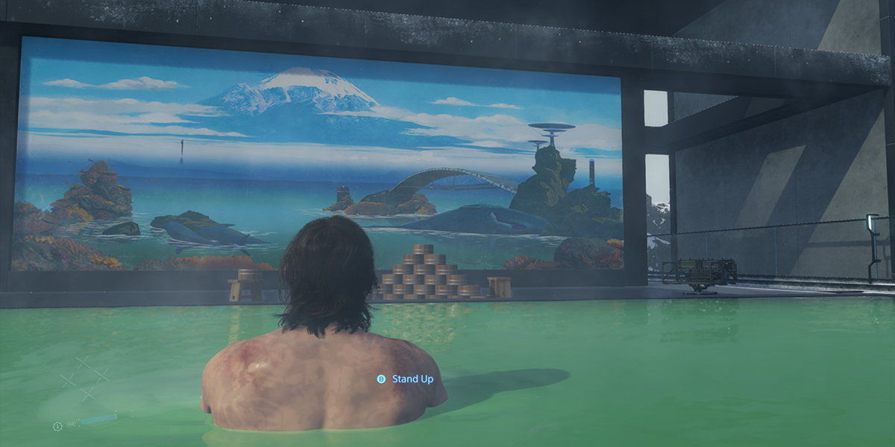

#### Spoiler alert

There won't be any spoiler warnings in this piece for the plot of _Death Stranding_, and even if I included them, they probably wouldn't make much sense.

The most common thing I've read online about _Death Stranding_ is "you like it, or you don't." I would agree that it's a _divisive_ game, but probably not for the most common applications of the word: it isn't offensive or particularly inflammatory, but the way it's designed definitely has the potential to turn people off.

I feel that part of the blame for this is its marketing. Up until its launch, we really had no idea what the player would _do_ or what it was about. All we knew is that Hideo Kojima had departed Konami on bad terms after _Metal Gear Solid V_, a project that went over-budget and _still_ didn't come out finished.

Whether you're sympathetic to Kojima as an auteur or Konami as a business, it became more interesting to see what the former would do _after_, especially since Konami seem to be content to let much-loved IP rot while they put their time into pachinko machines.

In short, Kojima had something to prove with _Death Stranding_, especially after the frustrating cancelling of _Silent Hills_, which had a number of celebrities attached (Guillermo del Toro, Norman Reedus) and a very successful demo in _P.T._ With _Death Stranding_, we see del Toro, Reedus, Mads Mikkelsen, Conan O'Brien, Geoff Keighley, Nicolas Winding Refn and a bunch of Kojima's other entertainment industry friends appear in trailers that still fail to answer a basic question: "what is the player doing with their time?"

<figure>

<figcaption>

GDT is here in body scan, but not in voice.

</figcaption>

</figure>

Pre-launch we hear that Kojima looks to make what he calls a "Strand Game"; this is supposed to be an entirely new genre, but it doesn't exactly answer the question, either. We learn that the game is about forming connections between people and communities, and my ears perk up. It launches in late 2019, and a lot of people have a chance to watch videos and streams to figure out whether it's worth their time.

There's a lot of "...it's just walking?"

That's kind of a basic answer, and one I want to do my best to correct in this piece.

<iframe width="580" height="326" src="https://www.youtube.com/embed/UcaMw4aCz4c?feature=oembed" frameborder="0" allow="accelerometer; autoplay; encrypted-media; gyroscope; picture-in-picture" allowfullscreen data-origwidth="580" data-origheight="326" style="width: 750px; height: 421.552px;"></iframe>

I very rarely touch open world games because they need to scratch a certain itch for me. I need to be able to feel like that world is _alive_, and in doing so, I feel like I'm interacting with it and helping it grow. In video games like _The Legend of Zelda: Breath of the Wild_ or _The Elder Scrolls V: Skyrim_, I find that the things I like doing the best are the things that improve my virtual life within these worlds, help me interact with the people already living in it, and making processes that are difficult (travel, combat, etc) more efficient.

When I found out that was **the entire premise** of _Death Stranding_, I became increasingly interested. I decided to wait for its PC release, which occurred on July 14, 2020.

To try to explain the premise and plot of _Death Stranding_ is a bit difficult, because it feels like it does a disservice to it to just say "you're playing postman in the post-apocalypse." As Sam Porter Bridges (played by Norman Reedus), you're tasked with "connecting America" after an extinction event that connects the realms of the living and the dead.

Death brings ghosts, called BTs (Beached Things). Death and corpses attract BTs. When BTs (made of anti-matter) touch the matter of dead bodies, they explode, leaving craters in their wake. These explosions can kill humans, which causes a chain reaction.

The appearances of BTs also brings timefall — rain and snow that speeds up the aging of the first things it touches. This makes air travel impossible, and impacts the landscape of the game's United States.

Because air travel is impossible and everything that timefall touches degrades, it's up to humanity to lug cargo on foot (and as the game progresses, more convenient means) to bring supplies to each other. This is where the player character comes in.

Sam also carries a necklace with a series of mathematical equations on it, which, when connected to an outpost's terminal, brings them online to a "super Internet," made possible by the appearance of the BTs. It functions by sending data back in time so that the transfer appears instantaneous; in-game, it also allows you, the player, to see player-constructed buildings and contribute to building roads, zip-lines, and other infrastructure that makes deliveries easier.

In short, yes, it is about walking. But that walking has a purpose, and the path-finding that you need to undertake has a greater goal of improving logistics. This is why it feels divisive to explain to people: some peoples' eyes glaze over in boredom when they hear that pitch, but to me (and others), that sounds like an interesting challenge.

_Death Stranding_ is what happens when someone takes that "types of conflict" lesson from a literature course and focuses way too hard on "man vs environment." Every step you take in _Death Stranding_ benefits from forethought, preparation, and familiarity.

<figure>

<figcaption>

I left this truck here, stuck forever, as a monument to my hubris.

</figcaption>

</figure>

You're constantly using your scanner on the terrain, making decisions about what's too much of a risk: do you have enough stamina to ford the river? Is that cliff too steep? If you've ever played an MMORPG and became familiar with the texturing of terrain you can walk on — of course, to go where you shouldn't be — _Death Stranding_ scratches that itch in the name of making your delivery a _tiny_ bit faster.

If you've traversed a route between a wind energy farm and a distribution station enough times, you'll know where and how BTs will appear, and how you might avoid them. If you've outfitted yourself with a power exoskeleton for your legs, you'll spend less time balancing yourself out if you've over-packed your cargo. If you've prepared ahead of time to bring ladders and climbing ropes, all of a sudden reaching that one peak that would shave minutes off your delivery time is much easier.

This expands considerably once the player gets access to better tools to increase their logistics, and relies on others to help build them. Each player in _Death Stranding_ plays in their own instance, which means you never see other players walking around; you're in your own parallel dimension. However, you'll see their contributions to structures you want to build (like bridges, roads, shelters, and generators), and if you work together, you all benefit.

\[video src="https://mattdemers.com/wp-content/uploads/2020/08/DS\_Zipline.webm" mp4="https://mattdemers.com/wp-content/uploads/2020/08/DS\_Zipline.mp4" loop="on" preload="auto"\]

If you've taken the time to collaboratively build roads, suddenly a trip that would take 20 minutes on foot shrinks to 5 minutes by truck. Since that truck struggles with rocky terrain, loses battery power in rivers, and is vulnerable to ghost or scavenger attack, it's an _amazing_ feeling to suddenly be driving on a road that overpasses them all. Since the route is predetermined (so no trolling!), all you do is dump resources that you gather or recycle into machines that pave the road for you.

It's hard to write this piece because this sense of community — even if you aren't exchanging chats or messages — is much better experienced, and takes some time to appreciate. It feels very similar to _Dark Souls_' messaging feature, where people would let other players know where traps or treasure might be.

Just like in _Dark Souls_, messages or structures earn ratings, or "Likes", which the player receives periodically. Knowing other people have used a ladder I put down or appreciated a shelter I built near a delivery point gives me a unique sense of satisfaction: I'm not playing the game just for myself.

<figure>

<figcaption>

I placed this ladder early on in my playthrough, and 40 hours later it's still here, getting likes from people.

</figcaption>

</figure>

When I'm on a mountaintop and my powered exoskeleton is _just_ out of battery and I happen to stumble across a generator which puts me back to full, there's nothing I can do _besides_ throw a bunch of Likes towards its creator.

It's important to note that you don't see other peoples' structures until you bring a hub onto that Super Internet. This keeps the game from feeling like it's "solved" if you weren't playing on launch day. Logging in for the first time and seeing a set of bridges and zip-lines that trivialize the experience of getting to those hubs would remove a lot of the fun.

That fun is... specific. And again, I can understand why people don't enjoy it. But as someone who likes doing as many things as possible to made the game easier for myself before I advance the story, I find myself walking across a desolate landscape, listening to out-of-game podcasts, trying to traverse rivers or avoid falling rocks, finding small cairns left by other players, or running across their lost cargo.

If cargo is collected and then left on the ground for a long enough period of time (at a far enough distance away from the player), it gets sent to another players' world as "lost cargo." Again, this contributes to a feeling of community without even needing to see someone else: the game incentivizes you to complete that player's delivery, because you're all in it together.

I suppose that's the best case I can make for someone's enjoyment of _Death Stranding_: it's a unique way of forming connections with other players, and the in-game world itself. It is unlike anything I've ever played before, and that in itself is commendable; while I'm not usually in the "it's hard to process, so it must be art" camp, I think that the games-as-art debate could really use games like _Death Stranding_, if only to encourage people to step out of their comfort zones.

The story isn't anything revolutionary, and it's very easy to brush aside as "oh that Kojima" if you aren't particularly into science fiction or like reading emails, logs and other documents that further develop the world. The world doesn't even feel particularly _alive_ in all the ways I'd want it to, since most of the characters you interact with are hidden in bunkers, appearing via hologram.

The cities and citizens you're serving are similarly inaccessible, living in large buildings or behind walls that you can only really see in the background of the depots that you arrive/depart from. There's no **living** to be done outside of the private rooms that Sam has access to, and I think that's on purpose; the game wants you to focus on your interactions with the world itself, _then_ forming connections between your brokers. There's even some in-game text that implies that the majority of people in the world may be asexual, or at least hesitant to form bonds with each other (excerpt below):

> One theory posits that the Stranding accelerated the proliferation of these sexualities. In a terrifying new world in which BTs roam and annihilation is an everyday occurrence, people have grown reticent to form emotional connections with others.

Whether it's planned, or whether it's just a lack of budget precluding the inclusion of a more robust world, I find it a bit contradictory to my usual tastes. Usually I _like_ the world I'm inhabiting to feel lived-in, and the more NPCs, settlements, and signs of life the better.

With _Death Stranding_, the solitude and the feeling of me-against-the-world actually does a lot to calm and relax me. I feel very much at peace trucking through the wilderness, or figuring out just how I'm going to get over a cliff without dying. Seeing my actions impact people (not just through the plot, but through the online interactions) means that I feel like I'm contributing, and that my actions truly have weight.

That weight is something that open world games often get wrong, or fail to capture. The result of that failure is a world that feels sterile, lifeless, and boring; since you truly can't affect the game world, it's merely a theme park with set pieces that you can't deviate from.

With _Death Stranding_, every player death leaves a crater that persists. You also see the footprints that you took, and give other players Likes for following their trails. You don't feel like you're cheating; you feel like you're winning against a world that doesn't want you, or humanity, to succeed.

That kind of engrossing feeling is something that I find is increasingly rare when I play video games, and something I really cherish. Even if the plot itself doesn't shape my life, the gameplay fills in the gap with something unique, lasting and impactful.

If that sounds like something you'll enjoy as well, I urge you to give _Death Stranding_ a shot on PS4 or on PC through Steam.
