#### Spoiler warning and housekeeping

Hello! This piece is discussing a just-released game, so naturally there's going to be some mention of things that people haven't been able to see.

I omit things like crucial plot details, and try to avoid spoiling certain things like party members that other media doesn't cover. However, because of the nature of the piece (discussing why or why not it functions as an RPG) I **need** to be able to discuss things as a result of me spending time with the game.

Proceed at your own risk, I guess.

Thanks again to my wonderful patrons on Patreon for supporting this piece. Patrons get audio or a YouTube video of me reading this piece, as well.

Check out my Patreon!

I love SEGA's _Yakuza_ franchise. I started playing it in 2015 in a down period in my life, and I'm thankful for what it was then, and what it's done for me since.

It's helped me become more interested about Japan, and helped me take the step to actually traveling there; I can say that that trip was one of the best experiences in my life.

I've written about SEGA wrapping up the story of the series' main protagonist, Kazuma Kiryu, before. With _Yakuza 7_ (re-titled _Yakuza: Like a Dragon_ for the West), SEGA decided to radically change the series' genre in order to better work with its new protagonist: Kasuga Ichiban was obsessed with _Dragon Quest_, so _Like a Dragon_ would play like a turn-based RPG, rather than a beat-em-up.

<figure>

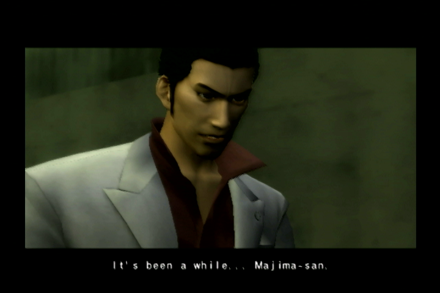

<figcaption>

We've come a long way since the PS2, baby.

</figcaption>

</figure>

I've been playing _Like a Dragon_ for 30 hours now, and I was debating how exactly I'd write about it. Instead of going for a general explainer, all I've been thinking about is how well the game delivers on its pitch of changing the gameplay radically. I don't know if it's valid to be able to criticize it, but I'd like to.

I say "I don't know if it's valid" because I don't know if my expectations are too high; I wanted to be careful of my what I thought the game was capable of going in, because there's a number of factors at play.

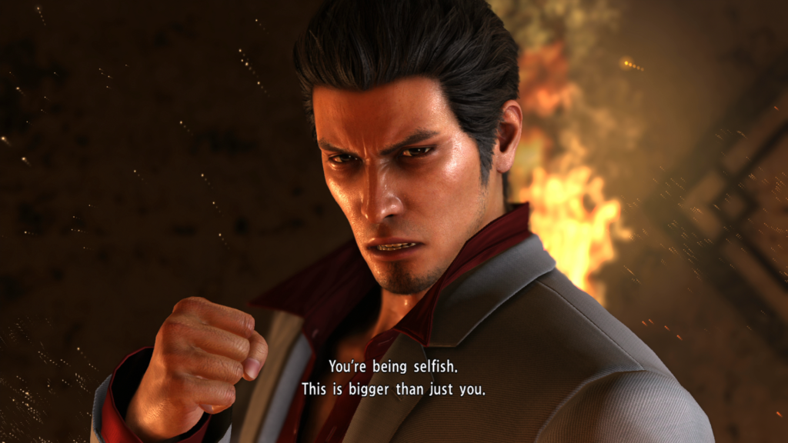

Historically, _Yakuza_ titles are masters of re-using content and engines to be able to develop new entries on the backbone of previous ones. While _Yakuza: Like a Dragon_ uses the titular Dragon engine that _Yakuza 6: The Song of Life_ (2016), _Yakuza: Kiwami 2_ (2017) and _Judgment_ (2018) used, it's using it for something vastly different.

The Dragon engine was a mess in _Yakuza 6_, and was vastly improved over the course of the next games that took advantage of it; however, the goal there is refining the same playstyle and game type, rather than innovating.

I wanted to be mindful of Ryu Ga Gotoku Studio potentially tripping over that engine in order to execute a new concept, and giving them some grace.

## Gathering your party and venturing forth

Again, I've spent 30 hours with _Yakuza: Like a Dragon_, and I've become more comfortable with criticizing the game's delivery of an RPG because it's woven so deeply into its pitch.

Ichiban Kasuga is a misfit among misfits: born in a brothel on New Year's Day and abandoned, he was raised by the staff and sex workers of Kamurocho's red light district. This positions himself as a son of Kamurocho, the _Yakuza_ series' mainstay setting — already, the developers want you to know he's meant to be there.

While we never see it, we're told that Ichiban spent a lot of his youth playing _Dragon Quest_. He joins the Arakawa Family, a subsidiary of the Tojo Clan, after finding people who would provide him the familial bonds he's been missing in his life.

We start the game playing as Ichiban in the year 2000; we see Kamurocho in a year we've never seen in-game before. Ichiban takes a fall for a murder (echoing the start of Kazuma Kiryu's history in 2005's _Yakuza_ for the Playstation 2), and we next see him 18 years later, when he gets out.

<figure>

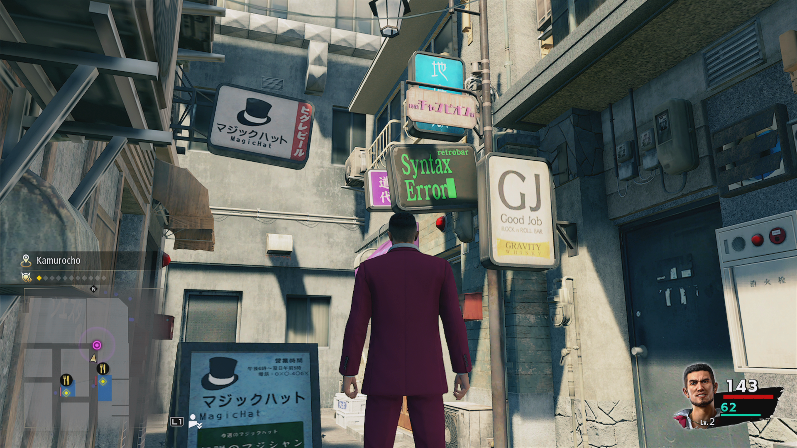

<figcaption>

At least the Syntax Error bar is still here...

</figcaption>

</figure>

Instead of carrying out fights like Kiryu did, in real-time combat, Ichiban mentally processes fights like a turn-based RPG battle.

When a fight is initiated, him and his party warp into their jobs' attire, and the enemies we saw on the street morph into RPG-friendly classes. Approaching a group of punks on the street mean when the fight starts, they're suddenly "Steamed Punks", or "Dine N Dashers". These puns are meant to remind you of _Dragon Quest_, where a lot of enemies have names like "Eggsoskeleton" or "Succubat."

Ichiban processes parts of his life as an RPG, and sometimes mentions things like gaining job experience as "leveling up." It's specifically to the point where characters will respond "what are you talking about? Like that old game, _Dragon Quest_?" I say _parts_ of his life, because thankfully _Yakuza: Like a Dragon_ doesn't have it to an obnoxious degree.

I mention this because again, the **fabric of RPGs and the expectations you have of them are worn into the design and pitch of this game**. If the game didn't want you to judge this on RPG terms, it wouldn't have involved references, design and concepts so closely with it.

With these things in mind, I started to write about my critiques of _Yakuza: Like a Dragon_, and I could've sworn that I didn't feel as harshly as my list has come out.

Unfortunately, the game struggles to live up to the RPG pedigree that it wants to homage; it lacks both the quality of life, while also struggling with its identity.

<figure>

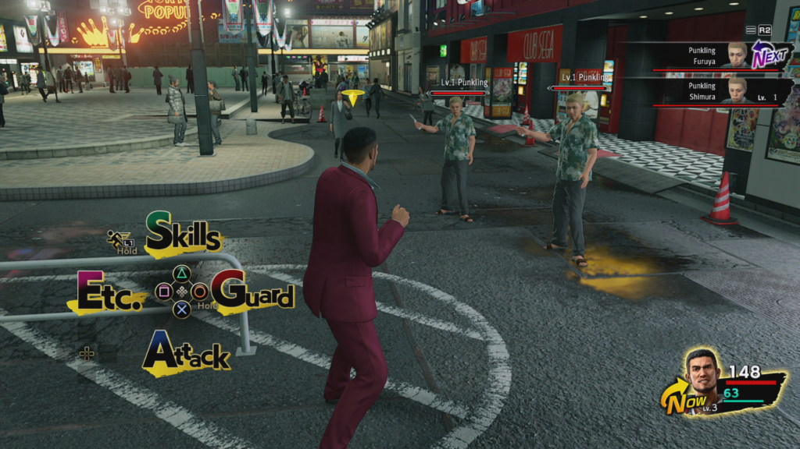

<figcaption>

I will always praise the people that pointed out that you could spell "SEGA" with "Skills, Etc, Guard and Attack."

</figcaption>

</figure>

If the goal was to merely make an RPG **battle system** in the Yakuza world, it did that. What it _didn't_ do was make a full conversion of the **whole game** into an RPG. It feels like it's wearing the _costume_ of an RPG without actually making all those parts come together to fit properly.

I'm not going to say that the creators didn't know what a good RPG looked like, but it feels like the concept was forced too much to be comfortable.

My notes for this piece are just a bunch of points about how nothing seems to fit well together; I figured I'd just get them all the open. Some of these are going to seem really specific, but when they all coalesce together, it becomes noticeable.

## CinemaSins (except not)

The game has multiple damage types (blunt, gun, blade) and multiple element types (fire, electric, water), because the game wants you to use them against enemies that have individual weaknesses, and vary your party's damage types, like Pokemon.

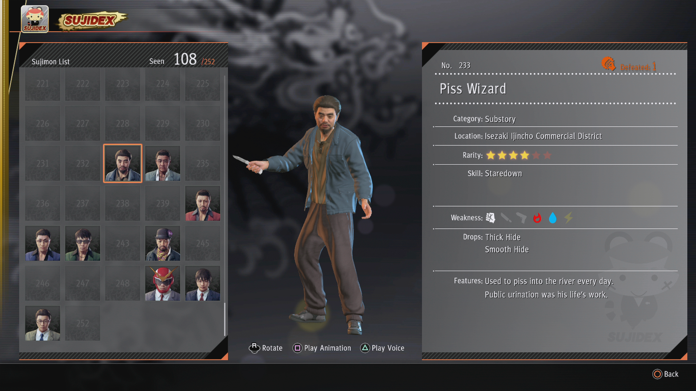

However, **there are no ways to see what the enemy is weak to in battle itself**. In a game like Pokemon, typing is evident either from the gym/locale you're fighting in, or the design of the Pokemon itself. In this game, it's less obvious.

Adding onto this, **there's no way to change weapons or jobs mid-battle**. If you're in a dungeon with your current party setup, there's no way to change it until you get out. This means that planning and forethought is less rewarded; your opponents in the Water Pokemon Gym are more obvious than a Korean Mafia hideout.

**Gear doesn't have level requirements**. This means if you can afford them, you can equip them regardless of level. If you've spent time in certain minigames, like the property management simulator, money is essentially no object.

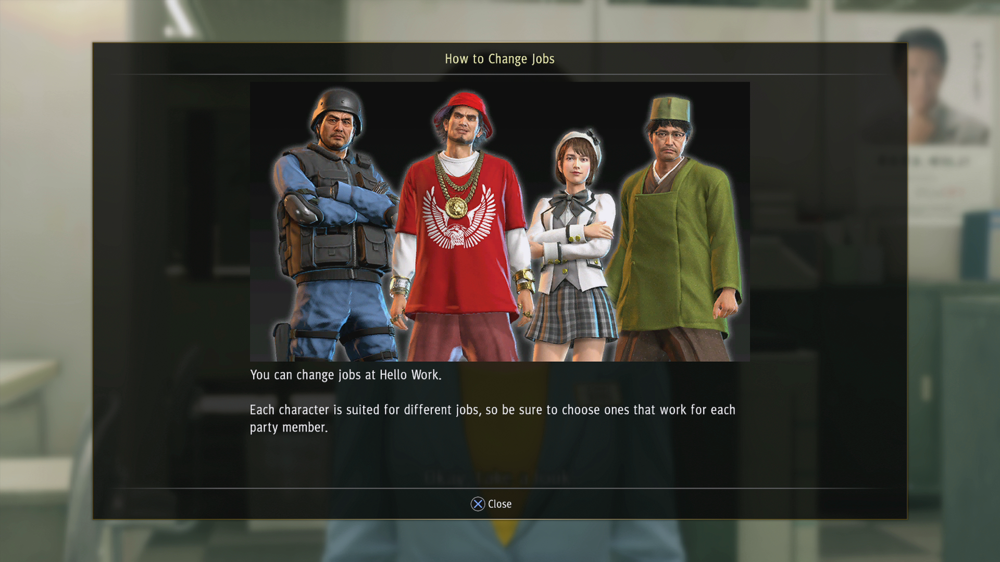

The in-game smith also has problems, where **weapons that do elemental damage aren't parallel to each other**. A fire damage and lightning damage weapon will have a clear stronger choice, which means that you gate yourself off from damage type coverage. Upgrading the items (+1, +2, etc) doesn't remedy this.

The crafting system is nice to have, but a chore to use. I feel like it should be required for these systems to have some kind of "shopping list" system, which tracks how many items you have, or updates as you collect.

While there's a reference app on your smartphone, there's no in-game shortcut to bring it up quickly. While it's a couple clicks (not _that_ bad), the UX could be improved. **Having crafting items be purchasable leads to the same problems with breaking the minigames for money**; suddenly, crafting and upgrades mean little, as well.

Insects needed for crafting are totally random in how you catch them, which means wandering. **There's no overall inventory limits**, and while _individual_ item counts have limits (10 of one type of food item, etc), there are so many different items that restoration becomes overabundant.

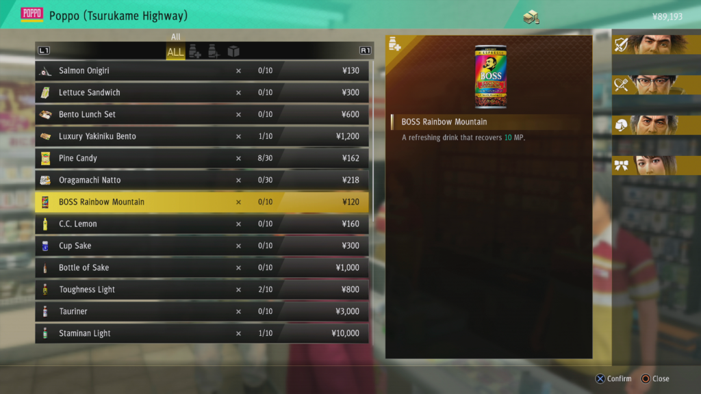

In talking to a friend, we both arrived to a similar conclusion; to keep combat challenging and engaging, we actively had to avoid getting into too many fights, or trying to prepare with gear as best we could. As the _Yakuza_ series is about exploration, side missions, minigames and experiences, this feels antithetical to what they'd want us to do.

#### Minor spoiler warning - hover to reveal

Over the course of writing this piece I've hit a major difficulty spike that has changed this a little bit. I still thing that throwing a 18-level gap between where you are and where you "should be" is a bit of a flawed design.

A major criticism with combat I have is that area of effect abilities are inconsistent. Because the enemies and party are moving around the environment constantly, enemies can drift in/out of range, and **there's no indicator of who the skill will hit**.

In games like _Chrono Trigger_, enemies that move in/out of AOE at least have a targeting indicator showing what is the right time; _Yakuza: Like a Dragon_ could sorely use this, considering AOE abilities are limited. I use them at the beginning of a fight while enemies are clumped up, but once they get knocked around and move, it's frustrating to plan.

In the previous _Yakuza_ games, the environment providing variety in combat meant that even if you were fighting the same group of thugs as your last fight, you likely had a different **setting** to take advantage of. This creativity and discovery kept combat fresh.

New destructibles and locales meant experimentation, and discovery of new finishing moves that depended on different situations. For instance, I always loved fighting near waist-high railings in certain games because one of Kiryu's heat moves involved suplexing them onto it back-first.

In _Yakuza: Like a Dragon_, railings are death, and to be avoided at all costs. Fighting near them, or having enemies on the other side of them, means that every attack must spend an animation walking up to the railing, stepping over it, attacking, then stepping back.

\[video src="https://mattdemers.com/wp-content/uploads/2020/11/Eri-Stuck.webm" mp4="https://mattdemers.com/wp-content/uploads/2020/11/Eri-Stuck.mp4" loop="on" preload="auto"\]

Sometimes the **AI's pathfinding completely breaks** as they run against a mailbox, alcove or bus shelter to go attack their target. After staring at your character run into a wall for far too long, they snap in place, teleporting to where they should be.

\[video src="https://mattdemers.com/wp-content/uploads/2020/11/Adachi-Caught.webm" mp4="https://mattdemers.com/wp-content/uploads/2020/11/Adachi-Caught.mp4" loop="on" preload="auto"\]

Even when Ichiban picks up signs, pylons or bikes to attack (like Kiryu would) there's no indicator that would allow for a choice to use them, or to know what's coming.

In some ways, the ability to be creative with combat has been stripped away in favor of a theme park. You choose your attacks, and when things influence them, you're supposed to be surprised or entertained by things you wouldn't expect.

\[video src="https://mattdemers.com/wp-content/uploads/2020/11/IchbanSignage.webm" mp4="https://mattdemers.com/wp-content/uploads/2020/11/IchbanSignage.mp4" loop="on" preload="auto"\]

This lack of clarity also extends to one of the game's earliest combat tutorials. You're told that when you knock enemies down, you can do more damage on the next attack, because they're defenseless.

However, **being knocked down isn't a status effect** — it's a timed event. It doesn't function like hitting a weakness in _Shin Megami Tensei_, where hitting someone weak to lightning with lightning damage will stun them for a turn, and make them more vulnerable. When you're in your menus, time doesn't stop (like it would with _Chrono Trigger_ with the "Wait" option enabled).

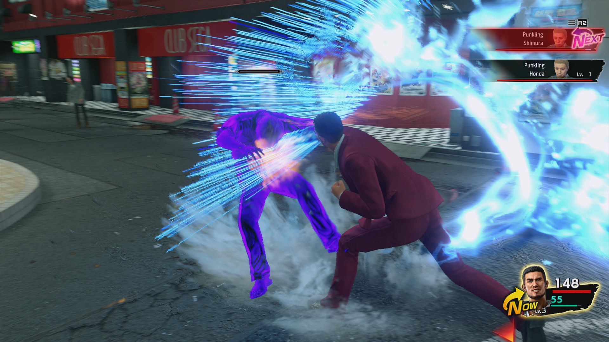

Sometimes, as the enemy is getting up when your character runs over to attack, you'll still get that "knocked down" version of the attack with extra damage. Sometimes you won't be fast enough, and they'll have stood up before you've chosen an action from the menu. It feels incredibly obtuse and unclear, and since they mentioned it in a tutorial, it feels important.

This runs contrary to what I feel is an appeal of the RPG genre: knowing your party and capabilities so well that you can execute a plan. Battles are a metaphorical puzzle to be solved, and the player is rewarded for choosing the right outcome.

While there are definitely some synergies in _Yakuza: Like a Dragon_ between skills and party members, they feel hard to execute, or not rewarding when other direct actions will get combat over with faster.

This makes it hard to build characters with purpose, and some classes feel overlapping and without clear identity. It doesn't help that the game **doesn't tell you what stats affect what**, or what your character might focus on. Thirty hours in, I _still_ have no idea what Dexterity and Agility affect, and who might want to focus on them over raw damage, HP, magic, or healing stats.

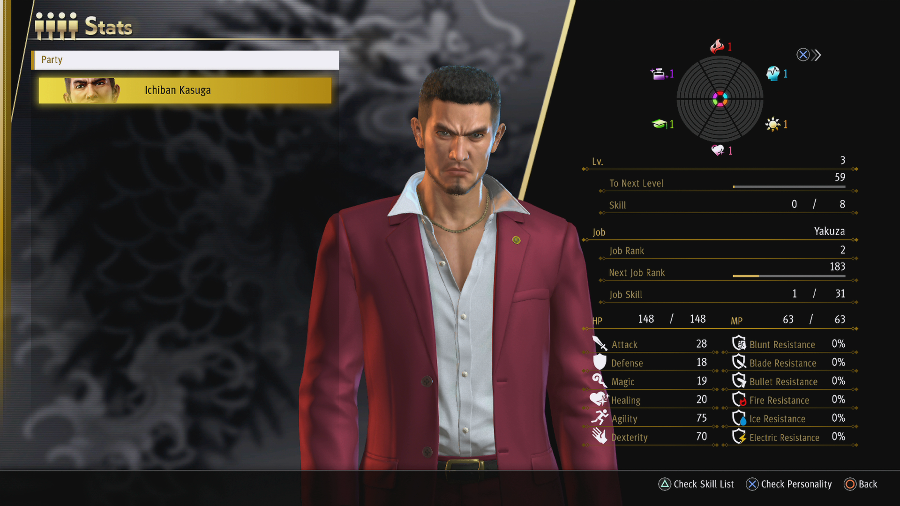

Going back to the skills, one of your party members has a Detective job, which allows him to provoke enemies with a Rage status that forces them only to auto-attack him. He also has an ability where "nearby melee attacks" provoke a counter from him. What should be a two-turn setup (provoke, counter) doesn't quite work, because the counter stance only lasts for one turn, and "mental" status effects like Rage are easily cancelled out by damage from your other party members.

With **no system of enmity or aggro**, this kind of "let the beefy dude take the damage" gameplay falls apart pretty fast — it seemed like whoever attacked an enemy last would be targeted for immediate revenge.

As we've already run into issues with item scaling and damage types, I found myself having to leave out a party member that I really liked, because well, crowd control (which most of his jobs did) wasn't effective. It also doesn't help that not every character can do every job.

\[video src="https://mattdemers.com/wp-content/uploads/2020/11/Battle.webm" mp4="https://mattdemers.com/wp-content/uploads/2020/11/Battle.mp4" loop="on" preload="auto"\]

What bugs me about all this is that _Yakuza: Like a Dragon_ references better RPGs and claims to take inspiration from them, but doesn't make use of their solutions to problems that are present here.

_Dragon Quest XI_ solved the "active camera" problem by having characters move around when idle, but moving them to where they're supposed to be _immediately_ after making the choice. Again, _Dragon Quest_ as a series is name-dropped multiple times in _Yakuza: Like a Dragon_, and it feels that if you're going to do that, you have to at least deliver an experience people would expect coming from those games.

_Dragon Quest_ also allows for more granular party AI mechanics, which is something I heavily enjoy. While I don't like the game to play itself, there's at least a per-member AI setting that allows me to just play the Hero, if I want to.

In _Yakuza: Like a Dragon_, you have four options for Auto-Battle, and each of them applies to the whole party:

- "Be Adaptable" (to what? What conditions change this?)
- "Take the Offensive" (clear enough, use whatever with no thought to MP or danger)
- "Prioritize Healing" (again, what does this mean? Heal everything at earliest convenience? Who does? With what? Does this count for recovering from debuffs, or applying your own?)
- "Don't Use Skills" (fine, "save MP")

In _Dragon Quest XI_, roles are a lot more defined, and in _Yakuza: Like a Dragon_, it feels like they wanted each class to be able to perform their "job," while _also_ having a damage type to cover the spread.

In _Dragon Quest_, the AI will also recognize things like defense against certain damage types, or even enemies that require critical/high risk moves to kill. They will even recognize highly valuable enemies that can run away, and attack those first.

The auto-battle in _Yakuza: Like a Dragon_ feels more like a "I don't want to do the action commands; I'd rather go to the bathroom while this fight plays out" button, rather than something that streamlines or aids combat.

Characters won't use buffs/debuffs. They'll heal or restore MP with the biggest items possible for the smallest circumstances. They won't prioritize targets with statuses that their skills can synergize with. Sometimes, regardless of the AI setting or MP, all they'll do is auto-attack repeatedly. Sometimes they'll vastly overkill enemies with MP-draining attacks when they don't need to.

I realize that there is a barrier to entry giving every RPG a copy of _Final Fantasy XII_'s Gambit system, which essentially allows you to program party actions on an "if / then" programming language. You aren't going to (and arguably shouldn't) give the level of control that would take the choice away from the player, and make every battle play out the same.

<figure>

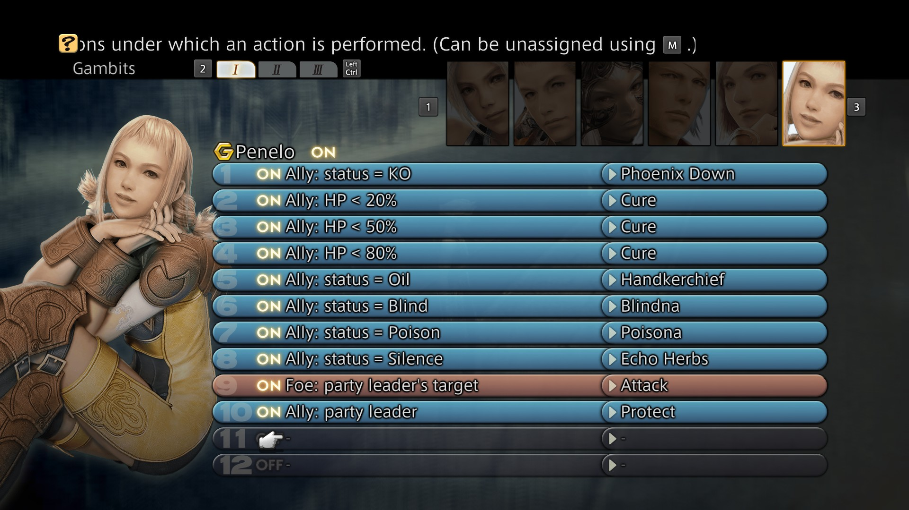

<figcaption>

Percentage threshholds, dammit!

</figcaption>

</figure>

I just want to be able to realistically know what my characters are going to prioritize, and how each is going to behave. I want to be able to understand how my choices affect combat to a reasonable degree, and I want to feel rewarded for knowing the system well enough to make smart decisions.

## Positives! We have those!

If _Like a Dragon_ is good at anything, it's establishing you at the lowest point of your life, and giving you the ability to improve yourself.

Ichiban having multiple personality stats that are influenced by dialog options feels like _Persona_'s personality system without the punishment for not knowing the right answer. Instead of a "+2 good answer", "+1 okay answer", "+0 bad answer", you're free to craft your Ichiban how you'd like.

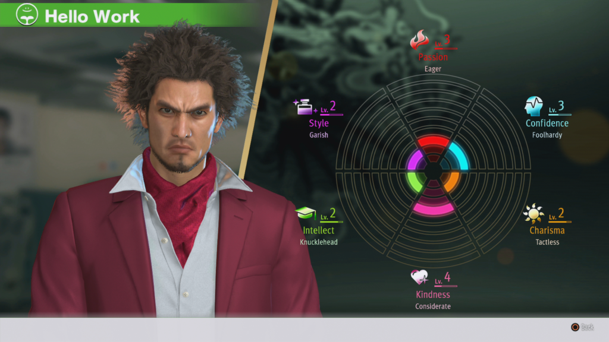

It also enables you to have an appreciation for how far you've come, as the game starts you with scrounging for coins under vending machines and half-eaten sandwiches out of the garbage. The overall theme of the game is rooted in this "coming from nothing" attitude, and a lot of the cutscenes reflect on Ichiban's growth as a person.

I like this, because Ichiban isn't Kazuma Kiryu. He isn't an all-powerful combat god, and he's flawed as a person. He also isn't a complete **idiot**, which I was personally very happy to see; protagonists can get away with being a knucklehead as long as they remain capable.

Despite being in jail for 18 years and not having a good upbringing, Ichiban still has an amazing heart, and his ability to empathize with others and read people sets him apart from Kazuma.

<figure>

- 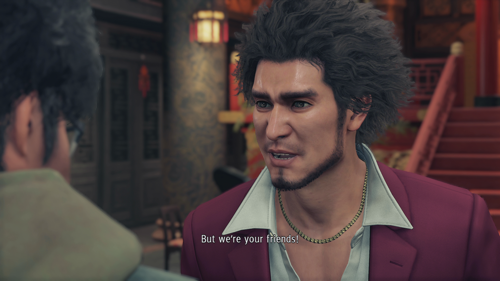
- 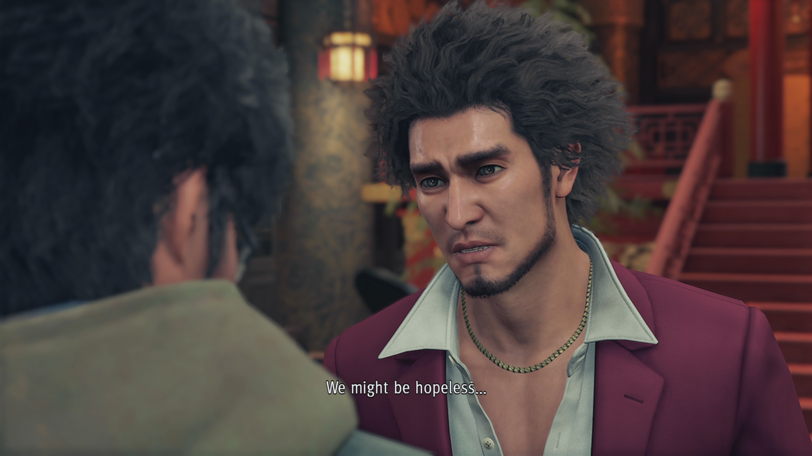

<figcaption>

Because sometimes you gotta slap your bros to let them know how much you care.

</figcaption>

</figure>

While Kiryu would be stoic in his pursuit for justice, Ichiban is free to do the right thing in his own way. He's more emotional without having that constantly used against him; I was honestly scared he'd be the type to constantly be manipulated, tricked or otherwise abused by the world around him.

His goals go beyond "I want to punch the bad guy!" and there's nuance in how he approaches them. Ichiban knows that the underworld is a shady place, and he knows that subterfuge is somehow how you achieve your aims.

While he's not the brightest bulb in the box, he's likable enough to make up for his shortcomings. His RPG mindset never comes at the expense of him as a person, and his time away from society in jail is somewhat salved by the year he was put away (2000). Instead of being imprisoned in 1990 and getting out in 2008, he at least knows that cellphones exist, and computers aren't just a fad.

All this stuff adds up to a positive, in the same way the negatives affect each other. Too often in RPGs have I played as a character who never seems to grasp the situation that's unfolding before them. They're always waiting for "the smart member" of the party to tell them what's going on, and despite their status as the chosen one, they're constantly tricked.

After a while, you can start disliking these characters because they never evolve, or if they do, it's a badly-implemented "I'm going to stop being a burden!"that doesn't evolve them fully.

Where Kazuma Kiryu's growth in previous games comes from getting stronger, and money helps him get there, Ichiban's growth comes from being a better human; even transitioning from sleeping in a homeless camp to a terrible apartment on sweat-stained futons feels like a victory.

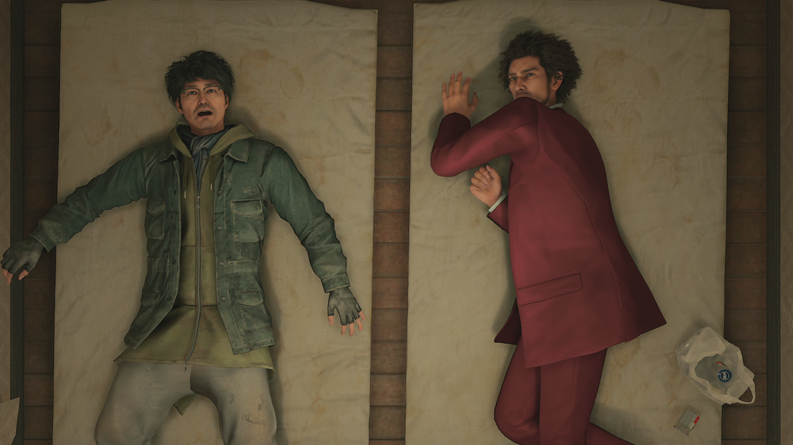

Perhaps it's a strength of _Yakuza: Like a Dragon_ that Ichiban is 42, and two other members of his party are 41 and 59. His supporting cast have life experience as "real people", and it means they come together as a cohesive team.

Social Links from _Persona_ are also here, serving as a mini substory for Ichiban and each party member. There are no romance options with party members, but there is an achievement involving romanceable women I haven't seen yet. These substories are pretty standard in terms of _Yakuza_, with a bit more emotion in terms of the person Ichiban is growing closer with; it's _still_ just as unsatisfying as _Persona_ in terms of not quite going as far as I'd like.

There's only five ranks of Bond (and five parts of the substory), the first four are just conversations in a bar, with the last being settling the conflict they've talked about.

While the conversations are nice, it runs into the _Persona_ problem of not being able to affect the plot, due to being able to ignore them entirely. They end up feeling short, and while your relationship with your party member _does_ grow, it's just as strong as I'd like it to be.

At the end of the day, though, the writing and camaraderie of the party system is done very well in _Yakuza: Like a Dragon_, and I feel like it's a very welcome addition. Having Ichiban be able to interact with his party as a non-silent protagonist means that exposition and reactions happen naturally.

Since Kazuma flew solo in previous _Yakuza_ games, there were usually a lot of scenes of people explaining what was happening _to_ him, which affected pacing. Ichiban can immediately react and work through things with the help of his team that've been together the whole time.

## Wrapping up

It didn't stick the landing on the combat, gear and class system, but _Yakuza: Like a Dragon_ seemed to nail the story, heart, and interactions between its characters. It's up to you to figure out how much each element matters, and what will influence your time with the game.

While these can seem like nitpicks, the premise of such a drastic shift in genre is to understand **and** execute another. If something like _The Legend of Zelda_ was going to morph from a third-person adventure to something like a fighting game, the base level of competency would be expected. It wouldn't be taken seriously if it didn't understand things like frame data, priority, or hitboxes.

_Metroid Prime_ taking the series from third-person platformer to a first-person shooter _needed to understand that change_. It either needed to satisfy the bare minimum of expectation from other games in the genre, or innovate on it enough to stand on its own (which, arguably, it did both).

With _Yakuza: Like a Dragon_, while it feels like Ryu Ga Gotoku understood the separate parts of an RPG they wanted to integrate, the whole product doesn't feel cohesive or polished enough. While I don't doubt that they've played RPGs and understand why they're great, it needed to be a wholly strong entity — while the character stuff was great, it's _always_ been great, and I didn't have any doubt they'd continue the trend.

This game feels like a rock group making a gangster rap album; while they might understand and appreciate what other people do, there's still going to be something lost while working from homage, rather than their own creative vision.

Again, right now, _Yakuza: Like a Dragon_ feels a bit too much like a theme park. Things happen, and cutscenes play with wacky summons or animations, but after that spectacle is done with, the entertainment wanes. The references and flash isn't supposed to be the **whole experience** — I like cakes with icing, but the latter is there to supplement the former.

The thing is, I actually _want_ to play another Ichiban-centered game. I _want_ to play another turn-based _Yakuza_. I want to see what Ryu Ga Gotoku can do with more time, more polish, and more understanding. Like with the improvement of the Dragon engine from _Yakuza 6_ to _Yakuza: Kiwami 2_ and _Judgment_, I know that the potential and attention to detail is there if the response warrants another attempt.

I just would like them to put more time into having it stand on its own merits, rather than being a collection of "oh, I know this from another game" moments.
