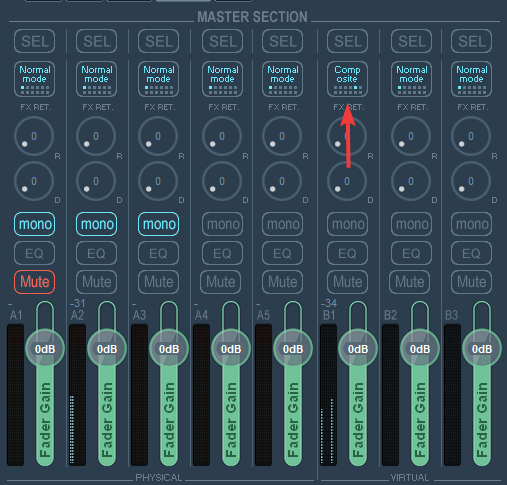
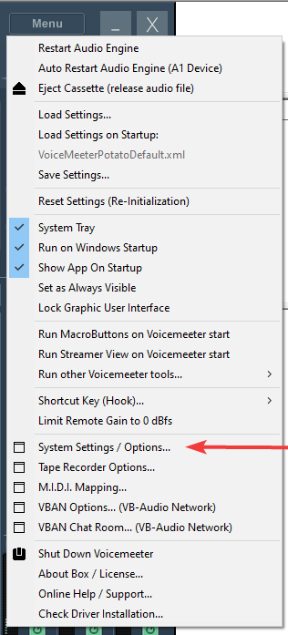
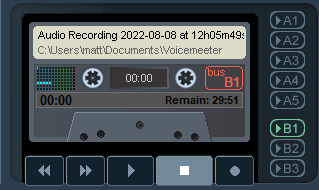
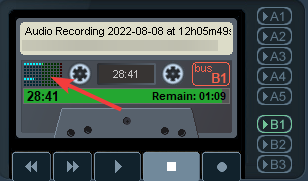

Podcasting has exploded in popularity as technology has made creating easier. However, this also introduces additional problems, as creators can’t always have a sweet in-home setup for recording multiple people.

I’ve been recording interviews with people for my newsletter, PlusHeart and came across a bit of a problem: I wanted to record both myself and my guest on separate audio tracks, so I could balance their volumes in Adobe Audition. Separating our voices into different tracks means that one file would only have one person’s audio; this makes editing a lot easier.

If you’re using something like Zoom, Google Meet or Discord to record your calls, there’s a couple different methods of doing so. Most common is probably using something like OBS Studio to record microphone and desktop audio to one file, and then doing the volume balancing in OBS itself.

This can be flawed because it doesn’t leave any room for error: you’re either stuck with the audio you’ve recorded, or you’re painstakingly cutting up one track and then raising the volume for each speaker.

I don’t have time for that, so I wanted to try to make the process easier using Voicemeeter. I use Voicemeeter already as a software audio mixer for my microphone and volume outputs; being able to see where the levels are in its interface makes eyeballing what a good volume is a lot easier than using the default Windows dialogs.

Voicemeeter _does_ have a way to record what it’s “hearing”, with audio from both your computer or your microphone, but it takes a bit of setup. This “tape recorder” interface has a number of switches to change what tracks it records, but in order to make it work for a podcast setup, I had to do some digging.

#### Before we start

This works best for a two-person interview (ie, yourself, and one subject). I don't think it's possible to split the audio into more than two tracks (I could be wrong, see below), so if you're in a call with multiple people, those people will all have the be volume-balanced in Discord, Google Meet, or on their ends before you start.

The information in this guide is taken from a topic on the Voicemeeter forums where the developer of Voicemeeter answered the question asked. It's mostly to make it more user-friendly and add screenshots.

If you need help with basic Voicemeeter setup, there's its manual or searching "Voicemeeter setup" on Google/YouTube.

## Configuring Voicemeeter to record interviews to separate tracks

#### Hello!

I like writing guides a lot. If this is something you found useful, consider supporting my writing or tossing me a tip.

The software I'm going to be using is Voicemeeter Potato, but this method should work with both Voicemeeter Banana and "Default Voicemeeter", as well.

## Step 1: Configuring your microphone

You're going to need to configure Voicemeeter to hear both your audio, and the audio of your subject.

When you load Voicemeeter, make sure "Hardware Input #1" is set to your microphone.

Keep in mind the "**B1**" track being live, as it will come into play later. This is the track where Voicemeeter will "hear" my input audio.

## Step 2: Configuring your desktop audio

In Windows (or MacOS), you'll need to make sure your default audio device is Voicemeeter's first virtual input. For me, it's labelled "Voicemeeter Input."

This means that anything that's played through my desktop (like music, sounds from my browser, etc) that use my **default** device (ie, you haven't changed it to something else), Voicemeeter will "hear" it.

Again, note the "**B1**" track highlighted here. Ignore "A1" and "A2," as that's just my personal setup.

## Step 3: Configuring your bus

After making sure both your mic and your desktop sound are sent to "B1", you're going to configure B1.

On the right side of the Voicemeeter window is a number of levels and knobs that represent your "outputs." These can be to your speakers, or other things (for instance, I have a cable from my PC that goes to sound-sentitive lights).

You'll notice above that these tracks are "A1-A5" and "B1-B3".

For the "B1" track, this is where your audio is being sent. However, the mode needs to be changed to that it separates the audio into two different tracks.

Clicking the button that should (by default) say "**Normal Mode**" (underneath the big "**SEL**" button), should change the button's label. Keep clicking until it changed to "**Composite**" (should be the fifth option).

Composite mode means that your audio and your guest's audio will be read by Voicemeeter separately. However, there's a couple more things to do.

Go to "**Menu**" in the top-right corner of the window, and then to "**System Settings / Options**".

From there, you can change the "**PATCH COMPOSITE**" dialog.

The important thing is the first two dialogs, as these are the different tracks that will be routed into the **B1** composite.

My first button is set to "IN#1 Left" because **my microphone** is set up to "Hardware Input 1", as set up above.

Because "**Voicemeeter Input**" is set up to "**IN#6**", I set that as the second audio source the Composite will accept. This might need some experimentation for you, depending on if you're using Voicemeeter Potato, Banana, or regular.

Also, click "Select PRE-Fader inputs" to switch it to "Select POST-Fader inputs" if it's selected. This makes it so Voicemeeter will record the audio _after_ it goes through Voicemeeter's volume meters, balance, etc.

In the next step, we'll make sure that the audio we want recording is being received.

## Step 4: Configuring recording

Finally, you're going to need to set up Voicemeeter to record the audio properly.

Above, you'll see Voicemeeter's recording interface. As you can see, the "B1" button is highlighted, and if you **right click** on the tape, you'll open the menu to do some further customizations.

Click "**Virtual BUS B1**" to select it.

Also important to change is the **"MUTITRACK OPTION > Generates 2 Mono WAVE files: Yes".** Also make sure the "Channels" is set to "**2**." This means that when the audio records, you'll end up with three files:

1. Your mixed audio.
2. Interviewer audio
3. Interview subject's audio

If you have more than one interview subject, you have the option of recording to 4, 6 or 8 different tracks; each one, however, will need to route to Voicemeeter in a different way.

Voicemeeter Potato has _three_ "Virtual Inputs", as I mentioned in Step 2. Subject #1 would route to "Voicemeter Input", Subject #2 would route to "Voicemeeter Aux Input" and Subject #3 would route to "Voicemeeter VAIO"; however, this reaches the limit of my knowledge, as I don't think Discord, Google Meet or Zoom can output each speaker to their own output.

## Step 5: Making sure it works!

From there, you have a couple ways of making sure everything is working properly.

When your mic is active, and your desktop sound is active at the same time, you should see two **separate** white bars; one is your mic audio, and the other is your desktop audio. You could play some music (which would be picked up by your desktop audio) and speak into your mic to see if both bars move.

<figure>

<figcaption>

You should also see it on the tape.

</figcaption>

</figure>

When you hit the circle "Record" button underneath the tape, and then hit "Stop" when you're done recording, you should end up with three files where you told Voicemeeter to store the recordings: your mic, "Track1" and "Track2".

If set up correctly, each should work properly. When you listen to the "Track 1" or "Track 2" audio files, it should **only** have your audio, or your subject's audio.

## Conclusion

This should enable you to get separate audio files, and should make your audio editing experience a lot less painful. Keep in mind that this is just going to record what Voicemeeter hears; anything volume or quality-related will need to be done _before_ it hits Voicemeeter.

Thanks for reading! Again, if this guide helped you, consider checking out my other work below, or tossing me a tip.
